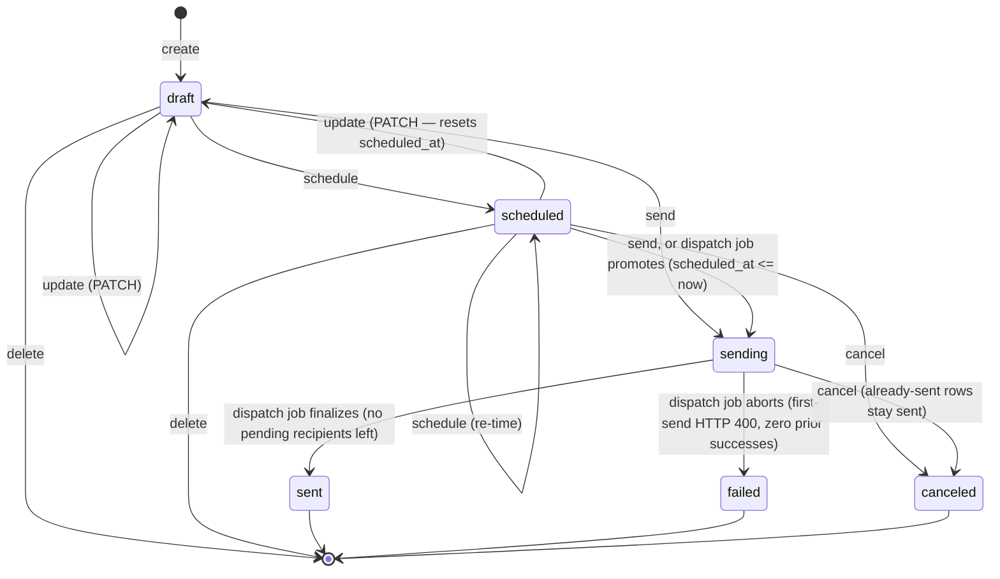

# `broadcasts` module

Admin-authored messages fanned out to every Telegram-linked user (optionally
narrowed to one locale). See
[ADR-0033](../../../../../../docs/decisions/0033-telegram-broadcasts.md) for
why delivery is a scheduler job instead of an outbox/broker, and the
[runbook](../../../../../../docs/runbooks/broadcasts.md) for day-to-day
operation.

## Responsibility

Own the `broadcasts` domain: draft CRUD, the send/schedule/cancel FSM, a
Telegram-HTML whitelist validator for the body, audience sizing, and the
recipient snapshot other code drains. **This module does not talk to
Telegram itself** — `apps/scheduler`'s `broadcast_dispatch` job does the
actual sending (imports `broadcasts.service`/`broadcasts.models` directly,
not `broadcasts.api`, to avoid pulling the FastAPI route stack into the
scheduler process). The one exception is the `test` endpoint
(`routes.py::admin_test_broadcast`), which sends immediately and
synchronously to the calling admin's own chat — a single call, not a
fan-out, so it doesn't need the dispatch job.

## Layout

| File          | Role                                                                                            |
| ------------- | ----------------------------------------------------------------------------------------------- |
| `models.py`   | `Broadcast` + `BroadcastRecipient` ORM tables.                                                  |
| `sanitize.py` | Telegram-HTML whitelist validator (`validate_body`) + `visible_length`. Pure, no I/O.           |
| `service.py`  | Draft CRUD, the FSM (`mark_send_now`/`schedule`/`cancel`), `audience_count`, recipient listing. |
| `schemas.py`  | Pydantic request/response shapes.                                                               |
| `routes.py`   | `/admin/broadcasts` HTTP surface (thin — parses, calls `service`, shapes the response).         |
| `api.py`      | Public surface — the models and `admin_router` other code may import.                           |

## Data model

### `broadcasts`

One row per composed message.

| Column                                          | Notes                                                                                                                                                                                |
| ----------------------------------------------- | ------------------------------------------------------------------------------------------------------------------------------------------------------------------------------------ |
| `title`                                         | Internal admin label only — never sent to Telegram.                                                                                                                                  |
| `status`                                        | FSM state, CHECK-constrained — see below.                                                                                                                                            |
| `body_html`                                     | Telegram-HTML text/caption. Whitelist-validated at save time _and_ re-validated at send time (`service._validate_sendable`) — never assumed valid just because it was accepted once. |
| `media_type`                                    | `none` / `photo` / `video` / `animation` / `document`.                                                                                                                               |
| `media_url`                                     | CDN URL from `storage.presign_upload(kind="broadcast_media")`. Used for the first send.                                                                                              |
| `media_file_id`                                 | Telegram's own id for the uploaded media, captured on the first successful send and reused for every subsequent recipient (no re-upload).                                            |
| `locale_filter`                                 | `NULL` = all languages; else `ru`/`en`/`uz`.                                                                                                                                         |
| `disable_web_page_preview`                      | Default `true`.                                                                                                                                                                      |
| `scheduled_at`                                  | Set when `status = scheduled`. Stored/compared UTC.                                                                                                                                  |
| `total_recipients`                              | Snapshot size — `0` until the dispatch job's first tick on this broadcast.                                                                                                           |
| `sent_count` / `failed_count` / `blocked_count` | Live counters, incremented atomically per recipient by the dispatch job.                                                                                                             |
| `started_at` / `finished_at`                    | Set by the dispatch job.                                                                                                                                                             |
| `last_error`                                    | Set only on a whole-broadcast abort (see "first-send abort" in the runbook).                                                                                                         |
| `created_by`                                    | Admin user id (FK `users`).                                                                                                                                                          |

### `broadcast_recipients`

The resumable work list, snapshotted once at send-start (`ON CONFLICT DO
NOTHING`, so re-snapshotting is idempotent).

| Column         | Notes                                                                      |
| -------------- | -------------------------------------------------------------------------- |
| `broadcast_id` | FK → `broadcasts`, `ON DELETE CASCADE`.                                    |
| `user_id`      | FK → `users`.                                                              |
| `tg_chat_id`   | Copied from `telegram_links` at snapshot time.                             |
| `status`       | `pending` / `sent` / `failed` / `blocked`.                                 |
| `error`        | Telegram's error description (truncated), for the problem-recipients list. |
| `sent_at`      | Set on a successful send.                                                  |

`UNIQUE(broadcast_id, user_id)` makes the snapshot idempotent; `INDEX
(broadcast_id, status)` backs the dispatch job's `FOR UPDATE SKIP LOCKED`
chunk query.

### `telegram_links.bot_blocked_at` (new column)

Nullable timestamp on the `users` module's own table. Set by the dispatch
job when a send comes back Telegram 403 (blocked / deactivated / chat not
found); excluded from `audience_count` and every future snapshot, so a
repeat broadcast doesn't keep hammering users who left. **Cleared on
`/start`** — see "`bot_blocked_at` lifecycle" below.

## FSM

`draft` and `scheduled` are the only editable states. Sending is a one-way
door once the dispatch job picks it up: from `sending` only `cancel` is
legal until the job itself settles the row into `sent`/`failed`.

Editing a `scheduled` broadcast resets it to `draft` and clears
`scheduled_at` — an admin who changes the content must re-schedule
explicitly. `mark_send_now`/`schedule` both re-run `sanitize.validate_body`
against the _stored_ body before flipping status, since neither
`create_draft` nor `update_draft` validates inline.

## HTTP surface (`/api/v1/admin/broadcasts`, `require_admin`)

| Method   | Path                                | Purpose                                                                |
| -------- | ----------------------------------- | ---------------------------------------------------------------------- |
| `GET`    | `/admin/broadcasts`                 | Paged list (+ status filter).                                          |
| `POST`   | `/admin/broadcasts`                 | Create draft.                                                          |
| `GET`    | `/admin/broadcasts/{id}`            | Detail + live counters.                                                |
| `PATCH`  | `/admin/broadcasts/{id}`            | Edit a draft/scheduled broadcast (409 otherwise).                      |
| `DELETE` | `/admin/broadcasts/{id}`            | Delete a draft (409 if not `draft`).                                   |
| `POST`   | `/admin/broadcasts/{id}/test`       | Send to the caller's own linked Telegram chat, no FSM change.          |
| `POST`   | `/admin/broadcasts/{id}/send`       | FSM → `sending` (status flip only — the dispatch job does the rest).   |
| `POST`   | `/admin/broadcasts/{id}/schedule`   | FSM → `scheduled`, sets `scheduled_at` (must clear a 5s minimum lead). |
| `POST`   | `/admin/broadcasts/{id}/cancel`     | FSM → `canceled` from `scheduled` or `sending`.                        |
| `GET`    | `/admin/broadcasts/{id}/recipients` | Paged problem-recipients list (`?status=failed`/`blocked`).            |
| `GET`    | `/admin/broadcasts/audience-count`  | Live eligible-recipient estimate (`?locale=`) for the composer.        |

All write endpoints require an `Idempotency-Key` header
(`_require_idempotency_key` in `routes.py`; see AGENTS.md §9). `send` is
additionally FSM-guarded — a broadcast already `sending`/`sent` can't be
re-sent, so a double-click is inherently safe on top of the idempotency key.
The `broadcasts` row itself is the audit trail (`created_by`, status
transitions, `started_at`/`finished_at`, the counters) — there's no separate
audit-log write, consistent with other admin mutations in this codebase.

## Telegram-HTML whitelist

`sanitize.py`'s `validate_body(html, *, has_media)` is the save-time
chokepoint: a body that passes it is guaranteed safe to hand to Telegram's
HTML parse mode. Built on the stdlib `html.parser.HTMLParser` — no new
dependency.

- **Allowed tags**: `b`, `i`, `u`, `s`, `a` (href `http`/`https`/`tg` only),
  `code`, `pre`, `tg-spoiler`, `blockquote`. Every other tag, every
  attribute besides `a[href]`, and any `script`/`style` is rejected.
- Tags must be **balanced and properly nested**; an unterminated tag,
  comment (`<!--`), processing instruction (`<?`), or declaration (`<!`)
  is rejected rather than silently swallowing the rest of the body (the
  failure mode `HTMLParser` would otherwise have by default — see the
  module docstring for the exact mechanics).
- **Length ceiling**, measured on _visible_ text (tags stripped, entities
  decoded once): **1024** chars when media is attached (it becomes a
  caption), **4096** text-only.
- Runs at save time (`create_draft`/`update_draft` do **not** call it
  inline — validation happens explicitly) and is **re-run** at
  send/schedule time against the stored body, so a body is never trusted
  just because it was accepted once.

A malformed body therefore never reaches the dispatch job — it fails fast
with a 422 in the composer instead of failing identically for every
recipient in the audience.

## Dispatch job (delivery)

Delivery is **not** handled by this module or by an outbox/worker — it's a
periodic scheduler job,
`apps/scheduler/src/yupay_scheduler/jobs/broadcast_dispatch.py`, registered
in `apps/scheduler/src/yupay_scheduler/main.py` and running every ~5s
(`max_instances=1`, `coalesce=True`). See
[ADR-0033](../../../../../../docs/decisions/0033-telegram-broadcasts.md) for
why (no outbox consumer, no broker in the API process) and the
[runbook](../../../../../../docs/runbooks/broadcasts.md) for the operator
view. Each tick, in short order:

1. **Promotes** due `scheduled` broadcasts (`scheduled_at <= now()`) to
   `sending`.
2. For up to `MAX_BROADCASTS_PER_TICK` (5) `sending` broadcasts, oldest
   `started_at` first:
   - **Snapshots** the audience into `broadcast_recipients` if not already
     done (`TelegramLink ⨝ User` where `bot_blocked_at IS NULL`, optional
     locale filter; `ON CONFLICT DO NOTHING`).
   - Claims a **chunk** (`CHUNK = 250`) of `pending` rows via
     `FOR UPDATE SKIP LOCKED`.
   - Delivers each one, paced at `RATE = 25`/s, **inside its own committed
     transaction per recipient** — the row's `pending → sent/failed/blocked`
     transition commits before the pacing sleep and before the next send.
     This makes a crash mid-chunk lose at most one recipient to a possible
     duplicate (durable at-least-once, not exactly-once — see ADR-0033).
   - `200` → `sent` (+ capture `file_id` on the first media send).
     `403` → `blocked`, stamps `telegram_links.bot_blocked_at`, no retry.
     `429` → sleeps `retry_after`, retries the same recipient (not a
     failure). `5xx`/network → a couple of retries, then `failed`. `400` on
     the **first** send with **zero prior successes** aborts the whole
     broadcast to `failed` rather than burning the rest of the audience.
   - Finalizes to `sent` once no `pending` rows remain.

## `bot_blocked_at` lifecycle

- **Set**: `broadcast_dispatch._deliver_one` stamps
  `telegram_links.bot_blocked_at = now()` the moment a send comes back
  Telegram 403 (blocked / deactivated / chat not found).
- **Read**: `service.audience_count` and the dispatch job's own snapshot
  query both filter `WHERE bot_blocked_at IS NULL` — a blocked link is
  invisible to every future broadcast (and the composer's audience-size
  preview) until it clears.
- **Cleared**: the bot's `/start` handler
  (`apps/bot/src/yupay_bot/main.py::_clear_bot_blocked`) sets it back to
  `NULL` for that `tg_user_id` — re-engaging with the bot is the user's own
  signal that they're reachable again. This runs in its own short-lived
  session (the bot has no request-scoped one), **after** the welcome
  message is already sent, and any failure is caught and logged rather than
  propagated — a DB hiccup on this must never break `/start` itself.
