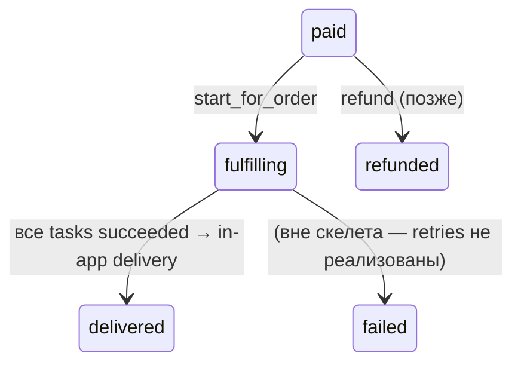
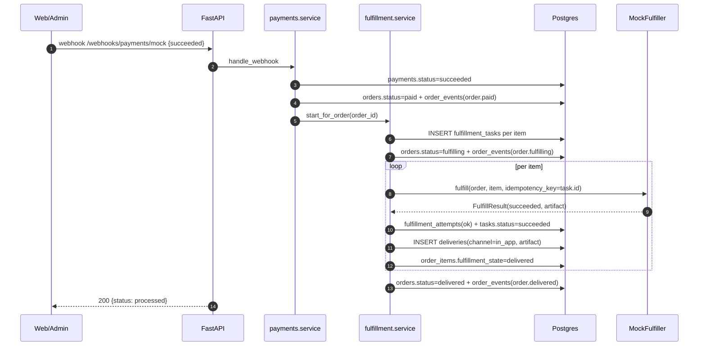

# `fulfillment` — skeleton

Саговый оркестратор YuPay. **Этап 1 — скелет** (ADR-0013): фиксируем схему БД,
контракт `Fulfiller`, HTTP-роуты, FSM-переходы заказа после оплаты и аудиторскую
таблицу. Все реальные поставщики (Steam, Riot, PUBG/Tencent, Spotify, Apple,
voucher-warehouse) заглушены — слоты зарезервированы.

См.
[`docs/decisions/0013-fulfillment-skeleton-and-provider-stubs.md`](../../../../../docs/decisions/0013-fulfillment-skeleton-and-provider-stubs.md).

## Что делает модуль

1. Получает сигнал «order paid» от `payments._mark_payment_succeeded` (сегодня —
   прямой in-process вызов; завтра — outbox + Dramatiq).
2. Создаёт `FulfillmentTask` на каждый `OrderItem` (1-to-1, UNIQUE).
3. Двигает order `paid → fulfilling`.
4. Для каждого task: маршрутизирует к `Fulfiller` (сейчас всегда `mock`),
   вызывает `fulfill(order, item, idempotency_key=task.id)`, пишет
   `FulfillmentAttempt`, обновляет статус task'а, пишет `Delivery` с артефактом.
5. Когда все tasks `succeeded` — order `fulfilling → delivered`.

## Контракт `Fulfiller`

```python
class Fulfiller(Protocol):
    supplier: str

    @property
    def available(self) -> bool: ...

    async def fulfill(*, order, item, idempotency_key: str) -> FulfillResult: ...
    async def check_status(*, task) -> FulfillStatus: ...
    async def cancel(*, task) -> None: ...
```

`FulfillResult` несёт `outcome` (`succeeded` / `in_progress` / `failed`),
`external_order_id`, опциональный `artifact_kind` + `artifact` (для `voucher_code`,
`topup_receipt`, `license_key`).

### Поставщики

| Slug | Статус | Что делает |
|---|---|---|
| `mock` | функционален в dev/staging | сразу возвращает `succeeded` + фейковый ваучер `MOCK-<order_item_id>` |
| `steam` | заглушка | `available=False`, все методы → `FulfillerNotIntegratedError` |
| `riot` | заглушка | то же |
| `pubg` | заглушка | то же (Tencent / Midasbuy) |
| `spotify` | заглушка | то же |
| `apple` | заглушка | то же |
| `voucher_inventory` | заглушка | подберёт код из будущего модуля `inventory` |

Реестр в `suppliers/__init__.py:REGISTRY`. Добавление нового поставщика =
реализовать класс + зарегистрировать slug.

## Таблицы

| Таблица | Что хранит |
|---|---|
| `fulfillment_tasks` | один task на `OrderItem` (UNIQUE), `status` ∈ pending/in_progress/succeeded/failed/cancelled, `supplier`, `external_order_id`, `attempts_count`, `metadata jsonb`, таймстемпы (`succeeded_at`/`failed_at`/`cancelled_at`). Partial UNIQUE `(supplier, external_order_id) WHERE NOT NULL`. |
| `fulfillment_attempts` | append-only аудит каждого тика (`kind` ∈ fulfill/status_check/cancel, `status` ∈ ok/error, `payload jsonb`, `error text`). |
| `deliveries` | финальный артефакт. UNIQUE `(order_item_id)`. `channel` (today всегда `in_app`), `artifact_kind`, `artifact jsonb`. |

Миграция: `0008_fulfillment_init`.

## FSM (после оплаты)



`order.delivered_at` ставится одновременно с `order.fulfilled_at`. Скелет не
разделяет «fulfilled» (артефакт сформирован) и «delivered» (юзер получил) — пока
канал доставки только `in_app` (артефакт лежит в `deliveries` и доступен
владельцу заказа).

## Идемпотентность

- `fulfillment_tasks.order_item_id` UNIQUE — повторный `start_for_order` для
  того же заказа ничего не плодит.
- `(supplier, external_order_id)` partial UNIQUE — реконсилер безопасно ретраит
  `check_status`.
- `Fulfiller.fulfill` получает `idempotency_key = task.id` — детерминированно по
  task'у, поэтому ретраи у провайдера попадают в ту же запись.

## HTTP

```
GET  /api/v1/orders/{order_id}/deliveries          — owner-only, список артефактов
GET  /api/v1/admin/fulfillment/tasks               — admin
GET  /api/v1/admin/fulfillment/tasks/{id}          — admin detail + attempts
POST /api/v1/admin/fulfillment/tasks/{id}/retry    — admin перезапуск failed
POST /api/v1/admin/fulfillment/tasks/{id}/cancel   — admin отмена pending/failed
POST /api/v1/admin/fulfillment/tasks/{id}/complete — manual: создать Delivery, завершить
POST /api/v1/admin/fulfillment/tasks/{id}/fail     — manual: отметить как failed с причиной
```

## Ручная выдача (`supplier="manual"`)

Для SKU без supplier-API: правило sourcing'а `mode="manual"` (см.
[`sourcing/README.md`](../sourcing/README.md)) маршрутизирует задачу на
`ManualFulfiller`. Он всегда возвращает `outcome="in_progress"` — task
паркуется в админской очереди (`/admin/fulfillment/tasks?supplier=manual&status_filter=in_progress`).

Админ обрабатывает заказ:
- **Завершить** → `POST /complete` с `{artifact_kind, artifact, channel?, admin_note?}`.
  Создаётся `Delivery`, task → `succeeded`, item → `delivered`, и
  `_try_settle_order` продвигает заказ до `delivered` тем же путём, что и для
  обычных supplier-задач.
- **Отклонить** → `POST /fail` с `{reason, admin_note?}`. Task → `failed`,
  `last_error = reason`, item → `failed`. Заказ остаётся в `fulfilling` —
  рефанд (если нужен) админ инициирует отдельно через
  `/admin/payments/{id}/refund`, чтобы деньги и выдача оставались под
  раздельным контролем.

Оба эндпоинта guard'ятся `supplier == "manual" AND status == "in_progress"`,
двойной `complete` ловится UNIQUE(`order_item_id`) на `deliveries`.
Метаданные ручной обработки (`admin_note`, `completed_by`) сохраняются в
отдельных колонках на `fulfillment_tasks` — не в `extra_metadata`, чтобы
не пересекаться с merged-метаданными supplier'а.

## Mock-flow (end-to-end в dev)



## Что в проде НЕ работает

- `mock` отключается при `Settings.is_prod`.
- Все stub-провайдеры отказывают (`available=False`).
- Скелет НЕ имеет retry-policy: failed task ждёт admin'а.

## Следующий шаг

Первый реальный адаптер — выбор по приоритету (PUBG/Tencent для UC топ-апов,
Steam для геймерских ключей, или voucher_inventory как самый автономный). Создать
`suppliers/<name>.py`, реализовать `Fulfiller`, написать contract-тесты
(success / retryable failure / duplicate replay). Параллельно — переехать саму
саговую цепочку в Dramatiq actor через outbox, чтобы webhook-ответ не блокировался
на медленной интеграции.
