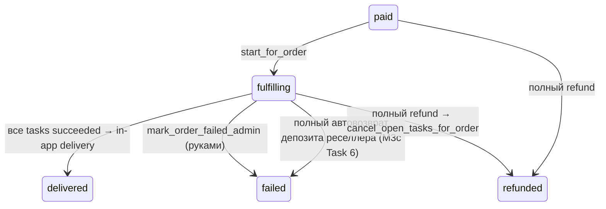
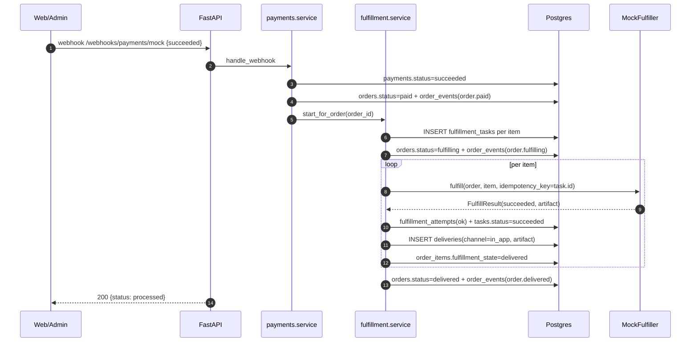

# `fulfillment` — skeleton

Саговый оркестратор YuPay. **Этап 1 — скелет** (ADR-0013): фиксируем схему БД,
контракт `Fulfiller`, HTTP-роуты, FSM-переходы заказа после оплаты и аудиторскую
таблицу. Все реальные поставщики (Steam, Riot, PUBG/Tencent, Spotify, Apple,
voucher-warehouse) заглушены — слоты зарезервированы.

См.
[`docs/decisions/0013-fulfillment-skeleton-and-provider-stubs.md`](../../../../../../docs/decisions/0013-fulfillment-skeleton-and-provider-stubs.md).

## Что делает модуль

1. Получает сигнал «order paid» от `payments._mark_payment_succeeded` — прямой
   in-process вызов `start_for_order`.
2. Создаёт `FulfillmentTask` на каждый `OrderItem` (1-to-1, UNIQUE).
3. Двигает order `paid → fulfilling`.
4. Для каждого task: маршрутизирует к `Fulfiller` (сейчас всегда `mock`),
   вызывает `fulfill(order, item, idempotency_key=task.id)`, пишет
   `FulfillmentAttempt`, обновляет статус task'а, пишет `Delivery` с артефактом.
5. Когда все tasks `succeeded` — order `fulfilling → delivered`.

**Два режима выполнения** (флаг `FULFILMENT_ASYNC`, по умолчанию
**выключен** — поведение продакшена не меняется ни на байт). Выключен: шаги
4–5 выполняются синхронно, в том же вызове, что и шаги 1–3, как описано
выше. Включён: `start_for_order` останавливается после шага 3 — задачи
остаются `pending`, и та же транзакция шлёт `pg_notify('fulfillment_queue',
order_id)` на COMMIT (откат — и NOTIFY не уходит). Шаги 4–5 выполняет
отдельный процесс `apps/worker` (`yupay_worker.consumer`): забирает задачи
через `drain_pending_tasks` (`FOR UPDATE SKIP LOCKED`, чтобы конкурентные
потребители не задваивали работу), каждую — в своём SAVEPOINT, так что
«отравленная» задача (неожиданное исключение мимо уже обработанных
`FulfillerError`/`FulfillerNotIntegratedError`) не роняет весь батч, а
уходит в `failed` — тем же путём ручного admin-retry, что и в синхронном
режиме. Воркер держит `fulfilment_concurrency` (по умолчанию 4)
параллельных drainer'ов, каждый со своей сессией: `SKIP LOCKED` и так
разводит их по разным строкам, а SAVEPOINT изолирует ошибку, но не
задержку — без параллелизма один зависший вызов поставщика останавливал бы
всю очередь. Poll tick (`fulfilment_poll_seconds`, по умолчанию 5с) — он же
reconciler на случай NOTIFY, потерянного при рестарте воркера. Дизайн и
почему выбрана именно очередь на Postgres, а не Dramatiq —
[ADR-0064](../../../../../../docs/decisions/0064-postgres-fulfilment-queue.md);
эксплуатация — [docs/runbooks/fulfillment-queue.md](../../../../../../docs/runbooks/fulfillment-queue.md).

> **Manual-завершение и дубликаты.** `complete_manual_task` пишет `Delivery`
> внутри SAVEPOINT, открытого **до** `db.add(...)`: `begin_nested()` делает
> autoflush уже накопленного состояния, поэтому поздний savepoint позволил бы
> упавшему INSERT отравить всю request-транзакцию. Конфликт по
> `UNIQUE(order_item_id)` откатывает только этот блок и отвечает 409.

## Контракт `Fulfiller`

```python
class Fulfiller(Protocol):
    supplier: str

    @property
    def available(self) -> bool: ...

    async def fulfill(*, order, item, idempotency_key: str) -> FulfillResult: ...
    async def check_status(*, task) -> FulfillStatus: ...
    async def cancel(*, task) -> None: ...
```

`FulfillResult` несёт `outcome` (`succeeded` / `in_progress` / `failed`),
`external_order_id`, опциональный `artifact_kind` + `artifact` (для `voucher_code`,
`topup_receipt`, `license_key`) и `money_outcome` — см. ниже.

### `MoneyOutcome` — что стало с нашими деньгами

Провал заказа и потеря денег — **разные события**. `MoneyOutcome`
(`suppliers/base.py`) отвечает на второй вопрос, и отвечает всегда.

> **Решения — в [ADR-0071](../../../../../../docs/decisions/0071-merchant-refunds.md).**
> Здесь — как это работает; там — почему именно так: почему `UNKNOWN` никогда
> не возвращает деньги сам (решение владельца, 2026-09-07), на какой род
> доказательства опирается каждое сопоставление — **поле поставщика**,
> **наблюдённое поведение**, **фраза в документации** или **строка ошибки плюс
> решение владельца о том, что за неё не списывают** (M3c, 2026-09-09), — и
> почему операторского re-grade нет ни в одну сторону.

| Значение   | Смысл                                                                        |
| ---------- | ---------------------------------------------------------------------------- |
| `RETURNED` | деньги у нас: поставщик вернул их, либо списания вообще не было              |
| `SPENT`    | мы **знаем**, что деньги ушли и не вернутся                                  |
| `UNKNOWN`  | выяснить нельзя. Решает человек — автоматический возврат по догадке запрещён |

Правила, на которых это держится:

- **Значения по умолчанию нет.** Поле обязательное и у `FulfillResult`, и у
  `FulfillStatus`, и у обоих исключений (`FulfillerError`,
  `FulfillerNotIntegratedError`) — mypy не пропустит адаптер, который забыл
  ответить. `tests/unit/test_supplier_money_outcome.py` обходит `REGISTRY`
  по AST и валится, если у адаптера есть терминальный провал без ответа.
  Список путей нигде не захардкожен: новый адаптер попадает под проверку сам.
- **`None` — только у нетерминальных исходов**: успех, `in_progress` и
  «низкий баланс поставщика» (`LOW_BALANCE_ERROR`). Последний не провал:
  заказ остаётся в работе, админ пополняет баланс.
- **`UNKNOWN` ≠ `SPENT`.** Автовозврат не срабатывает ни на том, ни на другом,
  но человеку они говорят разное.
- Уверенность у адаптеров **разная**, и её не сглаживают: `gengine` читает
  реальное поле `is_refunded`; `waxpeer` различает `canceled` и `error` по
  наблюдаемому поведению; у `g2b` поля нет вообще — только фраза в их
  документации, поэтому провал `g2b` после ушедшего вызова **по умолчанию** =
  `UNKNOWN` (`_FAILURE_MONEY_OUTCOME`). Но у `g2b` **три** константы, не одна:
  - `_NEVER_SENT` = `RETURNED` поднимается в четырёх отказах **до** любого
    вызова — нет `G2B_API_KEY`, в позиции нет `player_id`, у маппинга нет
    `external_variant_id`, активного маппинга нет вовсе. Это опора не на их
    документацию, а на наш собственный поток управления: заказ не уходил,
    значит и денег не уходило. Последний из четырёх достижим в обычной
    эксплуатации — деактивация маппинга уходящего SKU между заказом и дренажом
    вернёт депозит реселлеру автоматически.
  - `_REJECTED_UNBILLED` = `RETURNED` (M3c) — **один** отказ уже ушедшего
    вызова: создание игрового заказа, на которое G2B отвечает своим
    `HTTP 400 {"message":"Invalid player ID…","success":false}`. Это
    **четвёртый род доказательства**: не поле, не наблюдённое поведение и не
    наш поток управления, а строка их ошибки плюс решение владельца
    (2026-09-09), что за неё баланс не списывают. Совпадение проверяется
    узко — статус, их конверт и **сообщение целиком** (после сжатия пробелов и
    приведения регистра; `_is_an_unbilled_player_rejection`), потому что ложное
    срабатывание **здесь** возвращает реселлеру деньги, которые мы, возможно,
    потратили. Сравнение по префиксу приняло бы
    `"Invalid player ID; the order was created and charged"` — отказ, за
    который с нас **списали**. Отказ, который предикат не узнал (включая
    переформулированный), остаётся `UNKNOWN`: это и есть поведение, а не
    пробел; переформулировка со стороны G2B просто вернёт эти заказы в ручную
    очередь, где они и были до M3c.
- **Кто на это действует (M3b Task 3).** `_settle_merchant_deposit` —
  единственный потребитель. Для заказа реселлера (`order.merchant_id`
  не `NULL`) `RETURNED` автоматически возвращает списание на депозит
  (`merchants.refund.refund_order`), а `SPENT` и `UNKNOWN` не возвращают
  ничего и поднимают алерт `_alert_merchant_needs_a_human`. Розница не
  затронута вообще: гейт — `order.merchant_id is not None`, и он стоит
  **до** импорта `merchants`, потому что `INVENTORY_FAILURE_MONEY_OUTCOME`
  = `RETURNED` срабатывает на любом розничном заказе, у которого склад пуст
  **и переключиться не на кого** (`decision.strict or decision.fallback is
None`; при живом фолбэке задача уходит к поставщику, а не падает).
  Кроме статуса задачи проверяется ещё и состояние **позиции**: у стойла по
  низкому балансу поставщика позиция остаётся `in_progress`, а
  `money_outcome` переживает попытку — иначе повтор, упавший в стойло, вернул
  бы деньги за заказ, который мы вот-вот доставим.
- **И заказ закрывается (M3c Task 6).** Если после проводки списание вернулось
  **целиком** (`merchants.refund.settled_in_full`, тот же предикат, что у
  `failure_reason` и у алерта отмены), `_end_a_refunded_merchant_order` в том
  же сейвпойнте ставит `order.status = "failed"`, пишет событие `order.failed`
  и проводит переход через `orders.service.on_order_status_changed`. Правило
  розницы — «терминальный провал выдачи не двигает строку заказа» — держится
  на том, что оператор ещё может пополнить, повторить или выдать руками; для
  возвращённого заказа все три уже запрещены (`409
deposit_already_returned`), так что «в работе» было ложью. Частичное
  возмещение заказ не закрывает: там человек посреди решения. Розницы это не
  касается дважды — гейт `merchant_id` и отсутствие депозитного списания,
  против которого возмещение могло бы быть полным.
- **Четыре терминальных места**, и сид зовётся из всех: `drain_pending_tasks`,
  `retry_task`, `process_webhook_update` и `fail_manual_task` (последнее
  достижимо: B2B-видимый `top_up`-SKU без активного `SkuSupplierMapping` и без
  правила роутинга уходит в `supplier:manual` через `sourcing._resolve_auto`).
  Там пишется `UNKNOWN`, то есть денег это не двигает — вызов нужен, чтобы
  безопасность не держалась на том, какую константу эта функция пишет.
- **Где сид выполняется и почему он ловит всё.** Он вызывается **вне**
  SAVEPOINT'а `drain_pending_tasks`: аварийная ветка того савпоинта пишет
  `UNKNOWN`, и возврат, упавший внутри, откатил бы тот самый `RETURNED` и
  сделал бы возвратный провал невозвратным навсегда. При этом **всё тело**
  сида — ленивый импорт, три чтения, проводка и алерт — обёрнуто в один
  савпоинт и один `except Exception`: пробрасывать нельзя, потому что
  детерминированный сбой уносит батч, возвращает строки в `pending` и падает
  снова на следующем тике — это ливлок очереди фулфилмента, общей с розницей.
  Ловить безопасно именно из-за места: до аварийной ветки отсюда не достать.
  Ничего при этом не проглатывается — каждое исключение уходит в `log.error` с
  `order_id` и в алерт, с меткой `modelled=true|false`, так что `ImportError`
  из ленивого импорта (та самая форма 64decbd) отличим от обычного отказа
  одним запросом. Единственное, что снаружи, — `_flush_caller_writes`:
  савпоинт не может его накрыть, не выбросив ту самую запись о провале.
- Значение сохраняется в `fulfillment_tasks.metadata.money_outcome` в момент
  провала. Читать — `service.money_outcome_of(task)`, не по ключу. Оно
  **переживает** сам провал: задача, которая упала и потом прошла с повтора,
  всё ещё его отдаёт — это единственный след того, что ранняя попытка могла
  что-то потратить. Вопрос «что с этим заказом» = значение **плюс**
  `status == "failed"`; вопрос «есть ли непонятные деньги на задаче» — просто
  значение.
- **Значение только повышается по шкале `RETURNED < UNKNOWN < SPENT`.** Любой
  `RETURNED` — факт про _одну попытку_, а задача живёт дольше попыток:
  списание прошло и ответ пришёл 500 (`UNKNOWN`, верно) → админ жмёт «Повтор»
  → повтор упал на таймауте ещё до создания заказа (`RETURNED`, тоже верно) →
  и M3b вернул бы депозит за товар, который мы уже оплатили. Поэтому
  `retry_task` **не** стирает значение: это единственная память следующей
  попытки о том, что могла потратить предыдущая. Вниз не двигаемся и на
  верхнем конце: `SPENT` не превращается обратно в `UNKNOWN`, иначе инбокс
  начнёт говорить «непонятно» про деньги, про которые мы точно знали.
- **Понизить записанное значение нельзя ничем** — ни `retry_task`, ни
  `complete_manual_task`. Это безопасно, пока пишет только терминальный вердикт
  поставщика, и режет в обе стороны:
  - **Task 4:** если поллинг начнёт писать `money_outcome` в ветке `except`
    (транзиентная ошибка), любой сбой связи станет вечным `UNKNOWN` на живой
    задаче;
  - **уже сегодня:** `waxpeer` пишет `SPENT` на `error`, раннбук говорит
    «идти вытаскивать деньги», и оператор, который их вытащил, **не может
    записать `RETURNED`** — задача навсегда читается как «деньги ушли», и
    мерчанту никогда не прилетит автовозврат, хотя мы целы.

    Обеим сторонам нужен операторский re-grade. Его пока нет — и с M3b Task 3
    цена этого выросла: `SPENT`, который оператор разобрал руками, уже нельзя
    превратить в автовозврат, а ошибочный ранний `UNKNOWN` навсегда закрывает
    автовозврат этой задаче. Возврат при этом остаётся возможным вручную
    (раннбук merchant-b2b), так что это стоит минут оператора, а не денег.

- Нечитаемое значение в колонке (например, оператор руками вписал `UNKNOWN`
  вместо `unknown`) считается за `UNKNOWN`, а не за «пусто»: лестница падает
  **закрыто**, иначе ручная правка молча разоружала бы инвариант ровно на той
  задаче, из-за которой человек туда полез.
- **G-Engine: журнал намерения `gengine_pay_requested`.** Успешный `pay`
  возвращает `in_progress` — терминального исхода нет, писать нечего, и
  следующий поллинг увидел бы `invalid_account` и ответил `RETURNED` за
  оплаченный топ-ап. Поэтому `_advance` **не платит за `verified`-заказ, пока
  предыдущий тик не закоммитил намерение**: тик N кладёт ключ и не тратит
  ничего, тик N+1 (через 60 с) видит ключ и платит. Запись, которая живёт в той
  же транзакции, что и трата, — не журнал: любой откат платящего тика
  (`_try_settle_order` блокируется на строке заказа, COMMIT, таймаут) стёр бы
  ключ, а деньги — нет, и у поллинга нет crash net. Цена — один лишний тик до
  оплаты; ради этого джоб и написан (заказ висел девять часов, минута против
  этого — ничто). `is_refunded` ключ перебивает: вернувшиеся деньги вернулись
  независимо от того, что было потрачено.
- Провал без `money_outcome` не падает, но пишет
  `log.warning("fulfillment.money_outcome.missing")`: тотальность должна быть
  заметна и в рантайме, а не только в тесте.
- Старые ключи `supplier_refunded` / `needs_reconciliation` по-прежнему
  пишутся — их читают админка и раннбуки, — но **источник истины теперь
  типизированный**; при расхождении верить `money_outcome`.
- `supplier_refunded: false` рядом с `money_outcome: returned` — **не
  противоречие**: первое означает «возврата не было», второе — «деньги у
  нас». Оба верны, когда списания вообще не случилось (отказ верификации у
  `gengine`, пустой склад, незаинтегрированная заглушка). Возвращать нечего,
  потому что ничего не уходило.

### Поставщики

| Slug                | Статус                     | Что делает                                                            |
| ------------------- | -------------------------- | --------------------------------------------------------------------- |
| `mock`              | функционален в dev/staging | сразу возвращает `succeeded` + фейковый ваучер `MOCK-<order_item_id>` |
| `steam`             | заглушка                   | `available=False`, все методы → `FulfillerNotIntegratedError`         |
| `riot`              | заглушка                   | то же                                                                 |
| `pubg`              | заглушка                   | то же (Tencent / Midasbuy)                                            |
| `spotify`           | заглушка                   | то же                                                                 |
| `apple`             | заглушка                   | то же                                                                 |
| `voucher_inventory` | заглушка                   | подберёт код из будущего модуля `inventory`                           |

Реестр в `suppliers/__init__.py:REGISTRY`. Добавление нового поставщика =
реализовать класс + зарегистрировать slug.

## Таблицы

| Таблица                | Что хранит                                                                                                                                                                                                                                                                                                                                                                                                                                                           |
| ---------------------- | -------------------------------------------------------------------------------------------------------------------------------------------------------------------------------------------------------------------------------------------------------------------------------------------------------------------------------------------------------------------------------------------------------------------------------------------------------------------- |
| `fulfillment_tasks`    | один task на `OrderItem` (UNIQUE), `status` ∈ pending/in_progress/succeeded/failed/cancelled, `supplier`, `external_order_id`, `attempts_count`, `metadata jsonb`, таймстемпы (`succeeded_at`/`failed_at`/`cancelled_at`). Partial UNIQUE `(supplier, external_order_id) WHERE NOT NULL`.                                                                                                                                                                            |
| `fulfillment_attempts` | аудит обращений к поставщику (`kind` ∈ fulfill/status_check/cancel, `status` ∈ ok/error, `payload jsonb`, `error text`). **Не строка на тик:** повтор, идентичный предыдущей записи задачи, сворачивается в неё через `repeat_count` + `last_seen_at` (миграция 0045). Поллер спрашивает статус раз в минуту, пока заказ у поставщика открыт, — одна прод-задача накопила так 1641 строку, из них 1640 одинаковых. `attempts_count` считает строки, а не наблюдения. |
| `deliveries`           | финальный артефакт. UNIQUE `(order_item_id)`. `channel` (today всегда `in_app`), `artifact_kind`, `artifact jsonb`.                                                                                                                                                                                                                                                                                                                                                  |

> **Whitelist на покупательском API.** `artifact` отдаётся строго через
> allow-list `BUYER_SAFE_ARTIFACT_KEYS` + `buyer_safe_artifact()` —
> **`service.py`**, не `routes.py`: с M2 Task 5 у фильтра два потребителя, и
> `GET /merchant/v1/orders/{merchant_order_id}` (machine API, отдаёт
> реселлеру ваучер-код) вызывает ту же функцию. Две копии разошлись бы в
> опасную сторону: поле, добавленное в один список и забытое в другом, по
> умолчанию становится **видимым** на той поверхности, где о нём забыли.
> Наружу идут только `code`/`codes`/`key`/`pin`/`serial`/`steam_login`/
> `login`/`message`/`note`/`fulfillment_data`/`kind`/`app_name`/
> `package_name`/`status`. `source` (апстрим-поставщик) и любые
> внешние/внутренние id (`external_id`, `external_order_id`,
> `inventory_code_id`, `sku_id`, `catalogue_name`, raw `amount_units`) —
> admin-only, видны через `/admin/fulfillment`. Новое поле от поставщика по
> умолчанию скрыто, пока не добавлено в whitelist явно.

Миграция: `0008_fulfillment_init`.

## Стойло: задача встала, позиция — нет (`stall.py`, M3b Task 4)

У саги есть **один** мягкий провал. Когда поставщик отказывает из-за нехватки
**нашего** баланса у него, `_apply_failure` роняет задачу в `failed` (она
попадает в админский инбокс и поднимает low-balance алерт) и намеренно
оставляет позицию заказа в `in_progress` — витрина продолжает показывать
«обработка», пока оператор пополняет баланс и жмёт Retry. Для розничного
покупателя это правильно, и это **не меняется**.

Для реселлера это же состояние читалось как `status: "fulfilling",
failure_reason: null` — байт в байт то же, что у заказа, оформленного тридцать
секунд назад, и так бесконечно. `order_is_stalled(order)` отвечает на этот
вопрос, и только на него; значение (`fulfillment_delayed`) собирает
`merchants.order_status`, потому что словарь — его контракт.

- **Предикат — по форме, а не по строке ошибки.** «Задача встала (`failed`),
  а позиция, которую она выполняла, — нет». Шесть мест пишут
  `task.status = "failed"`, пять из них тут же пишут
  `item.fulfillment_state = "failed"`, шестое — ветка низкого баланса. Так что
  производитель сегодня один и у формы, и у сентинела; но второй мягкий провал,
  добавленный позже, — тоже стойло, а
  `last_error == "supplier_low_balance"` о нём промолчал бы.
- **Факт выводится, а не хранится.** Стойло обязано **само** исчезать на каждом
  выходе из него: пополнили и Retry прошёл, Retry упал терминально, задачу
  отменили, выдали руками, поддержка закрыла заказ. Хранимый маркер пришлось бы
  сбрасывать в каждом из этих мест, и то, где забыли, публиковало бы «ещё
  едет» про законченный заказ. Выводимый — сбрасывать нечего: каждый из этих
  переходов и так двигает задачу, позицию или обе.
- **Ни одной новой записи.** Модуль только читает: миграции нет, колонки нет,
  на пути фулфилмента не появилось ни одного нового write-сайта. Это же
  отвечает на ограничение из Task 1: «пишет только терминальный исход»
  осталось верным, поэтому транзиентный сбой поставщика по-прежнему не может
  застрять как вечный `UNKNOWN`.
- **Причину предикат не публикует.** То, что мы в минусе у конкретного
  поставщика, — факт про наше снабжение, а не про заказ реселлера; он живёт на
  задаче, в админском инбоксе и в ops-алерте.
- **Определение — пакетное (M3c Task 3).** У предиката появился второй
  потребитель: админский список заказов показывает то же самое рядом со
  статусом. Список отдаёт до 500 строк, а запрос на строку — это N+1
  (AGENTS.md §10), поэтому базовая функция теперь `stalled_order_ids(orders)`,
  а `order_is_stalled(order)` — её частный случай на один элемент. Два
  написания одного предиката разошлись бы в том, что вообще считать стойлом.
  Побочный эффект стоит знать: функция возвращает **множество id**, и оба
  вызывающих пересекают его со своим заказом, поэтому «чужое стойло» больше
  не может утечь в чужой ответ структурно, а не только из-за условия `WHERE`;
  само условие продолжает гарантировать обещание «в ответе нет id, о котором
  не спрашивали».

## Оповещения об ошибках

Любая ошибка фулфилмента уходит в ops-чат Telegram сразу — и та, где вызов
поставщика упал, и та, где вызов прошёл, а поставщик **ответил** отказом. Обе
пишут `status="error"` в `fulfillment_attempts`, поэтому алерт висит на
`_record_attempt`, а не на списке мест, который кто-то должен не забыть
дополнить.

Повторы гасятся дважды. Подряд идущие одинаковые ошибки вообще не доходят до
алерта — они сворачиваются в одну строку лога (см. миграцию 0045). Redis-дедуп
по `(задача, шаг, текст ошибки)` на час прикрывает «мигание» (ошибка →
восстановление → та же ошибка) и второго воркера. Другая ошибка — другой
инцидент, о нём сообщат сразу.

Алерт не может ни уронить продажу, ни замедлить её: он отправляется через
`_dispatch_alert` — стартует сразу, но сага его не ждёт. Иначе исходящий
HTTP-вызов оказывался бы внутри открытой транзакции БД (§10). Любое
исключение внутри алерта проглатывается и логируется. В сообщение не попадает `fulfillment_data` — там Steam-логин и
игровые id (§9); текст ошибки поставщика включён и обрезан, потому что именно
он говорит, что делать.

## FSM (после оплаты)



Обе стрелки в `failed` идут через `on_order_status_changed`. Вторая —
только для заказов реселлера и только когда депозит возвращён целиком;
розничный терминальный провал выдачи строку заказа по-прежнему не двигает.

`order.delivered_at` ставится одновременно с `order.fulfilled_at`. Скелет не
разделяет «fulfilled» (артефакт сформирован) и «delivered» (юзер получил) — пока
канал доставки только `in_app` (артефакт лежит в `deliveries` и доступен
владельцу заказа).

## Идемпотентность

- `fulfillment_tasks.order_item_id` UNIQUE — повторный `start_for_order` для
  того же заказа ничего не плодит.
- `(supplier, external_order_id)` partial UNIQUE — реконсилер безопасно ретраит
  `check_status`.
- `Fulfiller.fulfill` получает `idempotency_key = task.id` — детерминированно по
  task'у, поэтому ретраи у провайдера попадают в ту же запись.

## HTTP

```
GET  /api/v1/orders/{order_id}/deliveries          — owner-only, список артефактов
GET  /api/v1/admin/fulfillment/tasks               — admin
GET  /api/v1/admin/fulfillment/tasks/{id}          — admin detail + attempts
POST /api/v1/admin/fulfillment/tasks/{id}/retry    — admin перезапуск failed
POST /api/v1/admin/fulfillment/tasks/{id}/cancel   — admin отмена pending/failed
POST /api/v1/admin/fulfillment/tasks/{id}/complete — manual: создать Delivery, завершить
POST /api/v1/admin/fulfillment/tasks/{id}/fail     — manual: отметить как failed с причиной
```

## Ручная выдача (`supplier="manual"`)

Для SKU без supplier-API: правило sourcing'а `mode="manual"` (см.
[`sourcing/README.md`](../sourcing/README.md)) маршрутизирует задачу на
`ManualFulfiller`. Он всегда возвращает `outcome="in_progress"` — task
паркуется в админской очереди (`/admin/fulfillment/tasks?supplier=manual&status_filter=in_progress`).

Админ обрабатывает заказ:

- **Завершить** → `POST /complete` с `{artifact_kind, artifact, channel?, admin_note?}`.
  Создаётся `Delivery`, task → `succeeded`, item → `delivered`, и
  `_try_settle_order` продвигает заказ до `delivered` тем же путём, что и для
  обычных supplier-задач.
- **Отклонить** → `POST /fail` с `{reason, admin_note?}`. Task → `failed`,
  `last_error = reason`, item → `failed`. Заказ остаётся в `fulfilling` —
  рефанд (если нужен) админ инициирует отдельно через
  `/admin/payments/{id}/refund`, чтобы деньги и выдача оставались под
  раздельным контролем.

Оба эндпоинта guard'ятся `supplier == "manual" AND status == "in_progress"`,
двойной `complete` ловится UNIQUE(`order_item_id`) на `deliveries`.
Метаданные ручной обработки (`admin_note`, `completed_by`) сохраняются в
отдельных колонках на `fulfillment_tasks` — не в `extra_metadata`, чтобы
не пересекаться с merged-метаданными supplier'а.

## Каскадная отмена (отмена заказа / возврат)

Когда заказ завершается «отрицательно» — админ отменяет его или делает **полный**
возврат — открытые задачи фулфилмента отменяются автоматически, чтобы сага не
продолжала пытаться доставить (или не зависала в `failed`) товар, которым клиент
больше не владеет:

- `payments.service.refund_admin` при **полном** возврате (`is_full`) зовёт
  `cancel_open_tasks_for_order(order_id, reason="refund:<payment_id>")`. Частичный
  возврат оставляет заказ `delivered` и задачи не трогает.
- `orders.service.cancel_order_admin` зовёт
  `cancel_open_tasks_for_order(order_id, reason="order_cancelled")`. Сегодня отмена
  легальна только из `pending_payment` (задач ещё нет) — вызов идемпотентен и пока
  no-op, но контракт зафиксирован на будущее.

`cancel_open_tasks_for_order` проходит по всем задачам заказа и для каждой
не-терминальной (`pending`/`in_progress`/`failed`) выполняет тот же
`_apply_cancel`, что и админская кнопка `/cancel`: best-effort вызов
`Fulfiller.cancel`, затем `task.status=cancelled` и `order_item.fulfillment_state
= failed` (в `ck_order_items_state` нет значения `cancelled`). Уже `succeeded`
задачи **пропускаются** — возврат денег не отзывает выданный код; так же
пропускаются уже `cancelled` (идемпотентность).

**Отмена задачи по заказу реселлера — отдельное денежное состояние.**
`_apply_cancel` не пишет `money_outcome`, поэтому автовозврат сюда не приходит
никогда: отмена — решение человека по причине, которой этот код не видит, а
вывести из неё «поставщик вернул деньги» было бы ровно той догадкой, которую
`MoneyOutcome` запрещает. Депозит при этом остаётся списанным, а заказ —
неподвижным: `retry_task` и `complete_manual_task` отказывают `cancelled`-задаче.
Поэтому состояние делается **громким**: `log.warning("merchant_task_cancelled")`
и алерт `_alert_merchant_order_cancelled`, дедуп по заказу на час. Алерт
поднимается **только если по заказу ничего не вернулось**: `cancel_open_tasks_for_order`
отменяет и `failed`-задачи, так что штатный шаг поддержки — закрыть уже
возвращённый заказ руками — проходит здесь же, и алерт на счастливом пути
научил бы дежурного его не читать.

Задачи при этом читаются `FOR UPDATE`. Иначе «уже succeeded» означало бы
«succeeded на момент снимка транзакции»: возврат, стартовавший, пока воркер
держит claim-локи и вот-вот закоммитит `succeeded`, прочитал бы `pending`,
встал бы в очередь за локом и записал бы `cancelled` **поверх** только что
закоммиченного успеха — деньги вернули И товар выдали. Тот же лок стоит в
`retry_task`/`cancel_task` (админская кнопка Retry на уже подхваченной
воркером задаче иначе запускала бы вызов поставщика второй раз).

## Mock-flow (end-to-end в dev)



## Что в проде НЕ работает

- `mock` отключается при `Settings.is_prod`.
- Все stub-провайдеры отказывают (`available=False`).
- Скелет НЕ имеет retry-policy: failed task ждёт admin'а.

## Следующий шаг

Вынос саги из webhook-ответа сделан (флаг `FULFILMENT_ASYNC`, ADR-0064) —
остаётся первый реальный адаптер, выбор по приоритету (PUBG/Tencent для UC
топ-апов, Steam для геймерских ключей, или voucher_inventory как самый
автономный). Создать `suppliers/<name>.py`, реализовать `Fulfiller`,
написать contract-тесты (success / retryable failure / duplicate replay).

Отдельно: у `failed`-задачи сегодня нет запланированного retry ни в одном
из режимов — `next_attempt_at` существует в схеме, но ничего в него не
пишет (см. ADR-0064); она ждёт ручного admin-retry. Плановые повторы — не
реализованная фича, а не баг, но кандидат на будущую работу, если ручной
retry станет узким местом.
