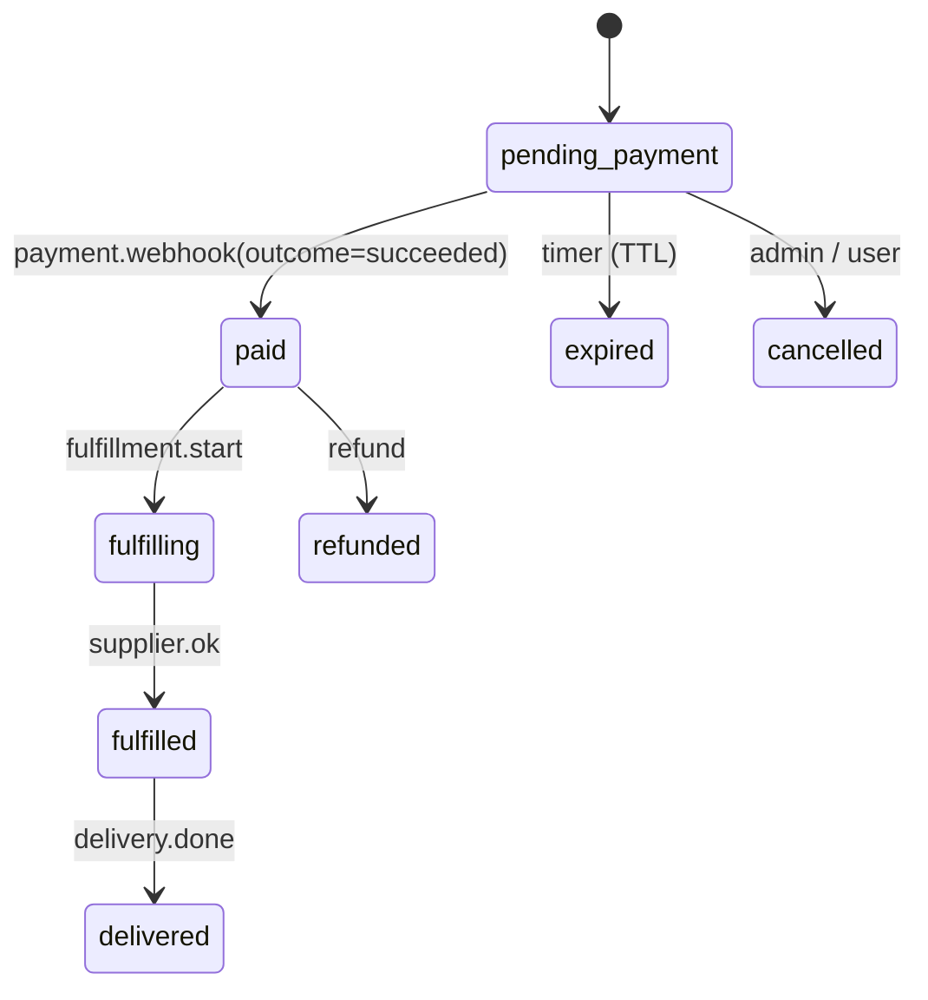
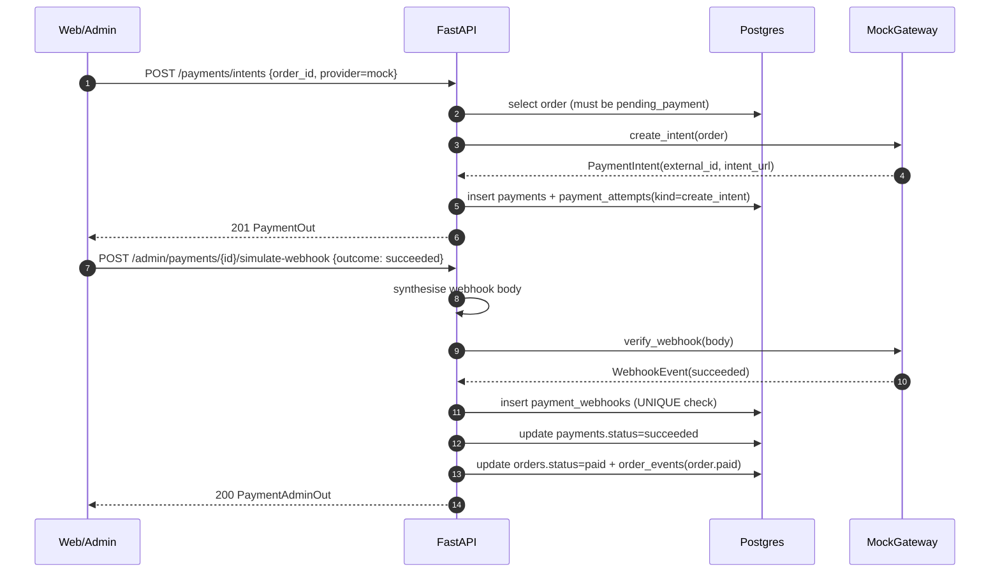

# `payments` — skeleton

Платёжный модуль YuPay. **Этап 1 — скелет** (ADR-0012): фиксируем схему БД, контракт
`PaymentGateway`, HTTP-роуты, FSM-переходы заказа и аудиторскую таблицу. Все реальные
эквайринги (Click, Payme, Uzum, YooKassa, Tinkoff, крипта) пока заглушены — их слоты
зарезервированы, чтобы будущая интеграция была "написать адаптер", а не "переделать
половину модуля".

См. также: [`docs/decisions/0012-payments-skeleton-and-provider-stubs.md`](../../../../../docs/decisions/0012-payments-skeleton-and-provider-stubs.md).

## Контракт `PaymentGateway`

Каждый провайдер реализует один и тот же протокол
(`yupay.modules.payments.gateways.base.PaymentGateway`):

```python
class PaymentGateway(Protocol):
    provider: str                        # slug в URL и БД ("mock", "click", ...)

    @property
    def available(self) -> bool: ...     # выключатель: stub'ы и mock в проде → False

    async def create_intent(*, order, return_url) -> PaymentIntent: ...
    async def verify_webhook(*, headers, body: bytes) -> WebhookEvent: ...
    async def refund(*, payment, amount: Decimal) -> RefundResult: ...
```

### Провайдеры

| Slug       | Статус                         | Что делает                                                                                  |
| ---------- | ------------------------------ | ------------------------------------------------------------------------------------------- |
| `mock`     | **функционален в dev/staging** | Возвращает stub-URL, принимает любой webhook с правильной shape. В проде `available=False`. |
| `click`    | заглушка                       | `available=False`, любой метод → `PaymentNotIntegratedError`.                               |
| `payme`    | заглушка                       | то же                                                                                       |
| `uzum`     | заглушка                       | то же                                                                                       |
| `yookassa` | заглушка                       | то же                                                                                       |
| `tinkoff`  | заглушка                       | то же                                                                                       |
| `crypto`   | заглушка (USDT)                | то же                                                                                       |

Реестр в `yupay/modules/payments/gateways/__init__.py:REGISTRY`. Добавление нового
провайдера = реализовать класс + зарегистрировать slug.

## Таблицы

| Таблица            | Зачем                                                                                                                                                                                                                                                  |
| ------------------ | ------------------------------------------------------------------------------------------------------------------------------------------------------------------------------------------------------------------------------------------------------ |
| `payments`         | один платёжный intent на заказ. Поля: `provider`, `status`, `amount`, `currency`, `intent_url`, `external_id`, `metadata jsonb`, таймстемпы (`succeeded_at` / `failed_at`). Partial UNIQUE на `(provider, external_id) WHERE external_id IS NOT NULL`. |
| `payment_attempts` | append-only аудит каждого тика (`kind` ∈ `create_intent` / `webhook` / `refund` / `cancel` / `status_check`, `status` ∈ `ok` / `error`, `payload jsonb`).                                                                                              |
| `payment_webhooks` | идемпотентная запись каждого входящего webhook'а. UNIQUE `(provider, external_event_id)` — реплеи короткозамыкаются.                                                                                                                                   |

Миграция: `apps/api/migrations/versions/0007_payments_init.py`.

## FSM заказа



Переход `pending_payment → paid` происходит **только** в
`payments.service._mark_payment_succeeded` — один источник истины.

## Идемпотентность

- **Intent**: повторный POST для того же заказа с тем же провайдером возвращает
  существующий pending-payment (без создания нового). Разный провайдер → 409.
- **Webhook**: `payment_webhooks(provider, external_event_id) UNIQUE` ловит дубли
  через `IntegrityError` под SAVEPOINT'ом (`begin_nested`) — дубль откатывает только
  вставку webhook-строки, не всю request-транзакцию. Дубль → 200 `{"status": "duplicate"}`.
- **Bad signature / shape**: 422 + `ValidationError`. Никогда не отвечаем 200 на
  невалидный webhook.

## HTTP

```
GET  /api/v1/payments/providers                       — список «живых» slug'ов
POST /api/v1/payments/intents                         — создать или переиспользовать intent
GET  /api/v1/payments/{payment_id}                    — owner-only
POST /api/v1/webhooks/payments/{provider}             — провайдерский webhook (без авторизации, signature внутри)
GET  /api/v1/admin/payments                           — admin
GET  /api/v1/admin/payments/{payment_id}              — admin detail + список attempts
POST /api/v1/admin/payments/{payment_id}/simulate-webhook — dev-only, только для mock
```

## Mock-flow (как протестировать end-to-end в dev)



## Что в проде НЕ работает

- `mock` отключается (`Settings.is_prod is True`).
- `/admin/payments/{id}/simulate-webhook` отвечает 403 в проде.
- Все stub-провайдеры всегда отказывают (`available=False`).

## Следующий шаг

Адаптер реального провайдера: создать `gateways/<provider>.py`, реализовать
`PaymentGateway`, обновить `REGISTRY`, добавить интеграционные тесты на
success / retryable failure / idempotent replay. **Никогда** не парсить тело
webhook'а до проверки подписи.
