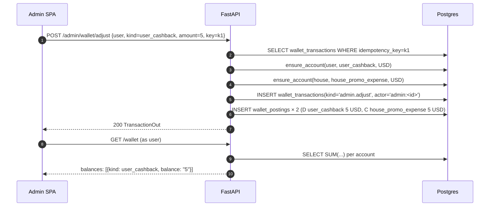

# `wallet` — skeleton

Двойной бухгалтерский ledger YuPay. **Этап 1 — скелет** (ADR-0014): живые
таблицы, сервис-примитивы (`ensure_account` / `post` / `balance`), одна
admin-мутация. Cashback-правила, рефанды, FX-проводки и outbox-fan-out
прицепятся, когда заработают `promotions` и реальные эквайринги.

См. также:
- [`docs/decisions/0004-double-entry-ledger.md`](../../../../../docs/decisions/0004-double-entry-ledger.md) — почему double-entry
- [`docs/decisions/0014-wallet-skeleton.md`](../../../../../docs/decisions/0014-wallet-skeleton.md) — что входит в скелет

## Инвариант

Любая транзакция — **минимум 2 проводки**, и per currency `SUM(D) == SUM(C)`.
Сервис кидает `ValidationError` при нарушении; deferred SQL-trigger — TODO в ADR-0019.

## Таксономия счетов

| Kind | Normal side | Что значит |
|---|---|---|
| `user_wallet` | D | тратимый баланс пользователя |
| `user_cashback` | D | накопленный кэшбэк |
| `user_promo_credit` | D | промо/реферальный кредит |
| `house_revenue` | C | выручка |
| `house_cogs` | D | себестоимость |
| `house_promo_expense` | D | промо-расходы |
| `house_refunds` | D | контр-выручка |
| `house_fx_pnl` | C | FX P&L |
| `provider_clearing` | C | клиринг с эквайрингом (owner_id = slug) |

`balance(account)` = `SUM(amount WHERE direction = normal_side) − SUM(amount WHERE direction ≠ normal_side)`. Положительное число всегда означает «есть в кошельке».

## Сервис

```python
async def ensure_account(db, *, owner_type, owner_id, kind, currency) -> WalletAccount: ...
async def post(
    db, *,
    kind: str,                 # 'admin.adjust' | 'order.cashback' | ...
    legs: list[Leg],           # каждая нога: account_id + direction + amount + currency
    idempotency_key: str,
    reference: Reference | None = None,
    actor: str = "system",
    metadata: dict | None = None,
) -> WalletTransaction: ...
async def balance(db, account_id) -> Decimal: ...
async def admin_adjust(db, *, user_id, kind, currency, amount, reason, idempotency_key, admin_id) -> WalletTransaction: ...
```

`post()`:
- Реджектит `len(legs) < 2`, `amount ≤ 0`, валюту, не совпадающую со счётом, frozen-счёт.
- Реплей по `idempotency_key` возвращает существующую транзакцию (без второго набора проводок).

## HTTP

```
GET  /api/v1/wallet                   — мои user_wallet/cashback/promo_credit балансы
GET  /api/v1/wallet/transactions      — моя история (default 50, max 200)
POST /api/v1/admin/wallet/adjust      — ручная корректировка (signed amount, reason, idempotency_key)
GET  /api/v1/admin/wallet/{user_id}   — все счета пользователя + история
```

`POST /admin/wallet/adjust` посылает две ноги: `D user_<kind>` + `C house_promo_expense`. Отрицательный `amount` — клавбэк (направления меняются).

## Sequence: admin даёт $5 кэшбэка



## Что в скелете НЕ работает

- Автоматическое начисление cashback по `order.delivered` — ждёт `promotions`.
- Списание баланса на оплату следующего заказа — ждёт интеграции с `payments`/`orders`.
- Реальные provider_clearing-проводки — ждут живого эквайринга.
- Outbox-события (`wallet.transaction.posted`) — ждут консьюмеров.
- Materialized view балансов — пока on-the-fly `SUM`. Включим, когда тест покажет горячее место.

## Что трогать дальше

1. **Outbox-эмиттер** в `post()` после успешного flush. Контракт: `wallet.transaction.posted` с `transaction_id` и сводкой по счетам.
2. **Cashback-rule engine** в `promotions/`, который слушает `order.delivered` и зовёт `wallet.post(kind='order.cashback', legs=[...])`.
3. **Trigger** `wallet_postings BEFORE COMMIT` для пер-транзакционного `SUM(D)=SUM(C)` (ADR-0019).
4. **Партиционирование** по месяцу при ~50M проводок.
