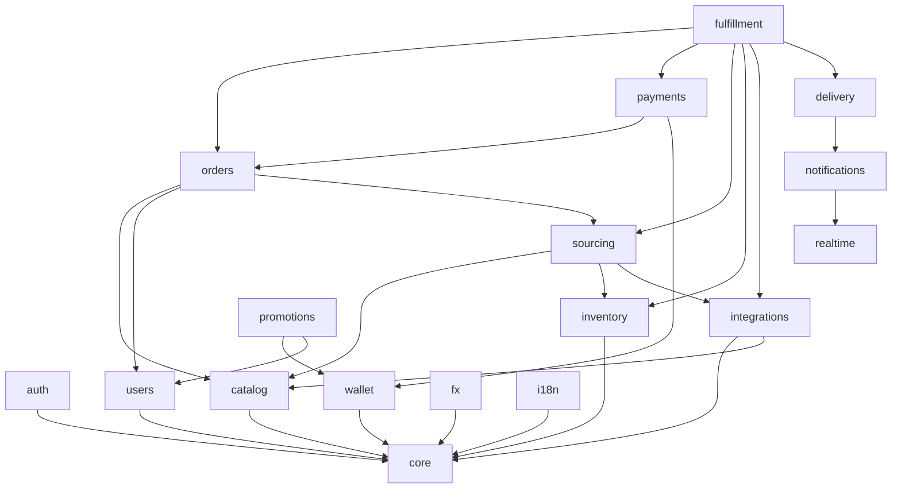

# YuPay — Module Map

Each module owns its tables and exposes a narrow Python interface via `apps/api/src/yupay/modules/<name>/api.py`. **No cross-module SQL joins.** Other modules call `api.py` or react to outbox events. This is the single rule that keeps future microservice extraction a refactor rather than a rewrite.

| Module           | Responsibility                                                                                                                                                                                             | Tables (key)                                                           |
| ---------------- | ---------------------------------------------------------------------------------------------------------------------------------------------------------------------------------------------------------- | ---------------------------------------------------------------------- |
| `core`           | Shared kernel: config, DB session, logging, errors, clock, id-gen, outbox runner, event bus                                                                                                                | `outbox_messages`, `idempotency_keys`, `processed_events`              |
| `auth`           | Telegram OAuth (initData + Login Widget), guest sessions, JWT issuance (EdDSA)                                                                                                                             | `auth_sessions`, `telegram_links`                                      |
| `users`          | Profile, locale, KYC-lite flags                                                                                                                                                                            | `users`, `user_profiles`                                               |
| `catalog`        | Products, categories, games, SKUs, denominations, multilingual content                                                                                                                                     | `products`, `categories`, `skus`, `sku_prices`, `product_translations` |
| `inventory`      | In-house code warehouse: bulk uploads, reservations, atomic issuance                                                                                                                                       | `inventory_codes`, `inventory_reservations`, `inventory_uploads`       |
| `integrations`   | SKU↔supplier mappings, catalog cache, supplier health probes (adapter code lives in `fulfillment/suppliers/*`); `integrations → catalog` (write layer: `create_brand`/`product`/`sku`) for G2B game import | `sku_supplier_mapping`, `supplier_catalog_cache`                       |
| `sourcing`       | Decides where a SKU is fulfilled from (in-house vs supplier A vs supplier B + fallback)                                                                                                                    | `sku_sourcing_rules`                                                   |
| `orders`         | Order aggregate, lifecycle FSM, idempotent creation, pricing snapshot                                                                                                                                      | `orders`, `order_items`, `order_events`                                |
| `payments`       | Gateway abstraction, intents, attempts, webhook verification & dispatch                                                                                                                                    | `payments`, `payment_attempts`, `payment_webhooks`                     |
| `wallet`         | Double-entry ledger; balance is a projection; cashback, refunds, payouts                                                                                                                                   | `wallet_accounts`, `wallet_postings`, `wallet_transactions`            |
| `promotions`     | Promo codes, cashback rules, referral program                                                                                                                                                              | `promo_codes`, `promo_redemptions`, `cashback_rules`, `referrals`      |
| `fulfillment`    | Saga orchestrator (reserve → pay → fulfill → deliver, with compensations)                                                                                                                                  | `fulfillment_tasks`, `fulfillment_attempts`                            |
| `delivery`       | Final hand-off to user channels (in-app, email, telegram)                                                                                                                                                  | `deliveries`                                                           |
| `notifications`  | Channel abstraction: email, telegram, WebSocket (via Redis pub/sub fan-out)                                                                                                                                | `notification_log`                                                     |
| `fx`             | FX rate provider chain, Redis cache, fallback, snapshot for orders                                                                                                                                         | `fx_rates`, `fx_snapshots`                                             |
| `i18n`           | Locale resolution, dictionaries, formatters                                                                                                                                                                | `translations` (or files)                                              |
| `realtime`       | WebSocket gateway + Redis pub/sub bridge                                                                                                                                                                   | —                                                                      |
| `stats`          | Admin dashboards: 24h operational KPIs (`/admin/stats/dashboard`) + range-windowed analytics (`/admin/stats/analytics/{business,ops}`, 7/30/90d, Redis-cached). Reads (read-only, for analytics aggregation): `orders`, `order_items`, `payments`, `payment_webhooks`, `fulfillment_tasks`, `inventory_codes`, `catalog` (sku/product/brand), `users`, `integrations` (`supplier_price_history`). Analytics aggregations live in `stats/analytics.py`. Margin is **approximate** (current `sku.cost_usdt`, NULL-cost rows excluded) | — (read-only aggregation; owns no tables)                              |
| `admin` _(stub)_ | Reserved namespace for later (SQLAdmin or custom Next.js admin)                                                                                                                                            | —                                                                      |
| `storage`        | Presigned PUT URLs for direct-from-admin uploads to Cloudflare R2 (`cdn.yupay.uz` reads)                                                                                                                   | — (file-backed, no DB tables)                                          |

## Dependency direction

Cycles are prohibited. When a "downstream" module needs to influence an "upstream" one, it does
so by emitting an event consumed by the upstream module's handler — not by importing it.
