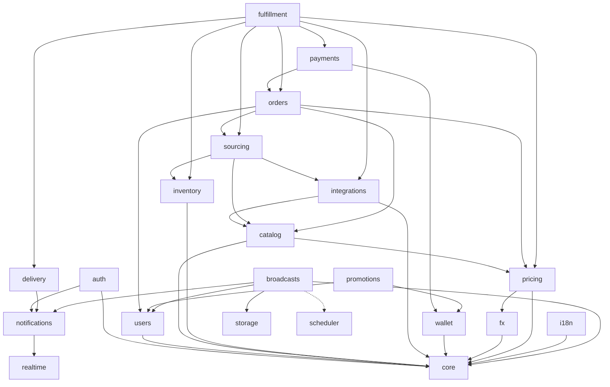

# YuPay — Module Map

Each module owns its tables and exposes a narrow Python interface via `apps/api/src/yupay/modules/<name>/api.py`. **No cross-module SQL joins.** Other modules call `api.py` or react to outbox events. This is the single rule that keeps future microservice extraction a refactor rather than a rewrite.

| Module           | Responsibility                                                                                                                                                                                                                                                                                                                                                                                                                                                                                                                                                   | Tables (key)                                                                                                   |
| ---------------- | ---------------------------------------------------------------------------------------------------------------------------------------------------------------------------------------------------------------------------------------------------------------------------------------------------------------------------------------------------------------------------------------------------------------------------------------------------------------------------------------------------------------------------------------------------------------- | -------------------------------------------------------------------------------------------------------------- |
| `core`           | Shared kernel: config, DB session, logging, errors, clock, id-gen, outbox runner, event bus                                                                                                                                                                                                                                                                                                                                                                                                                                                                      | `outbox_messages`, `idempotency_keys`, `processed_events`                                                      |
| `auth`           | Telegram OAuth (initData + Login Widget), **email/password registration/login/verification/reset** (argon2id hashing, `email_verify`/`password_reset` JWT kinds, single-use Redis reset marker, per-IP Redis guard on login/forgot), guest sessions, JWT issuance (EdDSA). Reads/writes `users`; uses Redis for reset markers (`auth:pwreset:{jti}`) and IP guard (`auth:ipguard:{bucket}:{ip}`); calls `notifications` email channel for verify/reset emails.                                                                                                   | `auth_sessions`, `telegram_links`                                                                              |
| `users`          | Profile, locale, KYC-lite flags                                                                                                                                                                                                                                                                                                                                                                                                                                                                                                                                  | `users`, `user_profiles`                                                                                       |
| `catalog`        | Products, categories, games, SKUs, denominations, multilingual content, per-brand FAQ (rendered on the brand page + emitted as FAQPage structured data; admin-managed via `/admin/catalog/brands/{id}/faqs` + `/admin/catalog/faqs/{id}`)                                                                                                                                                                                                                                                                                                                        | `products`, `categories`, `skus`, `sku_prices`, `product_translations`, `brand_faqs`, `brand_faq_translations` |
| `inventory`      | In-house code warehouse: bulk uploads, reservations, atomic issuance                                                                                                                                                                                                                                                                                                                                                                                                                                                                                             | `inventory_codes`, `inventory_reservations`, `inventory_uploads`                                               |
| `integrations`   | SKU↔supplier mappings, catalog cache, supplier health probes (adapter code lives in `fulfillment/suppliers/*`); `integrations → catalog` (write layer: `create_brand`/`product`/`sku`) for G2B game import                                                                                                                                                                                                                                                                                                                                                       | `sku_supplier_mapping`, `supplier_catalog_cache`                                                               |
| `sourcing`       | Decides where a SKU is fulfilled from (in-house vs supplier A vs supplier B + fallback)                                                                                                                                                                                                                                                                                                                                                                                                                                                                          | `sku_sourcing_rules`                                                                                           |
| `orders`         | Order aggregate, lifecycle FSM, idempotent creation, pricing snapshot                                                                                                                                                                                                                                                                                                                                                                                                                                                                                            | `orders`, `order_items`, `order_events`                                                                        |
| `payments`       | Gateway abstraction, intents, attempts, webhook verification & dispatch                                                                                                                                                                                                                                                                                                                                                                                                                                                                                          | `payments`, `payment_attempts`, `payment_webhooks`                                                             |
| `wallet`         | Double-entry ledger; balance is a projection; cashback, refunds, payouts                                                                                                                                                                                                                                                                                                                                                                                                                                                                                         | `wallet_accounts`, `wallet_postings`, `wallet_transactions`                                                    |
| `promo`          | Промокоды: выпуск (админ) и активация; кредитует `user_wallet` через ledger (ADR-0029)                                                                                                                                                                                                                                                                                                                                                                                                                                                                           | `promo_codes`, `promo_redemptions`                                                                             |
| `promotions`     | Promo codes, cashback rules, referral program                                                                                                                                                                                                                                                                                                                                                                                                                                                                                                                    | `promo_codes`, `promo_redemptions`, `cashback_rules`, `referrals`                                              |
| `fulfillment`    | Saga orchestrator (reserve → pay → fulfill → deliver, with compensations)                                                                                                                                                                                                                                                                                                                                                                                                                                                                                        | `fulfillment_tasks`, `fulfillment_attempts`                                                                    |
| `delivery`       | Final hand-off to user channels (in-app, email, telegram)                                                                                                                                                                                                                                                                                                                                                                                                                                                                                                        | `deliveries`                                                                                                   |
| `notifications`  | Channel abstraction: **email (Resend REST via `channels/email.py`)**, Telegram, WebSocket (via Redis pub/sub fan-out). Email channel sends four template types (`verify_email`, `password_reset`, `order_confirmation`, `order_delivered`) defined as dependency-free f-string builders in `templates.py`. Order emails are wired into `service.py` dispatch next to the Telegram branch, gated on `order.guest_email`; auth emails (verify/reset) are called from `auth/service.py` best-effort.                                                                | `notification_log`                                                                                             |
| `fx`             | FX rate provider chain, Redis cache, fallback, snapshot for orders                                                                                                                                                                                                                                                                                                                                                                                                                                                                                               | `fx_rates`, `fx_snapshots`                                                                                     |
| `pricing`        | Amount→units and amount→price conversions for variable-amount SKUs (Steam wallet top-ups); FX trust gate (`fx_guard`) that refuses to price off a stale/deviant/out-of-band rate — fails closed, never falls back to an unchecked rate (ADR-0032). Called by `catalog` (display price), `orders` (checkout pricing), `fulfillment` (Waxpeer gross-up)                                                                                                                                                                                                            | — (pure functions; reads `fx_rates`, owned by `fx`)                                                            |
| `i18n`           | Locale resolution, dictionaries, formatters                                                                                                                                                                                                                                                                                                                                                                                                                                                                                                                      | `translations` (or files)                                                                                      |
| `realtime`       | WebSocket gateway + Redis pub/sub bridge                                                                                                                                                                                                                                                                                                                                                                                                                                                                                                                         | —                                                                                                              |
| `stats`          | Admin dashboards: 24h operational KPIs (`/admin/stats/dashboard`) + range-windowed analytics (`/admin/stats/analytics/{business,ops}`, 7/30/90d, Redis-cached). Reads (read-only, for analytics aggregation): `orders`, `order_items`, `payments`, `payment_webhooks`, `fulfillment_tasks`, `inventory_codes`, `catalog` (sku/product/brand), `users`, `integrations` (`supplier_price_history`). Analytics aggregations live in `stats/analytics.py`. Margin is **approximate** (current `sku.cost_usdt`, NULL-cost rows excluded)                              | — (read-only aggregation; owns no tables)                                                                      |
| `admin` _(stub)_ | Reserved namespace for later (SQLAdmin or custom Next.js admin)                                                                                                                                                                                                                                                                                                                                                                                                                                                                                                  | —                                                                                                              |
| `storage`        | Presigned PUT URLs for direct-from-admin uploads to Cloudflare R2 (`cdn.yupay.uz` reads)                                                                                                                                                                                                                                                                                                                                                                                                                                                                         | — (file-backed, no DB tables)                                                                                  |
| `broadcasts`     | Admin-authored Telegram broadcasts: draft CRUD, send/schedule/cancel FSM, Telegram-HTML whitelist validation, audience sizing. **Delivery itself is not owned by this module** — the `apps/scheduler` `broadcast_dispatch` job imports `broadcasts.service`/`.models` directly (not `.api`) and fans out through the `notifications` Telegram channel; there is deliberately no outbox/broker involvement (ADR-0033). Reads `users`/`telegram_links` for audience targeting and `bot_blocked_at` exclusion; media comes from `storage` (`broadcast_media` kind). | `broadcasts`, `broadcast_recipients`; adds `telegram_links.bot_blocked_at`                                     |

## Dependency direction

Cycles are prohibited. When a "downstream" module needs to influence an "upstream" one, it does
so by emitting an event consumed by the upstream module's handler — not by importing it.

`scheduler` (dotted edge above) is not a `yupay.modules.*` package — it's the
separate `apps/scheduler` process. The dotted line marks it as an
out-of-process dependency rather than a Python import: the `broadcast_dispatch`
job reads/writes `broadcasts`' own tables directly and calls the
`notifications` Telegram channel itself, so `broadcasts`' delivery path
depends on that process running, without `broadcasts.api` ever importing
anything from it (see ADR-0033).
