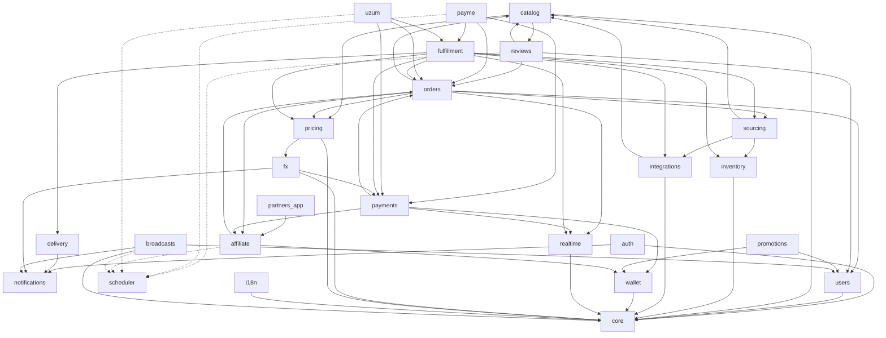

# YuPay — Module Map

Each module owns its tables and exposes a narrow Python interface via `apps/api/src/yupay/modules/<name>/api.py`. **No cross-module SQL joins.** Other modules call `api.py` or react to outbox events. This is the single rule that keeps future microservice extraction a refactor rather than a rewrite.

| Module           | Responsibility                                                                                                                                                                                                                                                                                                                                                                                                                                                                                                                                                                                                                                                                                                                                                                                                                                                                                                                                                                                                                                                                                                                                                                                                                                                                                                                                                                                                                                                                                                | Tables (key)                                                                                                                          |
| ---------------- | ------------------------------------------------------------------------------------------------------------------------------------------------------------------------------------------------------------------------------------------------------------------------------------------------------------------------------------------------------------------------------------------------------------------------------------------------------------------------------------------------------------------------------------------------------------------------------------------------------------------------------------------------------------------------------------------------------------------------------------------------------------------------------------------------------------------------------------------------------------------------------------------------------------------------------------------------------------------------------------------------------------------------------------------------------------------------------------------------------------------------------------------------------------------------------------------------------------------------------------------------------------------------------------------------------------------------------------------------------------------------------------------------------------------------------------------------------------------------------------------------------------- | ------------------------------------------------------------------------------------------------------------------------------------- |
| `core`           | Shared kernel: config, DB session, logging, errors, clock, id-gen, outbox runner, event bus                                                                                                                                                                                                                                                                                                                                                                                                                                                                                                                                                                                                                                                                                                                                                                                                                                                                                                                                                                                                                                                                                                                                                                                                                                                                                                                                                                                                                   | `outbox_messages`, `idempotency_keys`, `processed_events`                                                                             |
| `auth`           | Telegram OAuth (initData + Login Widget), **email/password registration/login/verification/reset** (argon2id hashing, `email_verify`/`password_reset` JWT kinds, single-use Redis reset marker, per-IP Redis guard on login/forgot), guest sessions, JWT issuance (EdDSA). Reads/writes `users`; uses Redis for reset markers (`auth:pwreset:{jti}`) and IP guard (`auth:ipguard:{bucket}:{ip}`); calls `notifications` email channel for verify/reset emails.                                                                                                                                                                                                                                                                                                                                                                                                                                                                                                                                                                                                                                                                                                                                                                                                                                                                                                                                                                                                                                                | `auth_sessions`, `telegram_links`                                                                                                     |
| `users`          | Profile, locale, KYC-lite flags                                                                                                                                                                                                                                                                                                                                                                                                                                                                                                                                                                                                                                                                                                                                                                                                                                                                                                                                                                                                                                                                                                                                                                                                                                                                                                                                                                                                                                                                               | `users`, `user_profiles`                                                                                                              |
| `catalog`        | Products, categories, games, SKUs, denominations, multilingual content, per-brand FAQ (rendered on the brand page + emitted as FAQPage structured data; admin-managed via `/admin/catalog/brands/{id}/faqs` + `/admin/catalog/faqs/{id}`); `BrandDetailOut.highlights` — localized value-prop chips (e.g. Steam's "0% комиссии") on `BrandTranslation`, resolved by `_pick_highlights` with row-level fallback (locale's translation row, else the `DEFAULT_LOCALE` row — no cross-locale field bleed) (ADR-0037)                                                                                                                                                                                                                                                                                                                                                                                                                                                                                                                                                                                                                                                                                                                                                                                                                                                                                                                                                                                             | `products`, `categories`, `skus`, `sku_prices`, `product_translations`, `brand_faqs`, `brand_faq_translations`                        |
| `inventory`      | In-house code warehouse: bulk uploads, reservations, atomic issuance                                                                                                                                                                                                                                                                                                                                                                                                                                                                                                                                                                                                                                                                                                                                                                                                                                                                                                                                                                                                                                                                                                                                                                                                                                                                                                                                                                                                                                          | `inventory_codes`, `inventory_reservations`, `inventory_uploads`                                                                      |
| `integrations`   | SKU↔supplier mappings, catalog cache, supplier health probes (adapter code lives in `fulfillment/suppliers/*`); `integrations → catalog` (write layer: `create_brand`/`product`/`sku`) for G2B game import                                                                                                                                                                                                                                                                                                                                                                                                                                                                                                                                                                                                                                                                                                                                                                                                                                                                                                                                                                                                                                                                                                                                                                                                                                                                                                    | `sku_supplier_mapping`, `supplier_catalog_cache`                                                                                      |
| `sourcing`       | Decides where a SKU is fulfilled from (in-house vs supplier A vs supplier B + fallback)                                                                                                                                                                                                                                                                                                                                                                                                                                                                                                                                                                                                                                                                                                                                                                                                                                                                                                                                                                                                                                                                                                                                                                                                                                                                                                                                                                                                                       | `sku_sourcing_rules`                                                                                                                  |
| `orders`         | Order aggregate, lifecycle FSM, idempotent creation, pricing snapshot. Its post-payment risk gate (`orders.risk`, ADR-0047/0062) reads `evidence` (ip/device/timezone) to evaluate window rules — rolling sum, velocity, shared identity, geo mismatch — across an identity's recent paid orders — current order included in the sums, so a single order at or above a sum cap can trip the rolling-sum rule by itself (velocity and shared-identity still need other orders); the same module's pre-charge veto (`precharge_veto`/`_veto_decision`, ADR-0063) refuses a charge outright — at the acquirers' pre-charge stage and at order creation — for a guest or fresh account whose `evidence.ip_country`/timezone falls outside `risk_home_countries`/`risk_home_timezones`, and `auto_refund_expired_holds` (same ADR, run by `apps/scheduler`'s `held_order_refund` job every 15 min) refunds a still-`paid`-and-held order once `risk_hold_auto_refund_hours` passes with nobody releasing or refunding it by hand where the gateway supports a merchant-initiated refund (`octo`, `wallet`) — for Payme/Click/Uzum, all three cabinet-refund-only (see their rows below), it escalates once to the admin channel instead of ever calling `refund_admin`                                                                                                                                                                                                                                             | `orders`, `order_items`, `order_events`                                                                                               |
| `payments`       | Gateway abstraction, intents, attempts, webhook verification & dispatch. Owns admin-controlled provider state (`provider_state.py`, `provider_admin.py`, `provider_analytics.py`): a DB-backed `active`/`disabled`/`maintenance` per logical provider (Click's `click`+`click_miniapp` slugs move together), consulted by `create_intent` (blocks new intents only — webhook/callback settlement never checks it, so in-flight payments still settle) and the storefront `GET /providers` endpoint; admin CRUD + per-provider analytics/incidents live under `/admin/payments/providers` (ADR-0041)                                                                                                                                                                                                                                                                                                                                                                                                                                                                                                                                                                                                                                                                                                                                                                                                                                                                                                           | `payments`, `payment_attempts`, `payment_webhooks`, `payment_provider_states`                                                         |
| `payme`          | Payme (Paycom) Merchant API: **we are the provider's JSON-RPC server**, not a webhook receiver. `POST /api/v1/payments/payme/merchant` implements the 7 methods (`CheckPerformTransaction`/`CreateTransaction`/`PerformTransaction`/`CancelTransaction`/`CheckTransaction`/`GetStatement`/`SetFiscalData`) driving Payme's own transaction state machine (`1`/`2`/`-1`/`-2`); `PerformTransaction`/`CancelTransaction` settle or reverse money through `payments.service`'s existing chokepoints (`settle_provider_payment`/`reverse_provider_payment`/`cancel_pending_provider_payment`), never a second FSM path. The `payments/gateways/payme.py` adapter builds the checkout URL (`create_intent`) and always 409s on `refund` (Payme refunds are cabinet-initiated, auto-reconciled via `CancelTransaction`). Reads `orders` via `account.order_id`; reads `fulfillment`'s `FulfillmentTask` status to gate the `-31007` partial-delivery refund guard; the out-of-process `apps/scheduler` `payme_timeout` job auto-cancels stale state-1 transactions after 12h (ADR-0034).                                                                                                                                                                                                                                                                                                                                                                                                                            | `payme_transactions`                                                                                                                  |
| `uzum`           | Uzum Bank Merchant API: **we are the provider's HTTP/JSON webhook server**, not a webhook receiver, and **we** own the transaction state machine (unlike Payme, whose own protocol state is authoritative). `POST /api/v1/payments/uzum/{check,create,confirm,reverse,status}` implements the 5 endpoints driving our own `UzumTransaction` state machine (`CREATED`/`CONFIRMED`/`REVERSED`/`FAILED`); `/confirm`/`/reverse` settle or reverse money through `payments.service`'s existing chokepoints (`settle_provider_payment`/`reverse_provider_payment`/`cancel_pending_provider_payment`), never a second FSM path. Idempotency is signalled by dedicated error codes (`10010`/`10016`/`10018`) rather than Payme's echo. The `payments/gateways/uzum.py` adapter builds the open-service deep-link checkout URL (`create_intent`) and always raises on `refund` (Uzum refunds are reconciled entirely via Uzum-initiated `/reverse`, no merchant-side trigger at all). Reads `orders` via `params.order_id`; reads `fulfillment`'s `FulfillmentTask` status to gate the `10017` partial-delivery refund guard; the out-of-process `apps/scheduler` `uzum_timeout` job auto-fails stale `CREATED` transactions after 30 min (ADR-0035).                                                                                                                                                                                                                                                                 | `uzum_transactions`                                                                                                                   |
| `click`          | Click Shop API: **we are the provider's form-encoded webhook server**, not a webhook receiver, and **we** own the transaction state machine, same as Uzum. `POST /api/v1/payments/click/{prepare,complete}` implements the 2 endpoints driving our own `ClickTransaction` state machine (`PREPARED`/`CONFIRMED`/`CANCELLED`); `/complete` settles money through `payments.service`'s existing chokepoint (`settle_provider_payment`), never a second FSM path — Click v1 has no merchant-initiated refund at all, so there is no `reverse_provider_payment` caller here. Auth is an MD5 `sign_string` over the raw form fields, keyed on a **per-service** secret (`signature.py`), not HTTP Basic auth. **Two services share one merchant** — routed as two `PaymentGateway` provider ids, `click` (web, service `108149`) and `click_miniapp` (bot, service `108150`), both backed by one parametrised `ClickGateway` class; the inbound `service_id` field (not the outbound provider choice) picks the secret and the backing payment's provider. A negative inbound `error` field (Click-initiated abort) or the stale-prepare sweep both cancel via `cancel_pending_provider_payment`. The `payments/gateways/click.py` adapter builds the `my.click.uz/services/pay` checkout URL (`create_intent`) and always raises on `refund`. Reads `orders` via `merchant_trans_id`; the out-of-process `apps/scheduler` `click_timeout` job auto-cancels stale `PREPARED` transactions after 30 min (ADR-0036). | `click_transactions`                                                                                                                  |
| `wallet`         | Double-entry ledger; balance is a projection; cashback, refunds, payouts; customer 1:1 top-up (`POST /wallet/topup`, ADR-0058)                                                                                                                                                                                                                                                                                                                                                                                                                                                                                                                                                                                                                                                                                                                                                                                                                                                                                                                                                                                                                                                                                                                                                                                                                                                                                                                                                                                | `wallet_accounts`, `wallet_postings`, `wallet_transactions`                                                                           |
| `promo`          | Промокоды: выпуск (админ) и активация; кредитует `user_wallet` через ledger (ADR-0029)                                                                                                                                                                                                                                                                                                                                                                                                                                                                                                                                                                                                                                                                                                                                                                                                                                                                                                                                                                                                                                                                                                                                                                                                                                                                                                                                                                                                                        | `promo_codes`, `promo_redemptions`                                                                                                    |
| `affiliate`      | Партнёрская программа: партнёры и заявки, коды со скидкой 3–10%, пожизненная привязка покупателя, скидка в оформлении заказа и её учёт в марже, привязка покупателя при оплате, начисление комиссии 1–2% свипом планировщика, баланс и заявки на вывод (ADR-0061)                                                                                                                                                                                                                                                                                                                                                                                                                                                                                                                                                                                                                                                                                                                                                                                                                                                                                                                                                                                                                                                                                                                                                                                                                                             | `affiliate_partners`, `affiliate_codes`, `affiliate_attributions`, `affiliate_commissions`, `affiliate_payouts`, `affiliate_sessions` |
| `partners` (app) | Сайт партнёрской программы на partners.yupay.uz: лендинг с заявкой, вход, панель с балансом, статистикой, начислениями и заявками на вывод                                                                                                                                                                                                                                                                                                                                                                                                                                                                                                                                                                                                                                                                                                                                                                                                                                                                                                                                                                                                                                                                                                                                                                                                                                                                                                                                                                    | — (Next.js, ходит в `affiliate` API)                                                                                                  |
| `reviews`        | Brand reviews & ratings: verified-buyer (delivered order containing the brand) 1–5 star reviews, post-moderation (publish immediately; admin hide/unhide/remove; user report + auto-hide ≥3), one per `(user, order, brand)`, immutable. Denormalized aggregate in `brand_rating_stats` bumped transactionally; `catalog` reads it via `reviews.api.get_stats` (batch, no N+1). Nightly scheduler reconcile. SEO `aggregateRating`. (ADR-0039)                                                                                                                                                                                                                                                                                                                                                                                                                                                                                                                                                                                                                                                                                                                                                                                                                                                                                                                                                                                                                                                                | `reviews`, `review_reports`, `brand_rating_stats`                                                                                     |
| `promotions`     | Promo codes, cashback rules, referral program                                                                                                                                                                                                                                                                                                                                                                                                                                                                                                                                                                                                                                                                                                                                                                                                                                                                                                                                                                                                                                                                                                                                                                                                                                                                                                                                                                                                                                                                 | `promo_codes`, `promo_redemptions`, `cashback_rules`, `referrals`                                                                     |
| `fulfillment`    | Saga orchestrator (reserve → pay → fulfill → deliver, with compensations)                                                                                                                                                                                                                                                                                                                                                                                                                                                                                                                                                                                                                                                                                                                                                                                                                                                                                                                                                                                                                                                                                                                                                                                                                                                                                                                                                                                                                                     | `fulfillment_tasks`, `fulfillment_attempts`                                                                                           |
| `delivery`       | Final hand-off to user channels (in-app, email, telegram)                                                                                                                                                                                                                                                                                                                                                                                                                                                                                                                                                                                                                                                                                                                                                                                                                                                                                                                                                                                                                                                                                                                                                                                                                                                                                                                                                                                                                                                     | `deliveries`                                                                                                                          |
| `evidence`       | Chargeback defence: one immutable `order_evidence` row per order holding the request context an acquirer asks for when a cardholder disputes a payment (IP, User-Agent, Accept-Language, passive browser hints). Written by `orders`' create route _after_ the order exists and inside a SAVEPOINT, so a failed capture can never cost the sale; idempotent, so an `Idempotency-Key` retry keeps the original context. The pack served at `GET /admin/orders/{id}/evidence` joins the capture to `orders`' own `order_events` timeline. Retention is stamped per row (`purge_after`, default 600 days — Payme's Общие условия п. 6.3.2 require 540) and enforced by the `apps/scheduler` `purge_evidence` job. Only place in the schema holding an unhashed IP; deliberate exception to AGENTS.md §9 (ADR-0044).                                                                                                                                                                                                                                                                                                                                                                                                                                                                                                                                                                                                                                                                                              | `order_evidence`                                                                                                                      |
| `notifications`  | Channel abstraction: **email (Resend REST via `channels/email.py`)**, Telegram. Email channel sends four template types (`verify_email`, `password_reset`, `order_confirmation`, `order_delivered`) defined as dependency-free f-string builders in `templates.py`. Order emails are wired into `service.py` dispatch next to the Telegram branch, gated on `order.guest_email`; auth emails (verify/reset) are called from `auth/service.py` best-effort. Live order-status push is a **separate** module (`realtime`) — `orders`/`payments`/`fulfillment` call it directly, not through this one.                                                                                                                                                                                                                                                                                                                                                                                                                                                                                                                                                                                                                                                                                                                                                                                                                                                                                                           | `notification_log`                                                                                                                    |
| `fx`             | FX rate provider chain, Redis cache, fallback, snapshot for orders; per-quote admin toggle (ADR-0055); admin-ordered adapters with live per-provider quotes (ADR-0057); 5-min refresh job + 6% drop-only tripwire that pages ops and puts active payment providers (including wallet) into maintenance (ADR-0056)                                                                                                                                                                                                                                                                                                                                                                                                                                                                                                                                                                                                                                                                                                                                                                                                                                                                                                                                                                                                                                                                                                                                                                                             | `fx_rates`, `fx_snapshots`, `fx_quote_settings`, `fx_provider_settings`                                                               |
| `pricing`        | Amount→units and amount→price conversions for variable-amount SKUs (Steam wallet top-ups); FX trust gate (`fx_guard`) that refuses to price off a stale/deviant/out-of-band rate — fails closed, never falls back to an unchecked rate (ADR-0032). Called by `catalog` (display price), `orders` (checkout pricing), `fulfillment` (Waxpeer gross-up)                                                                                                                                                                                                                                                                                                                                                                                                                                                                                                                                                                                                                                                                                                                                                                                                                                                                                                                                                                                                                                                                                                                                                         | — (pure functions; reads `fx_rates`, owned by `fx`)                                                                                   |
| `i18n`           | Locale resolution, dictionaries, formatters                                                                                                                                                                                                                                                                                                                                                                                                                                                                                                                                                                                                                                                                                                                                                                                                                                                                                                                                                                                                                                                                                                                                                                                                                                                                                                                                                                                                                                                                   | `translations` (or files)                                                                                                             |
| `realtime`       | WebSocket gateway for live order-status pushes to logged-in users, fanned out via Redis pub/sub (transitions fire in `api`/`worker`/`scheduler`; the socket lives in one `api` instance). `POST /realtime/handshake` mints a 60s `kind="ws"` JWT scoped to the caller's own `channel="user:{id}"`; `WS /realtime/ws/orders?token=…` verifies it, subscribes to `realtime:user:{id}`, forwards messages, and sends a 25s server ping. `publish_order_event(user_id, message)` is the sole write surface — a no-op for guest orders. **Domain rule: a fulfillment failure is not an order failure** — a paid order stays at `fulfilling` for admin remediation rather than moving to a customer-facing `failed`, so `order.failed` is defined in the wire contract but never emitted, and there is no customer "failed" modal (ADR-0040).                                                                                                                                                                                                                                                                                                                                                                                                                                                                                                                                                                                                                                                                       | —                                                                                                                                     |
| `stats`          | Admin dashboards: 24h operational KPIs (`/admin/stats/dashboard`) + range-windowed analytics (`/admin/stats/analytics/{business,ops}`, 7/30/90d, Redis-cached). Reads (read-only, for analytics aggregation): `orders`, `order_items`, `payments`, `payment_webhooks`, `fulfillment_tasks`, `inventory_codes`, `catalog` (sku/product/brand), `users`, `integrations` (`supplier_price_history`). Analytics aggregations live in `stats/analytics.py`. Margin is **approximate** (current `sku.cost_usdt`, NULL-cost rows excluded)                                                                                                                                                                                                                                                                                                                                                                                                                                                                                                                                                                                                                                                                                                                                                                                                                                                                                                                                                                           | — (read-only aggregation; owns no tables)                                                                                             |
| `admin` _(stub)_ | Reserved namespace for later (SQLAdmin or custom Next.js admin)                                                                                                                                                                                                                                                                                                                                                                                                                                                                                                                                                                                                                                                                                                                                                                                                                                                                                                                                                                                                                                                                                                                                                                                                                                                                                                                                                                                                                                               | —                                                                                                                                     |
| `storage`        | Presigned PUT URLs for direct-from-admin uploads to Cloudflare R2 (`cdn.yupay.uz` reads)                                                                                                                                                                                                                                                                                                                                                                                                                                                                                                                                                                                                                                                                                                                                                                                                                                                                                                                                                                                                                                                                                                                                                                                                                                                                                                                                                                                                                      | — (file-backed, no DB tables)                                                                                                         |
| `broadcasts`     | Admin-authored Telegram broadcasts: draft CRUD, send/schedule/cancel FSM, Telegram-HTML whitelist validation, audience sizing. **Delivery itself is not owned by this module** — the `apps/scheduler` `broadcast_dispatch` job imports `broadcasts.service`/`.models` directly (not `.api`) and fans out through the `notifications` Telegram channel; there is deliberately no outbox/broker involvement (ADR-0033). Reads `users`/`telegram_links` for audience targeting and `bot_blocked_at` exclusion. Media is uploaded via `storage`'s presign flow (`broadcast_media` kind) at the admin-SPA level — like every other admin image upload (see `catalog`'s `brand_logo`/`product_image` kinds) — and the resulting URL is then saved onto the broadcast row over HTTP; this module's backend code never imports `storage`, so no edge is drawn for it below.                                                                                                                                                                                                                                                                                                                                                                                                                                                                                                                                                                                                                                           | `broadcasts`, `broadcast_recipients`; adds `telegram_links.bot_blocked_at`                                                            |

## Dependency direction

Cycles are prohibited. When a "downstream" module needs to influence an "upstream" one, it does
so by emitting an event consumed by the upstream module's handler — not by importing it.

`scheduler` (dotted edge above) is not a `yupay.modules.*` package — it's the
separate `apps/scheduler` process. The dotted line marks it as an
out-of-process dependency rather than a Python import: the `broadcast_dispatch`
job reads/writes `broadcasts`' own tables directly and calls the
`notifications` Telegram channel itself, so `broadcasts`' delivery path
depends on that process running, without `broadcasts.api` ever importing
anything from it (see ADR-0033).

Same story for `payme -.-> scheduler`: the `apps/scheduler` `payme_timeout`
job imports `payme.models`/`payments.service` directly (not `payme.api`) to
auto-cancel state-1 transactions Payme itself never followed up on after
12h, so `payme`'s timeout guarantee depends on that process running, without
`payme.api` importing anything from `scheduler` in the other direction (see
ADR-0034).

And again for `uzum -.-> scheduler`: the `apps/scheduler` `uzum_timeout` job
imports `uzum.models`/`payments.service` directly (not `uzum.api`) to
auto-fail `CREATED` transactions Uzum itself never confirmed or reversed
after 30 minutes, so `uzum`'s timeout guarantee likewise depends on that
process running, without `uzum.api` importing anything from `scheduler` in
the other direction (see ADR-0035).

And again for `click -.-> scheduler`: the `apps/scheduler` `click_timeout` job
imports `click.service`/`click.models` directly (not `click.api`) to cancel
`PREPARED` transactions Click itself never followed up with a `/complete`
call after 30 minutes, so `click`'s timeout guarantee likewise depends on
that process running, without `click.api` importing anything from
`scheduler` in the other direction (see ADR-0036).

The `catalog <--> reviews` pair is a deliberate two-way edge, not a cycle to
break: `reviews.service` reads `catalog`'s `Brand`/`Product`/`Sku` **models**
(to resolve a brand by slug and verify the order contains it), while
`catalog.service` reads `reviews`' aggregate via `reviews.service.get_stats`
to attach `rating` to brand DTOs. To keep the storefront render path free of
an import cycle at bootstrap, `catalog.service` imports `reviews.service`
directly rather than `reviews.api` (whose `routes` would pull the whole
`api/v1` router stack) — the same trap the scheduler jobs avoid. The
`reviews -.-> scheduler` dotted edge marks the nightly `recompute_review_stats`
job, which imports `reviews.service.recompute_all_stats` directly to rebuild
`brand_rating_stats` from published reviews — a drift safety net over the
transactional bumps (see ADR-0039).

The `orders --> realtime`, `payments --> realtime`, and `fulfillment -->
realtime` edges are publish-only: each service calls
`realtime.api.publish_order_event(order.user_id, message)` right after an
order-status transition, via a **lazy, function-local import**
(`from yupay.modules.realtime import api as realtime`) rather than a
module-level one — importing at module scope would pull `realtime.routes`,
and with it the whole `api/v1` router stack, into every
`orders`/`payments`/`fulfillment` import, the same trap the scheduler jobs and
`catalog`↔`reviews` avoid above. `realtime --> core` is the Redis pub/sub
connection (`get_redis()`), not a shared table — `realtime` owns no tables of
its own. The web/miniapp frontends are WS **clients** of `realtime`'s
`/ws/orders` endpoint, an out-of-process dependency like `scheduler` rather
than a Python import, so — like `scheduler` — it is not drawn as a module edge
here (see `docs/decisions/0040-order-realtime-ws.md`).
