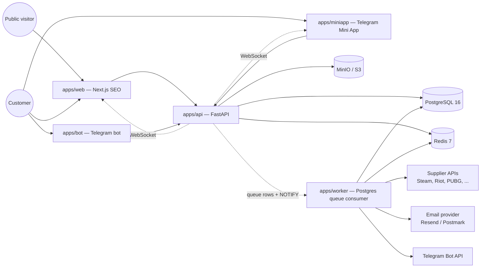

# YuPay — Architecture Overview

YuPay is a **modular monolith** on FastAPI with two Next.js clients (public web + Telegram
Mini App). The monolith is decomposed into bounded contexts that communicate via narrow
in-process interfaces and asynchronous domain events on a transactional outbox. Every module
is shaped to be extractable into a separate service later without rewrites.

## System context (C4 L1)

## Modules (C4 L2)

See [`module-map.md`](./module-map.md) for the authoritative list. Short summary:

`core` · `auth` · `users` · `catalog` · `inventory` · `integrations` · `sourcing` · `orders`
· `payments` · `wallet` · `promotions` · `fulfillment` · `delivery` · `notifications` · `fx`
· `i18n` · `realtime` · `admin` (stub).

## Critical patterns

- **Idempotency** on every mutating endpoint and every webhook (provider event ID or
  `Idempotency-Key` header).
- **Transactional outbox** for reliable domain event publishing.
- **Orchestrated saga** for the purchase flow: `PriceLock → Reserve → Pay → Fulfill →
Deliver → Reward`. State lives in `fulfillment_tasks`.
- **Double-entry ledger** for the wallet (append-only postings, debit = credit invariant per
  currency per transaction).
- **Payment gateway abstraction** — common protocol for Stripe / PayPal / YooKassa / Click /
  Payme / Uzum / Crypto.
- **Supplier abstraction** — `SupplierClient` protocol with `tenacity` retries and
  `purgatory` circuit breakers per vendor.
- **Metrics** — per-route counts/latencies come from the FastAPI instrumentator; domain
  counters live in `core.metrics` with closed `Literal` label vocabularies and recorders
  that can never fail a request. Never a label: an id, a link, a nickname, an IP.
  Catalogue: [`metrics.md`](./metrics.md).
- **FX** — USD as the canonical currency. Display prices converted on the fly with cached
  rates; checkout snapshots the rate into `fx_snapshots`.

## Scale targets

- 1–5K orders/day, ~200 RPS peak at launch.
- Three locales: RU (default), EN, UZ.
- Single-VPS deployment to start; horizontal split documented in
  [`scaling-roadmap.md`](./scaling-roadmap.md) (TODO).
