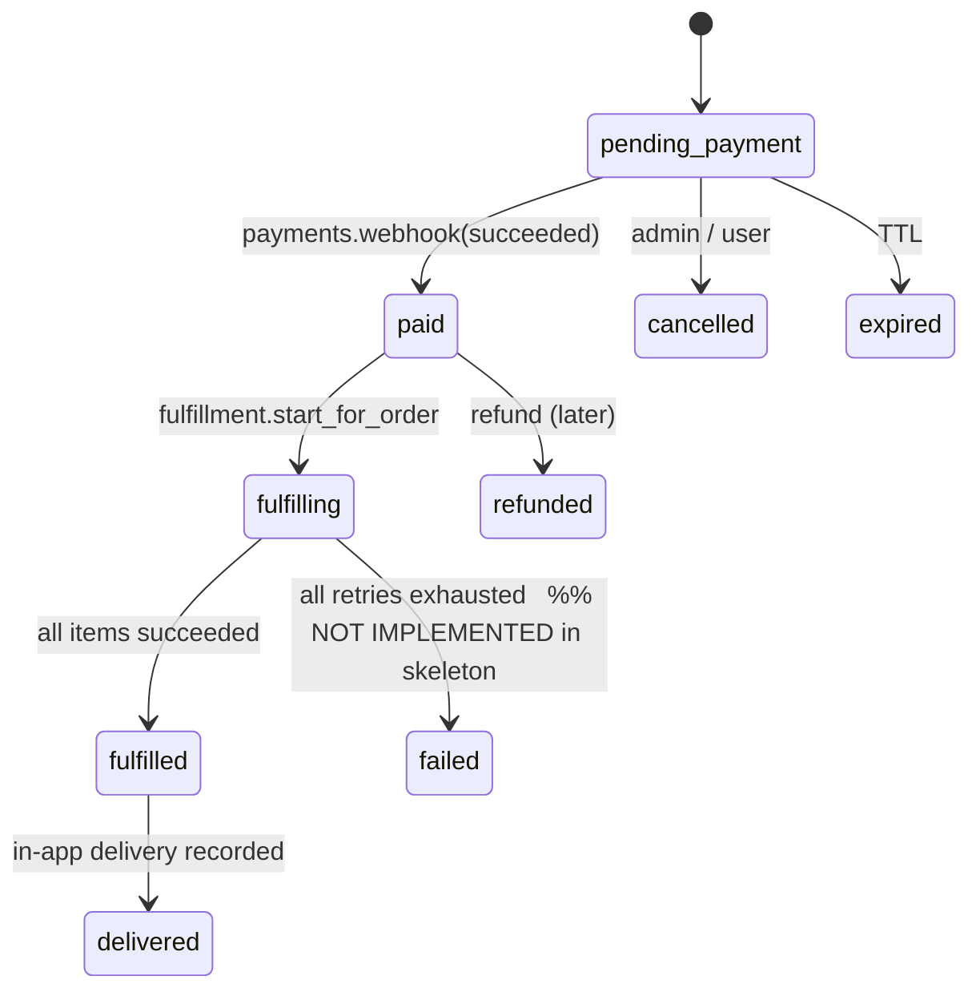

# 0013. Fulfilment skeleton: mock provider + supplier stubs

- **Status**: Accepted
- **Date**: 2026-05-16
- **Builds on**: ADR-0011 (order FSM), ADR-0012 (payments skeleton)
- **Deciders**: founding team
- **Tags**: backend, fulfilment, integrations

## Context

After [[ADR-0012]] (payments) an order can reach `paid`. Nothing downstream picks
it up yet — there's no orchestrator, no audit, no place for delivery artifacts to
land. At the same time we have **zero real supplier contracts** (Steam, Riot,
PUBG/Tencent, Spotify, Apple, voucher warehouse) and an empty `integrations`
module. We need to:

1. Fix the boundary now so a real supplier adapter is a drop-in later.
2. Be able to walk an order through the full lifecycle end-to-end in dev/staging
   without any external dependency (so QA, frontend, and admin can build against
   real flows).
3. Not bake assumptions about a specific supplier's request/response shape into
   tables or into the order FSM.

## Decision

Land a **mock-end-to-end fulfiller** that completes the fulfilment flow in
process, plus **stubs** for every supplier we intend to integrate. The
orchestrator is a synchronous in-app saga today; it gets moved into the Dramatiq
worker without an interface change later (see §"Migration to async worker").

### Tables (migration `0008_fulfillment_init`)

```
fulfillment_tasks
  id                UUID PK
  order_id          UUID NOT NULL → orders.id ON DELETE CASCADE
  order_item_id     UUID NOT NULL → order_items.id ON DELETE CASCADE  (UNIQUE)
  supplier          VARCHAR(32) NOT NULL          -- 'mock' | 'steam' | ...
  status            VARCHAR(24) NOT NULL          -- pending | in_progress | succeeded | failed | cancelled
  attempts_count    INTEGER NOT NULL DEFAULT 0
  next_attempt_at   TIMESTAMPTZ NULL              -- when reconciler should retry
  last_error        TEXT NULL
  external_order_id VARCHAR(128) NULL             -- supplier-side reference
  metadata          JSONB NOT NULL DEFAULT '{}'
  created_at, updated_at, succeeded_at, failed_at, cancelled_at  TIMESTAMPTZ

fulfillment_attempts
  id              UUID PK
  task_id         UUID NOT NULL → fulfillment_tasks.id ON DELETE CASCADE
  kind            VARCHAR(24) NOT NULL    -- fulfill | status_check | cancel
  status          VARCHAR(16) NOT NULL    -- ok | error
  payload         JSONB NOT NULL DEFAULT '{}'
  error           TEXT NULL
  created_at      TIMESTAMPTZ NOT NULL DEFAULT now()

deliveries
  id              UUID PK
  order_item_id   UUID NOT NULL → order_items.id ON DELETE CASCADE  (UNIQUE)
  channel         VARCHAR(24) NOT NULL    -- 'in_app' (default) | 'email' | 'telegram'
  artifact_kind   VARCHAR(24) NOT NULL    -- 'voucher_code' | 'topup_receipt' | 'license_key'
  artifact        JSONB NOT NULL          -- {"code": "...", "expires_at": "...", ...}
  delivered_at    TIMESTAMPTZ NOT NULL DEFAULT now()
```

Status check constraints + a partial unique `(supplier, external_order_id) WHERE
external_order_id IS NOT NULL` to dedup supplier-side reconciliation.

### Fulfiller protocol

```python
class Fulfiller(Protocol):
    supplier: str

    @property
    def available(self) -> bool: ...

    async def fulfill(
        self,
        *,
        order: Order,
        item: OrderItem,
        idempotency_key: str,
    ) -> FulfillResult: ...

    async def check_status(
        self,
        *,
        task: FulfillmentTask,
    ) -> FulfillStatus: ...

    async def cancel(
        self,
        *,
        task: FulfillmentTask,
    ) -> None: ...
```

`FulfillResult` carries:
- `external_order_id: str | None` — supplier-side reference for reconciliation
- `outcome: Literal["succeeded", "in_progress", "failed"]`
- `artifact: dict | None` — populated when `succeeded` and the supplier hands us
  the deliverable inline (e.g. a voucher code)
- `error: str | None` — for `failed`

### Providers

| Slug | Status | Behaviour |
|---|---|---|
| `mock` | functional in dev/staging | Always returns `succeeded` immediately with a fake artifact (`voucher_code = "MOCK-<order_item_id>"`). Disabled in prod. |
| `steam` | stub | `available=False`, every method → `FulfillerNotIntegratedError` |
| `riot` | stub | idem |
| `pubg` | stub | idem (Tencent / Midasbuy) |
| `spotify` | stub | idem |
| `apple` | stub | idem |
| `voucher_inventory` | stub | will read codes from the future `inventory_codes` table |

### Orchestration (saga today, in-process)

1. **Trigger.** `payments._mark_payment_succeeded` calls
   `fulfillment.api.start_for_order(order_id)` **in the same DB transaction**.
   When we move to Dramatiq, payments writes an outbox row instead and the
   worker picks it up.
2. **Plan.** `start_for_order` creates one `FulfillmentTask` per `OrderItem`. The
   supplier is resolved via `sourcing` (today: hard-coded `mock`).
3. **Order FSM.** Order moves `paid → fulfilling` synchronously.
4. **Execute.** Each task is processed (`process_task`): set `in_progress` →
   call `fulfiller.fulfill(...)` → on success persist `FulfillmentAttempt(ok)`,
   set task `succeeded`, write `Delivery` row, set `order_items.fulfillment_state
   = "fulfilled"`. On failure: persist attempt as `error`, set task to `failed`
   (skeleton stage — no retry policy yet).
5. **Settle order.** When every item is `fulfilled` the order moves
   `fulfilling → fulfilled → delivered` (the skeleton collapses the two — once
   the artifact is recorded in `deliveries` we consider it delivered through the
   default in-app channel).

### FSM (combined)



### Idempotency

- Per-item: `(supplier, external_order_id) UNIQUE WHERE NOT NULL` lets the
  reconciler safely retry status checks.
- Per-task: `fulfillment_tasks.order_item_id` is unique — a duplicate
  `start_for_order` call is a no-op (`ON CONFLICT DO NOTHING` semantics in the
  service, not the DB).
- The `idempotency_key` passed to the supplier is the deterministic
  `task.id` so retries land on the same supplier-side request.

### HTTP

```
GET  /api/v1/orders/{order_id}/deliveries           — owner-only, returns artifacts
GET  /api/v1/admin/fulfillment/tasks                — admin list (filters: order_id, status, supplier)
POST /api/v1/admin/fulfillment/tasks/{id}/retry     — admin re-runs a failed task
POST /api/v1/admin/fulfillment/tasks/{id}/cancel    — admin cancels a pending/failed task
```

## What we are NOT doing yet

- **No retry policy.** A failed task stays `failed` until an admin retries. The
  reconciler that wakes up stuck `in_progress` tasks lands with the first real
  supplier adapter.
- **No supplier-specific webhooks.** A real supplier with asynchronous
  fulfilment (e.g. Steam wallet pending review) will get a webhook receiver
  later — the path will mirror `webhooks/payments/{provider}`.
- **No partial fulfilment.** Either every item lands a delivery or the order
  stays `fulfilling`. Splitting an order into independently shippable bundles is
  a future product decision.
- **No multi-channel delivery.** `deliveries.channel = "in_app"` only.
  Email/Telegram delivery hooks land with the `notifications` module.

## Migration to async worker

When Dramatiq is wired in:
1. `payments._mark_payment_succeeded` writes `outbox_messages(kind="order.paid",
   payload={order_id})` instead of calling the service directly.
2. A Dramatiq actor reads outbox + calls `fulfillment.api.start_for_order`.
3. `process_task` itself is dispatched as a separate actor per task with
   `tenacity` retries + `purgatory` circuit breaker per supplier.

No public-API change. The synchronous path remains as a fallback for tests.

## Consequences

- Customers and admin can walk an order from cart through delivered in dev/staging
  immediately.
- Adding a real supplier = implement `Fulfiller` + register slug + write
  integration tests for success / retryable failure / duplicate-request replay.
- The synchronous-saga shortcut adds **one extra DB transaction** to the payment
  webhook path. Acceptable while throughput is in the dozens-per-minute range;
  must move to the worker before launch.

---

## Update — manual fulfilment (2026-05-22)

`ManualFulfiller` joins the registry as a non-stub supplier with
`available=True` regardless of `Settings.is_prod`. Routing happens through
the existing `sourcing` module (new `mode="manual"`, see ADR-0015 update).
`fulfill()` returns `outcome="in_progress"`; the task parks in the admin
queue until an operator finalises it through one of two new admin routes:

- `POST /admin/fulfillment/tasks/{id}/complete` — creates the `Delivery`
  row with the supplied artifact, flips task → `succeeded`, item →
  `delivered`, and calls `_try_settle_order` (same path supplier-success
  uses).
- `POST /admin/fulfillment/tasks/{id}/fail` — task → `failed` with the
  admin's reason recorded in `last_error`. The order stays in `fulfilling`;
  the refund (if any) is initiated separately via
  `/admin/payments/{id}/refund`, keeping the money side under explicit
  admin control.

Both endpoints guard on `supplier == "manual" AND status == "in_progress"`.
Double-completion is also caught at the DB level by the
`UNIQUE(order_item_id)` constraint on `deliveries`. Audit fields
`admin_note` and `completed_by` were added to `fulfillment_tasks` as plain
columns rather than overloading `extra_metadata` (which gets merged with
supplier-returned metadata in `service.py`).
