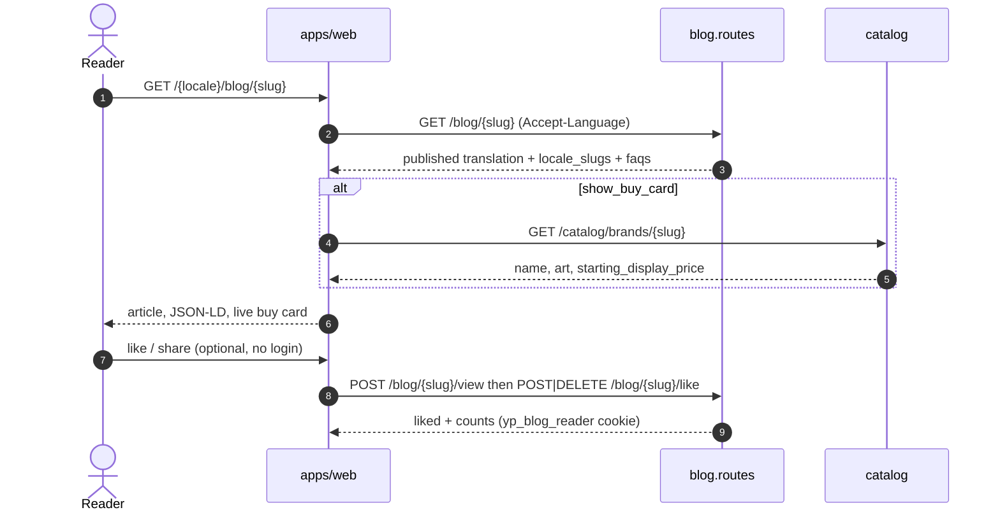

# Read a published blog post

A guest opens an editorial URL on the storefront. Prices come from the live
catalogue, not from the article HTML.

Drafts and missing locales are 404. Archive keeps `published_at` so an
indexed URL can still be explained later; v1 does not hard-delete.
