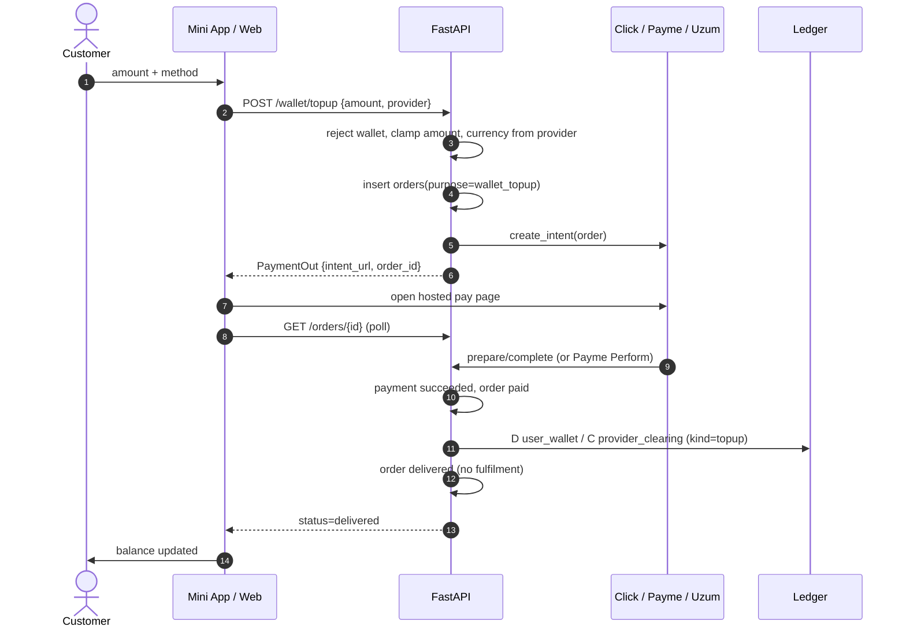
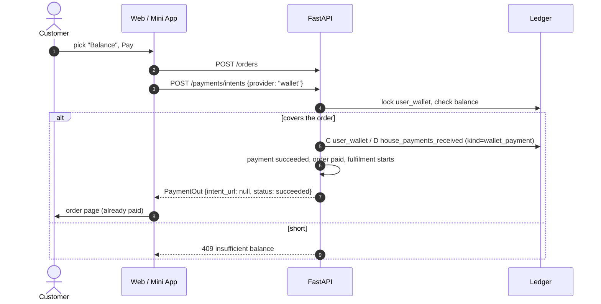

# Wallet top-up and paying from the balance

Customer funds `user_wallet` in the same currency they pay with. No FX.
See [ADR-0058](../../decisions/0058-wallet-customer-topup.md).

Limits: UZS 10 000–5 000 000 (whole so'm); USDT 5–500 (0.01). Topping the
wallet up _from_ the wallet is refused.

## Surfaces

Both storefronts run the same endpoints; only the entry points differ.

|           | Mini App                     | Web                                                    |
| --------- | ---------------------------- | ------------------------------------------------------ |
| Balance   | wallet tab                   | chip in the header (desktop), account menu, mobile nav |
| Top-up    | `/wallet/top-up`             | `/account/wallet/top-up`                               |
| Acquirers | `click_miniapp`, Payme, Uzum | `click`, Payme, Uzum                                   |

Click bills through a per-surface merchant service, so the web must send
`click` and the mini app `click_miniapp`. `X-Yupay-Surface` (set by each
app's API client) is what records the order's `source`.

## Paying an order from the balance

`WalletGateway` is not an acquirer: it posts against our own ledger inside
`create_intent` and returns `status="succeeded"` with `intent_url: null`, so
there is no hosted page and no webhook. The storefront's existing
"no intent_url" branch already lands on the order, which is why paying from
the balance needed no second checkout path.

The whole order is charged or none of it: there is no split between the
balance and a card. The storefront therefore refuses the tile before
submitting — showing the shortfall — rather than letting the gateway answer
409 after the order row exists.
