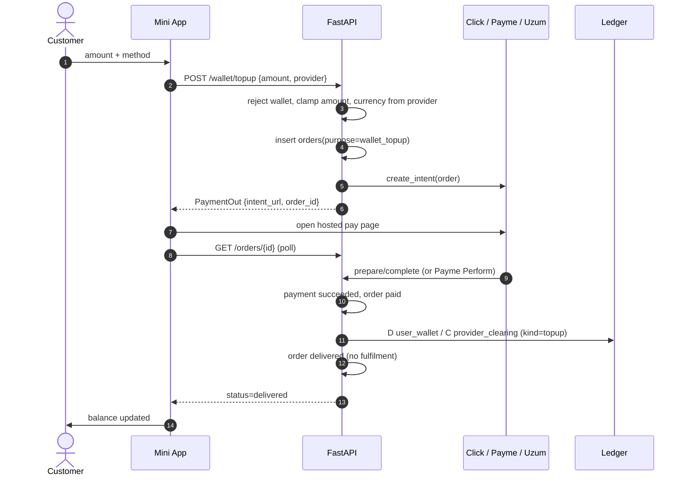

# Wallet top-up (mini app)

Customer funds `user_wallet` in the same currency they pay with. No FX.
See [ADR-0058](../../decisions/0058-wallet-customer-topup.md).

Limits: UZS 10 000–5 000 000 (whole so'm); USDT 5–500 (0.01). Paying from
the YuPay wallet is refused.
