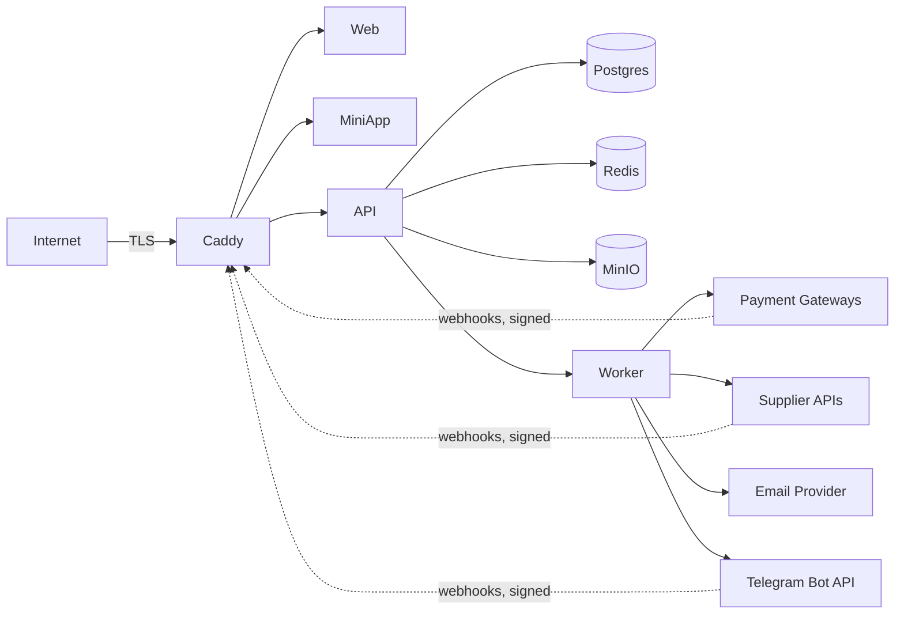

# YuPay — Threat model

> Living document. Review at least quarterly. Update whenever auth, payments, or supplier
> integrations change.

## Trust boundaries

## STRIDE

| Threat                     | Where                                                                                                                                                                                       | Mitigation                                                                                                                                                                                                                                                                                                                                                                                                                                                                                                                                                                                                                                                                                                                                                                                                                                                                                                                                                                                                                                                                                                                           |
| -------------------------- | ------------------------------------------------------------------------------------------------------------------------------------------------------------------------------------------- | ------------------------------------------------------------------------------------------------------------------------------------------------------------------------------------------------------------------------------------------------------------------------------------------------------------------------------------------------------------------------------------------------------------------------------------------------------------------------------------------------------------------------------------------------------------------------------------------------------------------------------------------------------------------------------------------------------------------------------------------------------------------------------------------------------------------------------------------------------------------------------------------------------------------------------------------------------------------------------------------------------------------------------------------------------------------------------------------------------------------------------------ |
| **Spoofing**               | Telegram Mini App initData forgery                                                                                                                                                          | HMAC validation against bot token, server-side, on every request                                                                                                                                                                                                                                                                                                                                                                                                                                                                                                                                                                                                                                                                                                                                                                                                                                                                                                                                                                                                                                                                     |
| **Spoofing**               | Telegram Login Widget payload replay                                                                                                                                                        | HMAC + `auth_date` freshness check, plus single-use enforcement (`auth:tg-widget:{hash}` Redis `SET NX`) — a captured, still-fresh payload can't be replayed a second time (ADR-0038 §7)                                                                                                                                                                                                                                                                                                                                                                                                                                                                                                                                                                                                                                                                                                                                                                                                                                                                                                                                             |
| **Spoofing**               | Webhook source forgery                                                                                                                                                                      | Per-provider signature verification before parsing body, using constant-time compares (`hmac.compare_digest`, OR-accumulated across configured keys) so response timing can't leak which credential matched (ADR-0038 §7)                                                                                                                                                                                                                                                                                                                                                                                                                                                                                                                                                                                                                                                                                                                                                                                                                                                                                                            |
| **Tampering**              | Payment amounts modified in transit                                                                                                                                                         | TLS + provider signs the webhook body                                                                                                                                                                                                                                                                                                                                                                                                                                                                                                                                                                                                                                                                                                                                                                                                                                                                                                                                                                                                                                                                                                |
| **Tampering**              | Ledger postings altered                                                                                                                                                                     | Append-only DB constraint; updates/deletes rejected at the data layer                                                                                                                                                                                                                                                                                                                                                                                                                                                                                                                                                                                                                                                                                                                                                                                                                                                                                                                                                                                                                                                                |
| **Tampering**              | Second refund posted against an already-refunded payment                                                                                                                                    | `refund_admin` only admits `status == "succeeded"`; any refund (full or partial) moves the status off `succeeded`, so a second call is rejected (ADR-0038 §3). Multi/partial refund tracking is a deferred `payment_refunds`-table follow-up                                                                                                                                                                                                                                                                                                                                                                                                                                                                                                                                                                                                                                                                                                                                                                                                                                                                                         |
| **Repudiation**            | Customer disputes order                                                                                                                                                                     | Order events table + ledger trail; all webhooks persisted with `external_event_id`                                                                                                                                                                                                                                                                                                                                                                                                                                                                                                                                                                                                                                                                                                                                                                                                                                                                                                                                                                                                                                                   |
| **Information disclosure** | PII in logs                                                                                                                                                                                 | Structured logger redactor; PII fields blocklisted (now includes Telegram `chat_id`, ADR-0038 §7)                                                                                                                                                                                                                                                                                                                                                                                                                                                                                                                                                                                                                                                                                                                                                                                                                                                                                                                                                                                                                                    |
| **Information disclosure** | Provider secrets/PII surfaced verbatim in the admin audit feed                                                                                                                              | `audit.list_audit_events` recursively masks any key on the redaction blocklist (card/pan/cvv/secret/signature/…) before returning a page — closes raw webhook JSON (e.g. Octo masked PAN/`rrn`) reaching the UI unmasked (ADR-0038 §6)                                                                                                                                                                                                                                                                                                                                                                                                                                                                                                                                                                                                                                                                                                                                                                                                                                                                                               |
| **Information disclosure** | Voucher codes stolen                                                                                                                                                                        | Codes encrypted at rest (libsodium / pgcrypto); dedup `code_hash` is HMAC-SHA256 keyed off an HKDF-derived key (not bare SHA-256), so a leaked table alone can't be brute-forced against low-entropy codes (ADR-0038 §7)                                                                                                                                                                                                                                                                                                                                                                                                                                                                                                                                                                                                                                                                                                                                                                                                                                                                                                             |
| **Information disclosure** | Prometheus `/metrics` on public API host                                                                                                                                                    | Blocked at Caddy (`respond 404`); Prometheus scrapes `api:8000` over the internal docker network only                                                                                                                                                                                                                                                                                                                                                                                                                                                                                                                                                                                                                                                                                                                                                                                                                                                                                                                                                                                                                                |
| **Information disclosure** | Guest email in URLs / proxy logs / browser history                                                                                                                                          | Guest order/deliveries lookup reads `X-Guest-Email` as a header, not a `?email=` query param (ADR-0038 §7); `OrderEvent.actor` stores a truncated email hash, never the raw address (ADR-0038 §6)                                                                                                                                                                                                                                                                                                                                                                                                                                                                                                                                                                                                                                                                                                                                                                                                                                                                                                                                    |
| **Tampering**              | Stored XSS via catalog-sourced JSON-LD (brand names, FAQ)                                                                                                                                   | `serializeJsonLd` escapes `<` so `</script>` can't terminate the tag; storefront CSP pins `default-src`/`object-src`/`base-uri`/`form-action` (`script-src 'unsafe-inline'` remains — forced by Next.js SSG, no per-request nonce possible; accepted risk, ADR-0038 §8)                                                                                                                                                                                                                                                                                                                                                                                                                                                                                                                                                                                                                                                                                                                                                                                                                                                              |
| **Tampering**              | Admin-authored regex (`FormField.pattern`) causes ReDoS                                                                                                                                     | Write-time guard rejects nested-quantifier/oversized-bound/overlong patterns; checkout additionally caps matched input at 256 chars before `re.fullmatch` — defense in depth, not exhaustive (ADR-0038 §7)                                                                                                                                                                                                                                                                                                                                                                                                                                                                                                                                                                                                                                                                                                                                                                                                                                                                                                                           |
| **SSRF**                   | Catalog image URL (`image_url`/`logo_url`/`hero_image_url`) used to make the Next.js image optimizer fetch an internal address                                                              | Pydantic validator rejects non-`https`, `localhost`/`*.internal`/`*.local`, and IP-literal hosts in private/loopback/link-local (incl. `169.254.169.254`)/reserved/multicast ranges, at both admin write and G2B import (ADR-0038 §5). The host is read **the way the fetcher reads it**: IDNA/UTS-46-normalised before classification and parsed by the URL standard's IPv4 rules, because Next's optimizer is Node's `new URL()` — `https://ⓛⓞⓒⓐⓛⓗⓞⓢⓣ/x.png`, `https://127。0。0。1/x.png`, `https://0x7f.1/x.png` and `https://127.1/x.png` all resolve to loopback there and were all accepted here until the M3a Task 2 re-review; the range table is `core/outbound_addresses.BLOCKED_FAMILIES`, shared with the connect-time client below so the two cannot drift (M3a Task 2 review found `fec0::/10` missing from what were then two lists). **Residual: DNS rebinding is still not closed on this path** — the _fetcher_ is Next.js's image optimizer, which offers no hook to re-check the address it connects to, so the check here remains a write-time one. It is closed on the webhook path, where we own the fetcher |
| **SSRF**                   | Merchant-supplied webhook URL used to make `apps/worker` — which runs inside the Docker network beside Postgres, Redis and MinIO — probe that network, including the cloud metadata address | `core/outbound.post_json` is the only fetcher for it and re-checks **at connect time**: it resolves once itself, refuses unless _every_ answer is public (`BLOCKED_FAMILIES` — loopback, RFC 1918, link-local incl. `169.254.169.254`, unique-local, site-local, multicast, `0.0.0.0/8`, reserved, plus a not-globally-routable catch-all for CGNAT), then builds the request against that address as a literal with the hostname carried in `Host` and TLS SNI, so DNS rebinding has no second lookup to differ on. An httpcore `connect_tcp` trace hook refuses if the socket layer is ever handed anything but the checked address. No redirects (a 30x is recorded, never followed), `trust_env=False` (a proxy would resolve by name on our behalf), no pooling across calls, a total wall-clock deadline, a cap on **wire** bytes, and a compressed answer refused undecoded (a gzip bomb cannot expand in-process). Admin-only configuration until M4's cabinet; the save-time check above still runs on the write. Every family has a named test and the pin is proved against real sockets (M3a Task 2, ADR-0070)           |
| **DoS**                    | Public endpoints flooded                                                                                                                                                                    | FastAPI slowapi per-IP limit on every route (ADR-0028) + Redis `ip_guard` on auth; Caddy-layer limit pending (stock image lacks `rate_limit`), Cloudflare as escalation                                                                                                                                                                                                                                                                                                                                                                                                                                                                                                                                                                                                                                                                                                                                                                                                                                                                                                                                                              |
| **DoS**                    | Supplier API rate-limited                                                                                                                                                                   | Per-supplier outbound token bucket; circuit breaker                                                                                                                                                                                                                                                                                                                                                                                                                                                                                                                                                                                                                                                                                                                                                                                                                                                                                                                                                                                                                                                                                  |
| **DoS**                    | Rejected-webhook audit rows used to flood storage                                                                                                                                           | Raw body capped at 4096 chars before persisting a signature/parse-failure row (ADR-0038 §7)                                                                                                                                                                                                                                                                                                                                                                                                                                                                                                                                                                                                                                                                                                                                                                                                                                                                                                                                                                                                                                          |
| **EoP**                    | Guest checkout token used outside scope                                                                                                                                                     | Token scoped to `email` + `order_id`; backend enforces                                                                                                                                                                                                                                                                                                                                                                                                                                                                                                                                                                                                                                                                                                                                                                                                                                                                                                                                                                                                                                                                               |
| **EoP**                    | Refresh token leaked (XSS or otherwise)                                                                                                                                                     | Rides an `HttpOnly; SameSite=Lax` cookie, never JS-readable and never in the JSON body/`localStorage` (ADR-0007, implemented per ADR-0038 §1); stored hashed in DB; rotation on every use; reuse triggers full session-lineage revocation                                                                                                                                                                                                                                                                                                                                                                                                                                                                                                                                                                                                                                                                                                                                                                                                                                                                                            |
| **EoP**                    | Access token still usable after logout                                                                                                                                                      | `auth:revoked:{jti}` Redis blocklist, set on logout and checked in `current_user` (ADR-0007, implemented per ADR-0038 §2). **Residual:** the refresh-reuse trip-wire can't blocklist the paired access token (no `jti` on that request) — it self-expires within ≤ 15 min                                                                                                                                                                                                                                                                                                                                                                                                                                                                                                                                                                                                                                                                                                                                                                                                                                                            |
| **Spoofing**               | WebSocket handshake token reused to read another user's order events                                                                                                                        | `kind="ws"` JWT's `channel` claim is always the caller's own `user:{id}` (server-minted at handshake, never client-supplied); the WS route subscribes to `realtime:user:{sub}` derived from the verified token, not from anything the client sends (ADR-0040)                                                                                                                                                                                                                                                                                                                                                                                                                                                                                                                                                                                                                                                                                                                                                                                                                                                                        |
| **Information disclosure** | Handshake token exposed via the WS URL (`?token=`) instead of a header                                                                                                                      | Unavoidable — the browser `WebSocket` API can't set request headers. Mitigated by `wss://` (TLS) in transit, a 60-second TTL, and the token carrying no PII (just `sub`/`channel`, both the caller's own id). **Residual:** the token can appear in server/proxy access logs for that 60s window (ADR-0040)                                                                                                                                                                                                                                                                                                                                                                                                                                                                                                                                                                                                                                                                                                                                                                                                                          |
| **Information disclosure** | Email-link tokens (`/auth/verify?token=`, `/auth/reset?token=`) reported to Yandex Metrika, then crawled by Yandex                                                                          | `SENSITIVE_PARAMS` (`lib/scrubUrl.ts`) strips `access`, `email` and `token` from every URL leaving the browser for analytics; the counter's inline snippet generates its `delete` calls from that same list so the first pageview and SPA hits can't scrub different sets. `/auth/` is `Disallow`ed in robots.txt so a JS-rendering crawler never fetches — and so never spends — a single-use token. **Found in production:** Yandex's crawl log listed `/en/auth/verify?token=eyJhbGciOi…` because `token` was missing from a hand-kept second copy of the list                                                                                                                                                                                                                                                                                                                                                                                                                                                                                                                                                                    |

## PII inventory

See `pii-handling.md`.

## User-generated content — reviews

- **XSS via review text:** review `body` is user-supplied. It is stored raw and
  **escaped on render** by both frontends (React text nodes / Next.js — never
  `dangerouslySetInnerHTML`; the admin queue renders it as plain text too). The
  API never interpolates it into HTML.
- **Spam / fake reviews:** mitigated by the verified-purchase gate (only a buyer
  with a `delivered` order for the brand can post), one-per-`(user, order, brand)`,
  the global rate limiter on `POST /reviews`, and a report → auto-hide (≥3
  distinct reporters) + admin moderation path.
- **Reviewer de-anonymisation:** the public API exposes the author's
  `display_name` or `null`, **never** the email; the service never logs `body`.

## WebSocket (realtime order updates)

- **Handshake token, not a bearer token:** `POST /realtime/handshake` (behind
  the normal `current_user` bearer-token auth) mints a **60-second**,
  single-purpose `kind="ws"` JWT whose `channel` claim is always the caller's
  own `user:{user.id}`. The client cannot request another user's channel —
  there is no field to ask for one — and the WS route
  (`WS /realtime/ws/orders?token=`) subscribes to `realtime:user:{sub}` using
  the `sub` decoded from the _verified_ token, never a client-supplied id.
- **Per-user channel isolation:** one Redis pub/sub channel per user
  (`realtime:user:{id}`, see `docs/architecture/cache-keys.md`); a socket
  subscribes to exactly one for its whole lifetime. There is no code path
  that lets a connection read another user's channel — the channel name is
  computed server-side from the token, never accepted as a parameter.
- **`?token=` query-string tradeoff:** the browser `WebSocket` API has no way
  to set an `Authorization` header, so the handshake token rides the URL
  (`wss://api.yupay.uz/api/v1/realtime/ws/orders?token=...`). Accepted:
  `wss://` (TLS) protects it in transit, the TTL is 60 seconds, and the token
  carries no PII. The residual risk is the token appearing in server/proxy
  access logs for that short window (ADR-0040).
- **No message replay / history:** on reconnect the client re-handshakes and
  gets no backlog — every message is a nudge that triggers an authoritative
  `GET /orders/{id}` refetch, never trusted as payload of record. A
  leaked/expired token is useless once its 60 seconds elapse, even before any
  socket is opened with it.
- **Guests never get a socket:** `publish_order_event` no-ops when
  `order.user_id is None`, and the frontends only mount the socket hook for a
  logged-in user — guest checkout is unaffected and keeps polling.
- **No PII in the wire payload:** messages carry `orderId`/`status`/
  timestamps only (see `packages/api-client/src/realtime/messages.ts`) — no
  email, phone, or Telegram id ever crosses the socket.

## Order claim, email verification & payment return (Phase 3 web-orders)

- **Email verification enforced at password login:** `login_password` rejects
  accounts with `email_verified_at IS NULL` (`EmailUnverifiedError`, 403).
  Telegram, guest-checkout, and admin-dev logins are exempt (no email to
  verify). Register no longer issues a session; verify-email does. This makes a
  user's email a trustworthy identity key for the order claim below. Existing
  users were grandfathered to verified by migration `0036` (forward-only), so
  enforcement applies only to signups from that point on.
- **Verify-email tokens are single-use:** consumed via `SET NX
auth:emailverify:{jti}` (same pattern as `auth:pwreset:{jti}`), so a leaked or
  replayed verify link cannot repeatedly mint sessions within its TTL. Recovery
  is the resend endpoint if a scanner/double-click burns the token.
- **Resend-verification is non-enumerating:** always 204, and the email send is
  scheduled off the request path (like `request_password_reset`) so response
  latency doesn't reveal whether the address exists or is already verified.
- **Order claim cannot cross accounts:** `POST /orders/claim` requires a Bearer
  session (guests are rejected before the handler), re-checks
  `email_verified_at`, and reassigns only orders where `user_id IS NULL` and
  `guest_email` matches the caller's email, in one XOR-safe UPDATE. It can never
  move an order to a non-matching or unverified account.
- **Guest order-view capability is unchanged:** a guest token is minted from an
  email but grants access only to orders whose `guest_email` matches (the
  backend re-hashes `X-Guest-Email` against the token). Knowing an unguessable
  order id **and** its email remains the capability — no escalation added.
- **Payment `return_url` open-redirect hardening:** the acquirer return URL
  defaults to the storefront (`web_base_url`) and any client-supplied
  `return_url` is validated same-origin (scheme+host) as `web_base_url`, so it
  can only ever bounce the customer back to our own storefront. Payment truth is
  the webhook, never the return; the return is UX only. **Deploy invariant:**
  `WEB_BASE_URL` must equal the canonical web origin (`https://yupay.uz`) — a
  mismatch/unset value makes web card intents 422 (see the email-verification
  runbook).

## Merchant actor arm on orders (B2B, 2026-09-07)

- **Owner guards match a known arm, never a comparison that failed to fail.**
  `orders.service.Actor` now has three arms (`user_id` / `email` /
  `merchant_id`, mirroring `ck_orders_actor_exclusive`). Every guard that
  decides "does this actor own this order" — `orders.service`'s
  `get_order_for_actor` / `list_orders_for_actor` /
  `_existing_idempotent_order`, `payments.routes._ensure_actor_owns_order`,
  `fulfillment.routes._ensure_order_owner` — dispatches on the arm that is set
  and **denies an arm it does not understand**, rather than falling through to
  an email comparison. The pattern it replaces was
  `(order.guest_email or "").lower() != (actor.email or "").lower()`: handed an
  actor with no email, both sides are `""`, the inequality is false, and the
  guard **passes for any order in the table** — every signed-in user's
  included, since their `guest_email` is NULL too. The SQL form was worse:
  SQLAlchemy compiles `Order.guest_email == None` to `guest_email IS NULL`,
  which _matches_, so an unscoped list would have returned other people's
  orders rather than none. Never reachable in production (no code path minted a
  merchant actor), but the arm now exists, so the guards are written positively
  and each has a test that a merchant actor gets 404.
- **A merchant is denied the retail read paths even for its own orders.**
  `/api/v1/payments/*` and the `/api/v1/orders/{id}/deliveries` magic link are
  capabilities bound to a mailed address (ADR-0042); a merchant has no mailed
  address. Merchant reads have their own authenticated route on `/merchant/v1`.
- **Idempotency keys are scoped per actor arm**, not globally
  (`uq_orders_idem_user` / `uq_orders_idem_guest` / `uq_orders_idem_merchant`),
  so one merchant's `merchant_order_id` can never replay — or reveal — another
  merchant's or a retail customer's order.
- **Order-event actors:** a merchant is audited as `merchant:{id}` unhashed (an
  internal account id, not the reseller's PII); the guest arm keeps its
  truncated `email_hash` pseudonym, so no plaintext address enters the audit
  feed.

## Merchant machine credentials (B2B, 2026-09-07)

- **The secret is encrypted at rest, not hashed.** `merchant_api_keys` holds
  `secret_enc` / `secret_nonce` (XSalsa20-Poly1305 via `core/crypto.py`, key
  HKDF-derived from `INVENTORY_ENC_KEY` under the purpose label
  `yupay:merchants:apikey:v1`). Encryption rather than a digest is structural,
  not a preference: an HMAC cannot be verified without the key material, so a
  one-way digest either forbids request signing or forces the stored digest to
  _be_ the signing key — key material in the clear under a reassuring name.
  What this buys: a stolen dump, a leaked replica or a SQL-injection read
  yields nothing usable. What it does not: an attacker holding both the dump
  and the application key is exactly as well off as with plaintext. The
  asymmetry that settled the design is that this repo already encrypts voucher
  codes, which are worth one SKU, while a signing key is worth a merchant's
  whole deposit.
- **Key separation.** The merchant purpose and the inventory purpose derive
  independent keys from the same input key material, so compromising one does
  not hand over the other. (`modules/inventory/crypto.py` still owns its own
  copy of the primitive — its rows are live and its `code_hash` is a lookup
  index that must stay byte-identical; delegating it to the core primitive is
  a filed follow-up.)
- **The signature covers the whole request line.**
  `{timestamp}\n{METHOD}\n{raw_path}\n{raw_query}\n{sha256(body)}`. The path and
  query are the **raw, percent-encoded** bytes, so neither can contain a
  literal LF and no request can smuggle a newline into one field to be read as
  the start of the next; the body is hashed so every field is fixed-width or
  LF-free. The earlier form signed the decoded path and was safe only by
  accident — CPython's `urlsplit` strips control characters — which is not a
  control. Signing the query is what stops a `?limit=10` lifted from the edge
  access log (which records query strings verbatim) being replayed as
  `?limit=100000`.
- **Replay: bounded by the window, kept out of the logs, and made harmless
  by idempotency — deliberately not by single-use signatures.** The ±300 s
  timestamp window bounds how long a captured request is interesting. An
  earlier revision made each signature single-use (`SET NX merchants:sig:…`)
  and that was **reverted**: a replaying attacker and a retrying client send
  byte-identical requests, so no marker can separate them, and single-use
  therefore breaks at-least-once retries on the money path — an HTTP client
  auto-retrying a reset connection would get an auth error for a network
  fault, and on order creation could never learn that its first attempt
  succeeded. Neither AWS SigV4 nor Stripe single-uses a signature, for the
  same reason.
  The capture vector that motivated it is closed at its source instead:
  Caddy's JSON access log redacts `Authorization` but logged our
  `X-Merchant-Key` / `X-Merchant-Signature` **verbatim** to stdout, which
  promtail ships to Loki — verified by reproducing the prod log block against
  `caddy:2-alpine`. Both headers are now deleted at the edge
  (`infra/caddy/Caddyfile.prod`, `format filter`), which AGENTS §9 requires
  independently of any replay argument. What remains accepted: a replay inside
  the window by someone who can observe traffic. For **mutations** the
  mitigation is endpoint idempotency — order creation keyed on
  `merchant_order_id` (spec §9.3) — which is therefore load-bearing rather
  than belt-and-braces, and is a binding constraint on the endpoint that
  introduces it.
- **No enumeration oracle on the credential.** Unknown `key_id`, revoked key
  and a wrong signature return one identical RFC 7807 body, and the
  unknown/revoked paths compute an HMAC against a constant dummy secret rather
  than returning early. The claim is deliberately narrow: **the payload is
  identical and the HMAC cost is equalised.** It is not constant-time end to
  end — an unknown `key_id` is an index miss where a known one is a hit plus a
  join — but a Postgres round-trip dwarfs a 32-byte HMAC, so the residual
  signal sits far below network noise.
- **A malformed signature is a 401, not a 500.** `hmac.compare_digest` raises
  `TypeError` on a non-ASCII `str`, and Starlette decodes header bytes as
  latin-1, so one raw high byte in `X-Merchant-Signature` would otherwise be an
  unauthenticated 500 with a Sentry traceback — and would distinguish
  malformed input from bad credentials. The value is shape-checked against
  exactly 64 lowercase hex characters before any comparison.
- **Secrets never reach a log or an error body.** The credential appears only
  in the response that mints it, and the create endpoint's idempotency replay
  snapshot deliberately stores `secret: null` — `idempotent_responses` has no
  reaper. The structured logger redacts `secret`, `signature`, `key` and
  `authorization` by name (`core.logging.REDACTED_KEYS`).
- **Throttling is two-axis, and the merchant axis is charged only after the
  signature verifies.** A `key_id` travels in a plaintext header; charging its
  counter earlier would let anyone who observed one exhaust its owner's
  budget. Forged traffic is bounded by the per-IP `merchant-api` bucket
  instead.
- **A frozen merchant is refused at the dependency** (403 `merchant_frozen`),
  before any endpoint body runs — the freeze button is an authentication-time
  control, not something each route has to remember.
- **The IP allowlist inherits `core/client_ip`'s assumption.** That helper
  takes the first `X-Forwarded-For` entry with no trusted-proxy check; its
  safety rests entirely on the shared edge overwriting the header rather than
  appending to it. Until now that assumption only decided which rate-limit
  counter got charged; it now also decides whether an allowlist can be
  bypassed with one header. **Filed for M3:** harden `client_ip` with a
  trusted-proxy check (repo-wide, so not a merchants change). The mitigating
  fact is that the allowlist is defence-in-depth **on top of** the HMAC and
  never the primary control — an attacker who can spoof the header still has
  no secret. Both the peer fallback and a multi-hop `a, b, c` value are pinned
  by tests, so the suite would fail rather than pass silently if the resolution
  changed.
- **A stored empty (non-NULL) `ip_allowlist` is fail-open**, the same as NULL.
  Two layers make it unreachable through the API (the schema rejects an empty
  array; `create_api_key` normalises it to NULL), and reading a stray one as
  "deny everything" would lock a merchant out over a data artefact — but an
  operator who hand-edited a row to `{}` meaning "block this key" got the
  opposite, so the auth path logs a warning naming the key when it sees one.

## Out of scope (we do not handle)

- Card data (PAN, CVV) — all card collection redirected to hosted provider fields.
- KYC documents — none collected at MVP.
- Children's data — TOS requires 18+.

## Google Sign-In (2026-09-02)

Linking is by Google-verified email. Attack considered: seed an account with
someone else's email + password, wait for the victim to «sign in with
Google» into it. Mitigations: password login refuses unverified emails, and
a Google login landing on an unverified-email account clears any stored
password hash before marking the email verified. The GIS credential is
verified server-side (signature, audience, expiry) via google-auth; the
`/auth/google` route sits behind the same `ip_guard` family as the other
credential endpoints (IP axis; the email is unknown pre-verification).

## Steam Sign-In (2026-09-02)

OpenID 2.0. The assertion is verified by round-tripping the exact parameter
set back to Steam (`check_authentication`); Steam marks assertions used, so
replay dies at their side. A `return_to` outside our callback URL is refused
before any network call. Identity is the steamid64 only (no email), stored
in `steam_links`; the endpoint sits behind `ip_guard` (`steam-login`).
