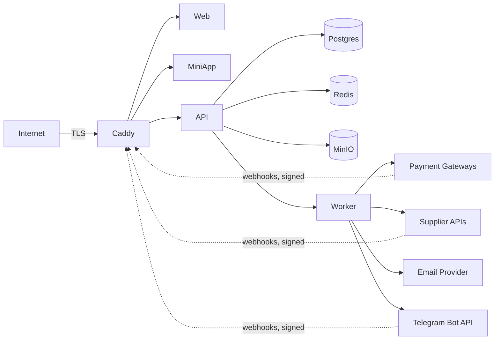

# YuPay — Threat model

> Living document. Review at least quarterly. Update whenever auth, payments, or supplier
> integrations change.

## Trust boundaries

## STRIDE

| Threat | Where | Mitigation |
|---|---|---|
| **Spoofing** | Telegram Mini App initData forgery | HMAC validation against bot token, server-side, on every request |
| **Spoofing** | Webhook source forgery | Per-provider signature verification before parsing body |
| **Tampering** | Payment amounts modified in transit | TLS + provider signs the webhook body |
| **Tampering** | Ledger postings altered | Append-only DB constraint; updates/deletes rejected at the data layer |
| **Repudiation** | Customer disputes order | Order events table + ledger trail; all webhooks persisted with `external_event_id` |
| **Information disclosure** | PII in logs | Structured logger redactor; PII fields blocklisted |
| **Information disclosure** | Voucher codes stolen | Codes encrypted at rest (libsodium / pgcrypto) |
| **DoS** | Public endpoints flooded | Caddy rate limit + FastAPI slowapi; CDN in front of catalog later |
| **DoS** | Supplier API rate-limited | Per-supplier outbound token bucket; circuit breaker |
| **EoP** | Guest checkout token used outside scope | Token scoped to `email` + `order_id`; backend enforces |
| **EoP** | Refresh token leaked | Stored hashed in DB; rotation on every use; revocable blocklist |

## PII inventory

See `pii-handling.md`.

## Out of scope (we do not handle)

- Card data (PAN, CVV) — all card collection redirected to hosted provider fields.
- KYC documents — none collected at MVP.
- Children's data — TOS requires 18+.
