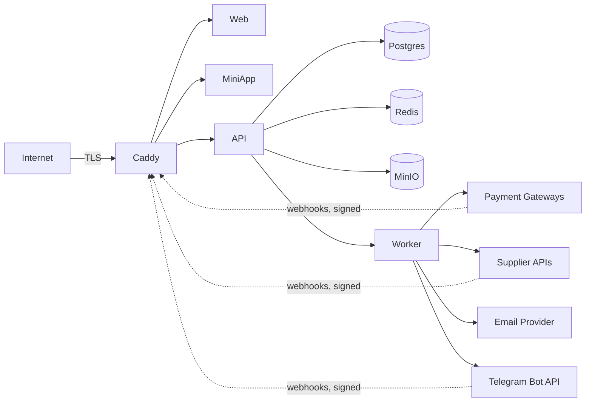

# YuPay — Threat model

> Living document. Review at least quarterly. Update whenever auth, payments, or supplier
> integrations change.

## Trust boundaries

## STRIDE

| Threat                     | Where                                                                                                                          | Mitigation                                                                                                                                                                                                                                                                                                                    |
| -------------------------- | ------------------------------------------------------------------------------------------------------------------------------ | ----------------------------------------------------------------------------------------------------------------------------------------------------------------------------------------------------------------------------------------------------------------------------------------------------------------------------- |
| **Spoofing**               | Telegram Mini App initData forgery                                                                                             | HMAC validation against bot token, server-side, on every request                                                                                                                                                                                                                                                              |
| **Spoofing**               | Telegram Login Widget payload replay                                                                                           | HMAC + `auth_date` freshness check, plus single-use enforcement (`auth:tg-widget:{hash}` Redis `SET NX`) — a captured, still-fresh payload can't be replayed a second time (ADR-0038 §7)                                                                                                                                      |
| **Spoofing**               | Webhook source forgery                                                                                                         | Per-provider signature verification before parsing body, using constant-time compares (`hmac.compare_digest`, OR-accumulated across configured keys) so response timing can't leak which credential matched (ADR-0038 §7)                                                                                                     |
| **Tampering**              | Payment amounts modified in transit                                                                                            | TLS + provider signs the webhook body                                                                                                                                                                                                                                                                                         |
| **Tampering**              | Ledger postings altered                                                                                                        | Append-only DB constraint; updates/deletes rejected at the data layer                                                                                                                                                                                                                                                         |
| **Tampering**              | Second refund posted against an already-refunded payment                                                                       | `refund_admin` only admits `status == "succeeded"`; any refund (full or partial) moves the status off `succeeded`, so a second call is rejected (ADR-0038 §3). Multi/partial refund tracking is a deferred `payment_refunds`-table follow-up                                                                                  |
| **Repudiation**            | Customer disputes order                                                                                                        | Order events table + ledger trail; all webhooks persisted with `external_event_id`                                                                                                                                                                                                                                            |
| **Information disclosure** | PII in logs                                                                                                                    | Structured logger redactor; PII fields blocklisted (now includes Telegram `chat_id`, ADR-0038 §7)                                                                                                                                                                                                                             |
| **Information disclosure** | Provider secrets/PII surfaced verbatim in the admin audit feed                                                                 | `audit.list_audit_events` recursively masks any key on the redaction blocklist (card/pan/cvv/secret/signature/…) before returning a page — closes raw webhook JSON (e.g. Octo masked PAN/`rrn`) reaching the UI unmasked (ADR-0038 §6)                                                                                        |
| **Information disclosure** | Voucher codes stolen                                                                                                           | Codes encrypted at rest (libsodium / pgcrypto); dedup `code_hash` is HMAC-SHA256 keyed off an HKDF-derived key (not bare SHA-256), so a leaked table alone can't be brute-forced against low-entropy codes (ADR-0038 §7)                                                                                                      |
| **Information disclosure** | Prometheus `/metrics` on public API host                                                                                       | Blocked at Caddy (`respond 404`); Prometheus scrapes `api:8000` over the internal docker network only                                                                                                                                                                                                                         |
| **Information disclosure** | Guest email in URLs / proxy logs / browser history                                                                             | Guest order/deliveries lookup reads `X-Guest-Email` as a header, not a `?email=` query param (ADR-0038 §7); `OrderEvent.actor` stores a truncated email hash, never the raw address (ADR-0038 §6)                                                                                                                             |
| **Tampering**              | Stored XSS via catalog-sourced JSON-LD (brand names, FAQ)                                                                      | `serializeJsonLd` escapes `<` so `</script>` can't terminate the tag; storefront CSP pins `default-src`/`object-src`/`base-uri`/`form-action` (`script-src 'unsafe-inline'` remains — forced by Next.js SSG, no per-request nonce possible; accepted risk, ADR-0038 §8)                                                       |
| **Tampering**              | Admin-authored regex (`FormField.pattern`) causes ReDoS                                                                        | Write-time guard rejects nested-quantifier/oversized-bound/overlong patterns; checkout additionally caps matched input at 256 chars before `re.fullmatch` — defense in depth, not exhaustive (ADR-0038 §7)                                                                                                                    |
| **SSRF**                   | Catalog image URL (`image_url`/`logo_url`/`hero_image_url`) used to make the Next.js image optimizer fetch an internal address | Pydantic validator rejects non-`https`, `localhost`/`*.internal`/`*.local`, and IP-literal hosts in private/loopback/link-local (incl. `169.254.169.254`)/reserved/multicast ranges, at both admin write and G2B import (ADR-0038 §5). **Residual: DNS rebinding is not closed** — validated at write time, not at fetch time |
| **DoS**                    | Public endpoints flooded                                                                                                       | FastAPI slowapi per-IP limit on every route (ADR-0028) + Redis `ip_guard` on auth; Caddy-layer limit pending (stock image lacks `rate_limit`), Cloudflare as escalation                                                                                                                                                       |
| **DoS**                    | Supplier API rate-limited                                                                                                      | Per-supplier outbound token bucket; circuit breaker                                                                                                                                                                                                                                                                           |
| **DoS**                    | Rejected-webhook audit rows used to flood storage                                                                              | Raw body capped at 4096 chars before persisting a signature/parse-failure row (ADR-0038 §7)                                                                                                                                                                                                                                   |
| **EoP**                    | Guest checkout token used outside scope                                                                                        | Token scoped to `email` + `order_id`; backend enforces                                                                                                                                                                                                                                                                        |
| **EoP**                    | Refresh token leaked (XSS or otherwise)                                                                                        | Rides an `HttpOnly; SameSite=Lax` cookie, never JS-readable and never in the JSON body/`localStorage` (ADR-0007, implemented per ADR-0038 §1); stored hashed in DB; rotation on every use; reuse triggers full session-lineage revocation                                                                                     |
| **EoP**                    | Access token still usable after logout                                                                                         | `auth:revoked:{jti}` Redis blocklist, set on logout and checked in `current_user` (ADR-0007, implemented per ADR-0038 §2). **Residual:** the refresh-reuse trip-wire can't blocklist the paired access token (no `jti` on that request) — it self-expires within ≤ 15 min                                                     |

## PII inventory

See `pii-handling.md`.

## Out of scope (we do not handle)

- Card data (PAN, CVV) — all card collection redirected to hosted provider fields.
- KYC documents — none collected at MVP.
- Children's data — TOS requires 18+.
