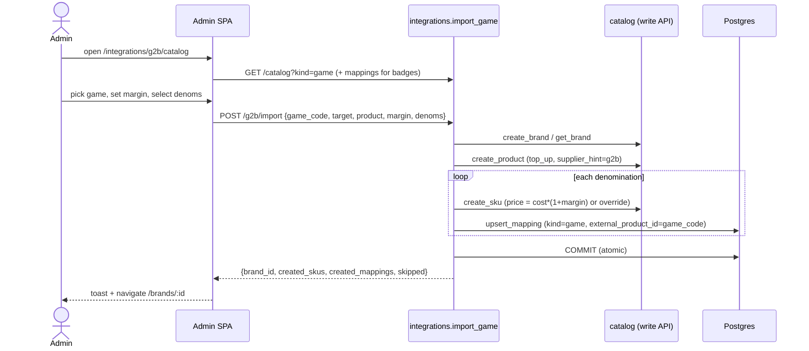

# G2B Catalog Import Implementation Plan

> **For agentic workers:** REQUIRED SUB-SKILL: Use superpowers:subagent-driven-development (recommended) or superpowers:executing-plans to implement this plan task-by-task. Steps use checkbox (`- [ ]`) syntax for tracking.

**Goal:** Let admins browse the cached G2B game catalog and import a game in one atomic action — creating a Brand + Product (`top_up`) + SKUs + supplier mappings ready to sell.

**Architecture:** A new `POST /admin/integrations/g2b/import` endpoint in the `integrations` module orchestrates the `catalog` module's public write API inside a single transaction. The admin SPA gets a catalog-browser page and a 3-step import wizard. No new DB tables, no Alembic migration. Sell price is computed backend-side from `margin_percent`, with per-row `price_usd_override`.

**Tech Stack:** Python 3.12 · FastAPI · SQLAlchemy 2 async · Pydantic v2 · pytest + testcontainers (API). React 19 · React Router 7 · TanStack Query v5 · react-hook-form + zod · Tailwind v4 (admin SPA).

**Spec:** `docs/superpowers/specs/2026-06-04-g2b-catalog-import-design.md`

**Branch:** `feat/admin-g2b-catalog-import` (already created; spec committed).

---

## Reference facts (verified in code — use verbatim)

- `catalog.admin_service.create_brand(db, body: BrandCreate) -> Brand` — flushes, raises `ConflictError("slug already exists")` on dup. Same shape: `create_product(db, ProductCreate) -> Product`, `create_sku(db, SkuCreate) -> Sku` (raises `ConflictError("sku_code already exists")`).
- `catalog.admin_service.get_brand(db, brand_id) -> Brand` raises `NotFoundError`. `get_category(db, category_id)` raises `NotFoundError`.
- Create schemas in `catalog.admin_schemas`: `BrandCreate(slug, category_id, logo_url?, hero_image_url?, accent_color?, sort_order=0, active=True, maintenance=False, translations: list[TranslationIn](min 1))`; `ProductCreate(slug, brand_id, kind, supplier_hint?, image_url?, sort_order=0, active=True, required_fields: list[FormField]=[], translations(min 1))`; `SkuCreate(product_id, sku_code, denomination?, region?, price_usd>0, cost_usdt?>0, image_url?, sort_order=0, active=True, price_overrides=[])`. `TranslationIn(locale: "ru"|"en"|"uz", name(1..255), short_description?, description?)`.
- `FormField` imported from `yupay.modules.catalog.schemas`.
- `integrations.service.upsert_mapping(db, payload: MappingUpsert) -> SkuSupplierMapping` — flushes, no commit. `MappingUpsert` is a frozen dataclass with ALL fields required: `sku_id, supplier_slug, kind, external_product_id, external_variant_id, quantity, extra: dict, is_active: bool, updated_by: str | None`. For `kind="game"`, `external_variant_id` must be non-empty or it raises `ValidationError`.
- Errors: `yupay.core.errors` has `NotFoundError` (→404), `ConflictError` (→409), `ValidationError` (→422), all `AppError` subclasses mapped by the global handler (same mechanism the existing admin routes rely on).
- `integrations` admin router is `integrations.routes.admin_router` (prefix `/admin/integrations`, `dependencies=[Depends(require_admin)]`), re-exported via `integrations.api` and mounted in `apps/api/src/yupay/api/v1/__init__.py`.
- `require_admin` dep: `from yupay.modules.admin.api import require_admin`; admin user model `from yupay.modules.users.models import User`; `admin.id` is the updater id.
- Catalog models: `from yupay.modules.catalog.models import Sku` (has `.sku_code`).
- Test conventions (`apps/api/tests/integration/`): fixtures `db_session: AsyncSession`, `client: AsyncClient`; helpers in `test_integrations_mapping.py` — `_login_user(client, tg_id)`, `_grant_admin(db, tg_id)`. Seeding done by inserting ORM rows directly. `pytestmark = pytest.mark.asyncio`.

---

## File structure

**API — create**
- `apps/api/tests/integration/test_g2b_import.py` — integration tests (endpoint-level).

**API — modify**
- `apps/api/src/yupay/modules/catalog/api.py` — re-export write surface (`create_brand/product/sku`, `BrandCreate/ProductCreate/SkuCreate/TranslationIn`, `get_brand/get_category`).
- `apps/api/src/yupay/modules/integrations/schemas.py` — add `NewBrandIn`, `ProductImportIn`, `DenomImportIn`, `GameImportIn`, `GameImportOut`.
- `apps/api/src/yupay/modules/integrations/service.py` — add `GameImportResult` + `import_game(...)` + `_sell_price(...)`.
- `apps/api/src/yupay/modules/integrations/routes.py` — add `POST /g2b/import`.
- `apps/api/src/yupay/modules/integrations/README.md` — "Import" section.

**Admin SPA — create**
- `apps/admin/src/features/integrations/SupplierCatalogPage.tsx`
- `apps/admin/src/features/integrations/GameImportPage.tsx`

**Admin SPA — modify**
- `apps/admin/src/features/integrations/types.ts` — import DTO types + `g2bFieldLabel` helper.
- `apps/admin/src/features/integrations/G2bDetailPage.tsx` — "Перейти к каталогу" button.
- `apps/admin/src/app/router.tsx` — two routes.
- `apps/admin/src/lib/queryKeys.ts` — `gameDenoms`, `gameFields` keys.

**Docs**
- `docs/decisions/0024-g2b-catalog-import.md`
- `docs/architecture/sequence-diagrams/g2b-catalog-import.mmd`
- `docs/architecture/module-map.md` (edit)
- `docs/api/openapi.json` + `packages/api-client/` (regenerated)

---

## Task 1: Extend catalog public surface

**Files:**
- Modify: `apps/api/src/yupay/modules/catalog/api.py`

- [ ] **Step 1: Add write-surface re-exports**

In `apps/api/src/yupay/modules/catalog/api.py`, add these imports after the existing `from yupay.modules.catalog.service import (...)` block:

```python
from yupay.modules.catalog.admin_schemas import (
    BrandCreate,
    ProductCreate,
    SkuCreate,
    TranslationIn,
)
from yupay.modules.catalog.admin_service import (
    create_brand,
    create_product,
    create_sku,
    get_brand,
    get_category,
)
```

Then add each new name to `__all__` (keep it sorted): `"BrandCreate"`, `"ProductCreate"`, `"SkuCreate"`, `"TranslationIn"`, `"create_brand"`, `"create_product"`, `"create_sku"`, `"get_brand"`, `"get_category"`.

- [ ] **Step 2: Verify the imports resolve**

Run: `cd apps/api && uv run python -c "from yupay.modules.catalog import api; print(api.create_brand, api.BrandCreate, api.get_brand)"`
Expected: prints three callables/classes, no ImportError.

- [ ] **Step 3: Commit**

```bash
git add apps/api/src/yupay/modules/catalog/api.py
git commit -m "feat(catalog): expose write API (create_brand/product/sku) on public surface"
```

---

## Task 2: Import request/response schemas

**Files:**
- Modify: `apps/api/src/yupay/modules/integrations/schemas.py`
- Test: `apps/api/tests/unit/test_g2b_import_schemas.py` (create)

- [ ] **Step 1: Write the failing test**

Create `apps/api/tests/unit/test_g2b_import_schemas.py`:

```python
"""Unit tests for GameImportIn validation."""

from __future__ import annotations

from decimal import Decimal

import pytest
from pydantic import ValidationError as PydValidationError
from yupay.modules.integrations.schemas import (
    DenomImportIn,
    GameImportIn,
    NewBrandIn,
    ProductImportIn,
)


def _denom() -> DenomImportIn:
    return DenomImportIn(
        catalogue_name="60 UC",
        denomination="60 UC",
        sku_code="g2b-pubg-60",
        cost_usdt=Decimal("0.85"),
    )


def _product() -> ProductImportIn:
    return ProductImportIn(slug="pubg-uc", name="PUBG UC")


def test_new_brand_requires_new_brand_block() -> None:
    with pytest.raises(PydValidationError):
        GameImportIn(
            game_code="pubg",
            target="new_brand",
            product=_product(),
            margin_percent=Decimal("20"),
            denominations=[_denom()],
        )


def test_existing_brand_requires_brand_id() -> None:
    with pytest.raises(PydValidationError):
        GameImportIn(
            game_code="pubg",
            target="existing_brand",
            product=_product(),
            margin_percent=Decimal("20"),
            denominations=[_denom()],
        )


def test_valid_new_brand_payload() -> None:
    payload = GameImportIn(
        game_code="pubg",
        target="new_brand",
        new_brand=NewBrandIn(slug="pubg-mobile", category_id="cat-1", name="PUBG Mobile"),
        product=_product(),
        margin_percent=Decimal("20"),
        denominations=[_denom()],
    )
    assert payload.new_brand is not None
    assert payload.denominations[0].sku_code == "g2b-pubg-60"


def test_denominations_must_be_non_empty() -> None:
    with pytest.raises(PydValidationError):
        GameImportIn(
            game_code="pubg",
            target="existing_brand",
            brand_id="b-1",
            product=_product(),
            margin_percent=Decimal("20"),
            denominations=[],
        )
```

- [ ] **Step 2: Run test to verify it fails**

Run: `cd apps/api && uv run pytest tests/unit/test_g2b_import_schemas.py -v`
Expected: FAIL with `ImportError` (schemas not defined yet).

- [ ] **Step 3: Add the schemas**

In `apps/api/src/yupay/modules/integrations/schemas.py`, add `Decimal` to imports (`from decimal import Decimal`) and `model_validator` (`from pydantic import BaseModel, ConfigDict, Field, model_validator`), plus `from yupay.modules.catalog.schemas import FormField`. Then append:

```python
class NewBrandIn(BaseModel):
    """New brand to create when importing a game (target='new_brand')."""

    model_config = ConfigDict(extra="forbid")

    slug: str = Field(min_length=3, max_length=64)
    category_id: str = Field(min_length=1)
    name: str = Field(min_length=1, max_length=255)
    logo_url: str | None = Field(default=None, max_length=1024)
    hero_image_url: str | None = Field(default=None, max_length=1024)
    accent_color: str | None = Field(default=None, max_length=16)


class ProductImportIn(BaseModel):
    """The game-as-product to create under the brand."""

    model_config = ConfigDict(extra="forbid")

    slug: str = Field(min_length=3, max_length=128)
    name: str = Field(min_length=1, max_length=255)
    required_fields: list[FormField] = Field(default_factory=list)
    image_url: str | None = Field(default=None, max_length=1024)


class DenomImportIn(BaseModel):
    """One supplier denomination to import as a SKU + mapping."""

    model_config = ConfigDict(extra="forbid")

    catalogue_name: str = Field(min_length=1, max_length=128)
    denomination: str = Field(min_length=1, max_length=64)
    sku_code: str = Field(min_length=1, max_length=64)
    cost_usdt: Decimal = Field(gt=0)
    price_usd_override: Decimal | None = Field(default=None, gt=0)
    region: str | None = Field(default=None, max_length=8)
    quantity: int = Field(default=1, ge=1, le=10_000)


class GameImportIn(BaseModel):
    """Payload for POST /admin/integrations/g2b/import."""

    model_config = ConfigDict(extra="forbid")

    game_code: str = Field(min_length=1, max_length=128)
    target: Literal["new_brand", "existing_brand"]
    brand_id: str | None = None
    new_brand: NewBrandIn | None = None
    product: ProductImportIn
    margin_percent: Decimal = Field(ge=0, le=1000)
    denominations: list[DenomImportIn] = Field(min_length=1)

    @model_validator(mode="after")
    def _check_target(self) -> "GameImportIn":
        if self.target == "new_brand" and self.new_brand is None:
            raise ValueError("new_brand is required when target='new_brand'")
        if self.target == "existing_brand" and not self.brand_id:
            raise ValueError("brand_id is required when target='existing_brand'")
        return self


class GameImportOut(BaseModel):
    """Result of a game import."""

    brand_id: str
    product_id: str
    created_skus: int
    created_mappings: int
    skipped: list[str]
```

Add all six new class names to `__all__`.

- [ ] **Step 4: Run test to verify it passes**

Run: `cd apps/api && uv run pytest tests/unit/test_g2b_import_schemas.py -v`
Expected: PASS (4 passed).

- [ ] **Step 5: Commit**

```bash
git add apps/api/src/yupay/modules/integrations/schemas.py apps/api/tests/unit/test_g2b_import_schemas.py
git commit -m "feat(integrations): add GameImportIn/Out schemas with target validation"
```

---

## Task 3: Import service (TDD via integration tests)

**Files:**
- Modify: `apps/api/src/yupay/modules/integrations/service.py`
- Test: `apps/api/tests/integration/test_g2b_import.py` (create)

- [ ] **Step 1: Write the failing integration test**

Create `apps/api/tests/integration/test_g2b_import.py`:

```python
"""Integration tests for import_game — atomic brand+product+sku+mapping."""

from __future__ import annotations

from decimal import Decimal

import pytest
from sqlalchemy import select
from sqlalchemy.ext.asyncio import AsyncSession
from yupay.core.errors import ConflictError
from yupay.core.ids import new_id
from yupay.modules.catalog.models import Brand, Category, CategoryTranslation, Product, Sku
from yupay.modules.integrations import service as svc
from yupay.modules.integrations.models import SkuSupplierMapping
from yupay.modules.integrations.schemas import (
    DenomImportIn,
    GameImportIn,
    NewBrandIn,
    ProductImportIn,
)

pytestmark = pytest.mark.asyncio


async def _seed_category(db: AsyncSession) -> str:
    cat = Category(id=new_id(), slug="games", sort_order=0, active=True)
    cat.translations = [CategoryTranslation(locale="ru", name="Игры")]
    db.add(cat)
    await db.flush()
    return cat.id


def _payload_new_brand(category_id: str) -> GameImportIn:
    return GameImportIn(
        game_code="pubgmobile",
        target="new_brand",
        new_brand=NewBrandIn(slug="pubg-mobile", category_id=category_id, name="PUBG Mobile"),
        product=ProductImportIn(slug="pubg-uc", name="PUBG UC"),
        margin_percent=Decimal("20"),
        denominations=[
            DenomImportIn(catalogue_name="60 UC", denomination="60 UC", sku_code="g2b-pubg-60", cost_usdt=Decimal("0.85")),
            DenomImportIn(catalogue_name="300 UC", denomination="300 UC", sku_code="g2b-pubg-300", cost_usdt=Decimal("4.00"), price_usd_override=Decimal("5.99")),
        ],
    )


async def test_import_new_brand_creates_everything(db_session: AsyncSession) -> None:
    cat = await _seed_category(db_session)
    result = await svc.import_game(db_session, _payload_new_brand(cat), admin_id="admin-1")

    assert result.created_skus == 2
    assert result.created_mappings == 2
    assert result.skipped == []

    brand = (await db_session.execute(select(Brand).where(Brand.id == result.brand_id))).scalar_one()
    assert brand.slug == "pubg-mobile"
    assert {t.locale for t in brand.translations} == {"ru", "en", "uz"}

    product = (await db_session.execute(select(Product).where(Product.id == result.product_id))).scalar_one()
    assert product.kind == "top_up"
    assert product.supplier_hint == "g2b"

    skus = (await db_session.execute(select(Sku).where(Sku.product_id == result.product_id).order_by(Sku.sku_code))).scalars().all()
    by_code = {s.sku_code: s for s in skus}
    # 0.85 * 1.20 = 1.02 (margin); override wins for the second.
    assert by_code["g2b-pubg-60"].price_usd == Decimal("1.02")
    assert by_code["g2b-pubg-60"].cost_usdt == Decimal("0.85")
    assert by_code["g2b-pubg-300"].price_usd == Decimal("5.99")

    mappings = (await db_session.execute(select(SkuSupplierMapping).where(SkuSupplierMapping.supplier_slug == "g2b"))).scalars().all()
    assert len(mappings) == 2
    m = next(x for x in mappings if x.external_variant_id == "60 UC")
    assert m.kind == "game"
    assert m.external_product_id == "pubgmobile"


async def test_import_existing_brand_adds_product(db_session: AsyncSession) -> None:
    cat = await _seed_category(db_session)
    first = await svc.import_game(db_session, _payload_new_brand(cat), admin_id="a")
    payload = GameImportIn(
        game_code="pubgmobile",
        target="existing_brand",
        brand_id=first.brand_id,
        product=ProductImportIn(slug="pubg-royal", name="PUBG Royal Pass"),
        margin_percent=Decimal("10"),
        denominations=[DenomImportIn(catalogue_name="Elite", denomination="Elite", sku_code="g2b-pubg-elite", cost_usdt=Decimal("9.00"))],
    )
    result = await svc.import_game(db_session, payload, admin_id="a")
    assert result.brand_id == first.brand_id
    brands = (await db_session.execute(select(Brand))).scalars().all()
    assert len(brands) == 1  # not duplicated


async def test_reimport_skips_existing_sku(db_session: AsyncSession) -> None:
    cat = await _seed_category(db_session)
    await svc.import_game(db_session, _payload_new_brand(cat), admin_id="a")
    payload = _payload_new_brand(cat)
    # change the slugs so brand/product creation under existing brand differs;
    # but reuse one sku_code to trigger the skip path.
    payload = GameImportIn(
        game_code="pubgmobile",
        target="existing_brand",
        brand_id=(await db_session.execute(select(Brand.id))).scalar_one(),
        product=ProductImportIn(slug="pubg-uc-2", name="PUBG UC v2"),
        margin_percent=Decimal("20"),
        denominations=[
            DenomImportIn(catalogue_name="60 UC", denomination="60 UC", sku_code="g2b-pubg-60", cost_usdt=Decimal("0.85")),
            DenomImportIn(catalogue_name="1800 UC", denomination="1800 UC", sku_code="g2b-pubg-1800", cost_usdt=Decimal("20.00")),
        ],
    )
    result = await svc.import_game(db_session, payload, admin_id="a")
    assert result.skipped == ["g2b-pubg-60"]
    assert result.created_skus == 1


async def test_duplicate_brand_slug_raises_conflict(db_session: AsyncSession) -> None:
    cat = await _seed_category(db_session)
    await svc.import_game(db_session, _payload_new_brand(cat), admin_id="a")
    with pytest.raises(ConflictError):
        # same brand slug again
        await svc.import_game(
            db_session,
            GameImportIn(
                game_code="pubgmobile",
                target="new_brand",
                new_brand=NewBrandIn(slug="pubg-mobile", category_id=cat, name="PUBG Mobile"),
                product=ProductImportIn(slug="pubg-uc-other", name="PUBG UC"),
                margin_percent=Decimal("20"),
                denominations=[DenomImportIn(catalogue_name="60 UC", denomination="60 UC", sku_code="x-60", cost_usdt=Decimal("0.85"))],
            ),
            admin_id="a",
        )
```

- [ ] **Step 2: Run to verify it fails**

Run: `cd apps/api && uv run pytest tests/integration/test_g2b_import.py -v`
Expected: FAIL with `AttributeError: module ... has no attribute 'import_game'`.

- [ ] **Step 3: Implement `import_game` + `_sell_price`**

In `apps/api/src/yupay/modules/integrations/service.py`, add near the top-level imports:

```python
from dataclasses import dataclass  # already imported — keep one
```

(Note: `dataclass` is already imported.) Add this dataclass next to `MappingUpsert`:

```python
@dataclass(frozen=True)
class GameImportResult:
    """Outcome of import_game."""

    brand_id: str
    product_id: str
    created_skus: int
    created_mappings: int
    skipped: list[str]
```

Then add the function (place it after `upsert_mapping`). Use **local imports** for the catalog public surface to avoid an import cycle (this mirrors `refresh_sku_cost_for_mapping`, which already imports catalog inside the function body):

```python
def _sell_price(cost_usdt: Any, margin_percent: Any) -> Any:
    """price = cost * (1 + margin/100), rounded to cents (half-up)."""
    from decimal import ROUND_HALF_UP, Decimal

    cost = Decimal(str(cost_usdt))
    margin = Decimal(str(margin_percent))
    return (cost * (Decimal(1) + margin / Decimal(100))).quantize(
        Decimal("0.01"), rounding=ROUND_HALF_UP
    )


async def import_game(db: AsyncSession, payload: Any, *, admin_id: str) -> GameImportResult:
    """Atomically import a G2B game into the catalog.

    Creates (or reuses) a Brand, creates a Product(kind='top_up'), and for
    each denomination a SKU + a 'game' supplier mapping. Does NOT commit —
    the caller (route) owns the transaction boundary, so a failure anywhere
    rolls the whole import back.

    Args:
        db: Active session (caller commits).
        payload: A ``GameImportIn``.
        admin_id: Id of the admin performing the import (mapping audit field).

    Returns:
        GameImportResult with counts and skipped sku_codes.
    """
    from yupay.core.errors import ValidationError
    from yupay.modules.catalog import api as catalog
    from yupay.modules.catalog.models import Sku

    # 1. Resolve the brand.
    if payload.target == "new_brand":
        nb = payload.new_brand
        brand = await catalog.create_brand(
            db,
            catalog.BrandCreate(
                slug=nb.slug,
                category_id=nb.category_id,
                logo_url=nb.logo_url,
                hero_image_url=nb.hero_image_url,
                accent_color=nb.accent_color,
                translations=[
                    catalog.TranslationIn(locale=loc, name=nb.name)
                    for loc in ("ru", "en", "uz")
                ],
            ),
        )
        brand_id = brand.id
    else:
        brand = await catalog.get_brand(db, payload.brand_id)  # raises NotFoundError
        brand_id = brand.id

    # 2. Create the product (the game).
    product = await catalog.create_product(
        db,
        catalog.ProductCreate(
            slug=payload.product.slug,
            brand_id=brand_id,
            kind="top_up",
            supplier_hint="g2b",
            image_url=payload.product.image_url,
            required_fields=payload.product.required_fields,
            translations=[
                catalog.TranslationIn(locale=loc, name=payload.product.name)
                for loc in ("ru", "en", "uz")
            ],
        ),
    )

    # 3. Which sku_codes already exist → skip (idempotent re-import).
    codes = [d.sku_code for d in payload.denominations]
    existing = set(
        (await db.execute(select(Sku.sku_code).where(Sku.sku_code.in_(codes)))).scalars().all()
    )

    created_skus = 0
    created_mappings = 0
    skipped: list[str] = []
    for d in payload.denominations:
        if d.sku_code in existing:
            skipped.append(d.sku_code)
            continue
        price = (
            d.price_usd_override
            if d.price_usd_override is not None
            else _sell_price(d.cost_usdt, payload.margin_percent)
        )
        if price <= 0:
            raise ValidationError(f"computed price_usd <= 0 for {d.sku_code}")
        sku = await catalog.create_sku(
            db,
            catalog.SkuCreate(
                product_id=product.id,
                sku_code=d.sku_code,
                denomination=d.denomination,
                region=d.region,
                price_usd=price,
                cost_usdt=d.cost_usdt,
            ),
        )
        created_skus += 1
        await upsert_mapping(
            db,
            MappingUpsert(
                sku_id=sku.id,
                supplier_slug="g2b",
                kind="game",
                external_product_id=payload.game_code,
                external_variant_id=d.catalogue_name,
                quantity=d.quantity,
                extra={},
                is_active=True,
                updated_by=admin_id,
            ),
        )
        created_mappings += 1

    return GameImportResult(
        brand_id=brand_id,
        product_id=product.id,
        created_skus=created_skus,
        created_mappings=created_mappings,
        skipped=skipped,
    )
```

Add `"GameImportResult"` and `"import_game"` to `__all__`.

- [ ] **Step 4: Run to verify it passes**

Run: `cd apps/api && uv run pytest tests/integration/test_g2b_import.py -v`
Expected: PASS (4 passed). If `ConflictError` from a dup brand slug surfaces as a different exception, confirm `create_brand` raised `ConflictError` (it does on `IntegrityError`).

- [ ] **Step 5: Commit**

```bash
git add apps/api/src/yupay/modules/integrations/service.py apps/api/tests/integration/test_g2b_import.py
git commit -m "feat(integrations): import_game — atomic brand+product+sku+mapping with backend margin"
```

---

## Task 4: HTTP route

**Files:**
- Modify: `apps/api/src/yupay/modules/integrations/routes.py`
- Test: `apps/api/tests/integration/test_g2b_import.py` (append endpoint test)

- [ ] **Step 1: Append the failing endpoint test**

Append to `apps/api/tests/integration/test_g2b_import.py` (add `from httpx import AsyncClient`, `from sqlalchemy import update`, and `from yupay.modules.users.models import TelegramLink, User` to imports; copy `_login_user` / `_grant_admin` from `test_integrations_mapping.py` — repeat them here, the engineer may read tasks out of order):

```python
import hashlib
import hmac
import json
import time
from urllib.parse import urlencode

from httpx import AsyncClient
from sqlalchemy import update
from yupay.modules.users.models import TelegramLink, User

BOT_TOKEN = "123456:TEST"


def _sign_init_data(fields: dict[str, str]) -> str:
    pairs = sorted((k, v) for k, v in fields.items() if k != "hash")
    data = "\n".join(f"{k}={v}" for k, v in pairs).encode("utf-8")
    secret = hmac.new(b"WebAppData", BOT_TOKEN.encode("utf-8"), hashlib.sha256).digest()
    signed = {**fields, "hash": hmac.new(secret, data, hashlib.sha256).hexdigest()}
    return urlencode(signed)


async def _login_admin(client: AsyncClient, db: AsyncSession, tg_id: int = 555) -> str:
    user_json = json.dumps({"id": tg_id, "first_name": "A"}, separators=(",", ":"))
    init = _sign_init_data({"user": user_json, "auth_date": str(int(time.time()))})
    r = await client.post("/api/v1/auth/telegram/webapp", json={"init_data": init})
    assert r.status_code == 200, r.text
    user_id = (
        await db.execute(
            select(User.id).join(TelegramLink, TelegramLink.user_id == User.id).where(TelegramLink.tg_user_id == tg_id)
        )
    ).scalar_one()
    await db.execute(update(User).where(User.id == user_id).values(roles=["admin"]))
    await db.commit()
    return r.json()["access_token"]


async def test_import_endpoint_creates_brand(db_session: AsyncSession, client: AsyncClient) -> None:
    cat = await _seed_category(db_session)
    await db_session.commit()
    token = await _login_admin(client, db_session)
    body = {
        "game_code": "pubgmobile",
        "target": "new_brand",
        "new_brand": {"slug": "pubg-mobile", "category_id": cat, "name": "PUBG Mobile"},
        "product": {"slug": "pubg-uc", "name": "PUBG UC"},
        "margin_percent": "20",
        "denominations": [
            {"catalogue_name": "60 UC", "denomination": "60 UC", "sku_code": "g2b-pubg-60", "cost_usdt": "0.85"}
        ],
    }
    r = await client.post(
        "/api/v1/admin/integrations/g2b/import",
        json=body,
        headers={"Authorization": f"Bearer {token}", "Idempotency-Key": "imp-1"},
    )
    assert r.status_code == 201, r.text
    data = r.json()
    assert data["created_skus"] == 1
    assert data["created_mappings"] == 1


async def test_import_endpoint_requires_admin(client: AsyncClient) -> None:
    r = await client.post("/api/v1/admin/integrations/g2b/import", json={})
    assert r.status_code in (401, 403)
```

Note: this test seeds the category in its own committed transaction; because the endpoint runs in a separate request session, `_seed_category` + `await db_session.commit()` must persist first.

- [ ] **Step 2: Run to verify it fails**

Run: `cd apps/api && uv run pytest tests/integration/test_g2b_import.py -k endpoint -v`
Expected: FAIL with 404 (route not mounted yet).

- [ ] **Step 3: Add the route**

In `apps/api/src/yupay/modules/integrations/routes.py`:

1. Add to the schema import block: `GameImportIn`, `GameImportOut`.
2. Add `Header` to the fastapi import: `from fastapi import APIRouter, Depends, Header, Query, status`.
3. Append this route (after `sync_g2b_catalog`, before `_g2b_fulfiller_or_none`):

```python
@admin_router.post(
    "/g2b/import",
    response_model=GameImportOut,
    status_code=status.HTTP_201_CREATED,
    summary="Import a G2B game as a Brand + Product + SKUs + mappings",
)
async def import_g2b_game(
    body: GameImportIn,
    db: Annotated[AsyncSession, Depends(db_session)],
    admin: Annotated[User, Depends(require_admin)],
    idempotency_key: Annotated[str | None, Header(alias="Idempotency-Key")] = None,
) -> GameImportOut:
    """Atomic import. Idempotency is structural — re-importing a denomination
    whose ``sku_code`` already exists skips it (reported in ``skipped``); the
    ``Idempotency-Key`` header is accepted for client convenience and logged.

    Errors propagate as the module's standard mapping: duplicate brand/product
    slug → 409, unknown brand_id/category_id → 404, bad price/payload → 422.
    """
    result = await svc.import_game(db, body, admin_id=admin.id)
    await db.commit()
    log.info(
        "integrations.g2b.import",
        game_code=body.game_code,
        created_skus=result.created_skus,
        skipped=len(result.skipped),
        idempotency_key=idempotency_key,
    )
    return GameImportOut(
        brand_id=result.brand_id,
        product_id=result.product_id,
        created_skus=result.created_skus,
        created_mappings=result.created_mappings,
        skipped=result.skipped,
    )
```

- [ ] **Step 4: Run to verify it passes**

Run: `cd apps/api && uv run pytest tests/integration/test_g2b_import.py -v`
Expected: PASS (all tests, including the two endpoint tests).

- [ ] **Step 5: Lint + typecheck the API**

Run: `cd apps/api && uv run ruff check src/yupay/modules/integrations && uv run mypy src/yupay/modules/integrations/service.py src/yupay/modules/integrations/routes.py src/yupay/modules/integrations/schemas.py`
Expected: no errors. Fix any (e.g. add a `# noqa` only if a rule is genuinely inapplicable; otherwise correct the code).

- [ ] **Step 6: Commit**

```bash
git add apps/api/src/yupay/modules/integrations/routes.py apps/api/tests/integration/test_g2b_import.py
git commit -m "feat(integrations): POST /admin/integrations/g2b/import endpoint"
```

---

## Task 5: Regenerate OpenAPI + TS client

**Files:**
- Regenerated: `docs/api/openapi.json`, `packages/api-client/`

- [ ] **Step 1: Regenerate**

Run: `make gen-api`
Expected: `docs/api/openapi.json` now contains the `/admin/integrations/g2b/import` path; `packages/api-client/` updated.

- [ ] **Step 2: Verify no drift**

Run: `git status --short docs/api packages/api-client`
Expected: shows modified generated files (the new endpoint). Confirm the import path is present: `grep -c "g2b/import" docs/api/openapi.json` → ≥ 1.

- [ ] **Step 3: Commit**

```bash
git add docs/api/openapi.json packages/api-client
git commit -m "build(api): regenerate OpenAPI + TS client for g2b import endpoint"
```

---

## Task 6: Admin — query keys + types

**Files:**
- Modify: `apps/admin/src/lib/queryKeys.ts`
- Modify: `apps/admin/src/features/integrations/types.ts`

- [ ] **Step 1: Add query keys**

In `apps/admin/src/lib/queryKeys.ts`, inside the `qk` object (follow the existing factory style — match how `integrationCatalog` is written), add:

```typescript
  gameDenoms: (code: string) => ["admin", "integrations", "g2b", "denoms", code] as const,
  gameFields: (code: string) => ["admin", "integrations", "g2b", "fields", code] as const,
```

- [ ] **Step 2: Add DTO types + field-label helper**

In `apps/admin/src/features/integrations/types.ts`, append:

```typescript
export interface GameImportDenom {
  catalogue_name: string;
  denomination: string;
  sku_code: string;
  cost_usdt: string;
  price_usd_override?: string;
  region?: string;
  quantity: number;
}

export interface GameImportPayload {
  game_code: string;
  target: "new_brand" | "existing_brand";
  brand_id?: string;
  new_brand?: {
    slug: string;
    category_id: string;
    name: string;
    logo_url?: string;
    hero_image_url?: string;
    accent_color?: string;
  };
  product: {
    slug: string;
    name: string;
    required_fields: FormFieldDto[];
    image_url?: string;
  };
  margin_percent: string;
  denominations: GameImportDenom[];
}

export interface GameImportResult {
  brand_id: string;
  product_id: string;
  created_skus: number;
  created_mappings: number;
  skipped: string[];
}

/** Minimal FormField shape we send to the API (matches catalog FormField). */
export interface FormFieldDto {
  key: string;
  label: { ru: string; en: string; uz: string };
  type: "text";
  required: boolean;
}

/** Best-effort ru/en/uz labels for common G2B field names; fallback to the raw key. */
export function g2bFieldLabel(key: string): { ru: string; en: string; uz: string } {
  const map: Record<string, { ru: string; en: string; uz: string }> = {
    userid: { ru: "ID игрока", en: "Player ID", uz: "Oʻyinchi ID" },
    zoneid: { ru: "ID сервера", en: "Server ID", uz: "Server ID" },
    server: { ru: "Сервер", en: "Server", uz: "Server" },
    charname: { ru: "Имя персонажа", en: "Character name", uz: "Belgi nomi" },
  };
  return map[key.toLowerCase()] ?? { ru: key, en: key, uz: key };
}
```

If `types.ts` does not already import the catalog `FormField`, this local `FormFieldDto` is intentionally self-contained — do not add a cross-package import.

- [ ] **Step 3: Typecheck**

Run: `pnpm --filter @yupay/admin exec tsc --noEmit`
Expected: 0 errors.

- [ ] **Step 4: Commit**

```bash
git add apps/admin/src/lib/queryKeys.ts apps/admin/src/features/integrations/types.ts
git commit -m "feat(admin): query keys + import DTO types for g2b catalog"
```

---

## Task 7: Admin — supplier catalog browser page

**Files:**
- Create: `apps/admin/src/features/integrations/SupplierCatalogPage.tsx`
- Modify: `apps/admin/src/app/router.tsx`
- Modify: `apps/admin/src/features/integrations/G2bDetailPage.tsx`

- [ ] **Step 1: Create the page**

Create `apps/admin/src/features/integrations/SupplierCatalogPage.tsx`. Mirror the conventions of `MappingsPage.tsx` (DataTable + PageHeader + debounced search via `useDebouncedValue`). It lists games from `GET /api/v1/admin/integrations/catalog?supplier_slug=g2b&kind=game` and badges already-imported games by cross-referencing mappings.

```tsx
/** Browse the cached G2B game catalog and jump into the import wizard. */
import { useQuery } from "@tanstack/react-query";
import { Database, Search } from "lucide-react";
import { useState } from "react";
import { Link, useParams } from "react-router-dom";

import { DataTable } from "@/components/DataTable";
import { PageHeader } from "@/components/PageHeader";
import { apiGet } from "@/lib/api";
import { useDebouncedValue } from "@/lib/useDebouncedValue";
import { qk } from "@/lib/queryKeys";

import type { CatalogEntry, SupplierMapping } from "./types";
import { SUPPLIER_LABELS } from "./types";

interface CatalogListOut {
  items: CatalogEntry[];
}
interface MappingListOut {
  items: SupplierMapping[];
}

export function SupplierCatalogPage() {
  const { slug = "g2b" } = useParams<{ slug?: string }>();
  const label = SUPPLIER_LABELS[slug as keyof typeof SUPPLIER_LABELS] ?? slug;
  const [search, setSearch] = useState("");
  const q = useDebouncedValue(search, 300);

  const games = useQuery<CatalogListOut>({
    queryKey: qk.integrationCatalog({ supplierSlug: slug, kind: "game", search: q }),
    queryFn: () =>
      apiGet<CatalogListOut>(
        `/api/v1/admin/integrations/catalog?supplier_slug=${slug}&kind=game` +
          (q ? `&search=${encodeURIComponent(q)}` : ""),
      ),
  });

  const mappings = useQuery<MappingListOut>({
    queryKey: qk.integrationMappings({ supplierSlug: slug }),
    queryFn: () =>
      apiGet<MappingListOut>(`/api/v1/admin/integrations/mappings?supplier_slug=${slug}`),
  });

  const imported = new Set(
    (mappings.data?.items ?? [])
      .filter((m) => m.kind === "game")
      .map((m) => m.external_product_id),
  );

  return (
    <div>
      <PageHeader
        title={`Каталог · ${label}`}
        description="Игры поставщика из локального кэша. Откройте игру, чтобы импортировать её как бренд с номиналами."
        breadcrumbs={[{ label: "Интеграции", to: "/integrations" }, { label, to: `/integrations/${slug}` }, { label: "Каталог" }]}
      />

      <label className="mb-4 flex max-w-sm items-center gap-2 rounded-md border border-[var(--border-default)] bg-[var(--bg-surface)] px-3">
        <Search className="size-4 text-[var(--text-tertiary)]" />
        <input
          value={search}
          onChange={(e) => {
            setSearch(e.target.value);
          }}
          placeholder="Поиск игры…"
          className="h-9 flex-1 bg-transparent text-sm outline-none"
        />
      </label>

      <DataTable
        rows={games.data?.items ?? []}
        rowKey={(r) => r.external_id}
        loading={games.isLoading}
        busy={games.isFetching}
        ariaLabel="Каталог игр поставщика"
        empty={
          <span>
            Каталог пуст. Сначала <Link to={`/integrations/${slug}`} className="underline">синхронизируйте каталог</Link>.
          </span>
        }
        columns={[
          { key: "title", header: "Игра", render: (r) => <span className="font-medium">{r.title}</span> },
          { key: "code", header: "game_code", render: (r) => <code className="font-mono text-xs">{r.external_id}</code> },
          {
            key: "status",
            header: "",
            render: (r) =>
              imported.has(r.external_id) ? (
                <span className="rounded bg-[var(--bg-accent-soft)] px-2 py-0.5 text-xs text-[var(--accent)]">импортирована</span>
              ) : null,
          },
          {
            key: "action",
            header: "",
            render: (r) => (
              <Link to={`/integrations/${slug}/catalog/${encodeURIComponent(r.external_id)}`} className="inline-flex items-center gap-1 text-sm font-medium text-[var(--accent)] hover:underline">
                <Database className="size-4" /> Импортировать →
              </Link>
            ),
          },
        ]}
      />
    </div>
  );
}
```

If `CatalogEntry` / `SupplierMapping` field names differ from what's used here (`external_id`, `title`, `kind`, `external_product_id`), open `types.ts` and use the exact existing names — do not invent new ones.

- [ ] **Step 2: Add routes**

In `apps/admin/src/app/router.tsx`, add inside the authed `Layout` children, next to the existing `/integrations/:slug` route — and **before** it so the static `catalog` segment isn't swallowed by `:slug` is not a concern here (different depth), but keep ordering tidy:

```tsx
import { SupplierCatalogPage } from "@/features/integrations/SupplierCatalogPage";
import { GameImportPage } from "@/features/integrations/GameImportPage";
// ...
{ path: "/integrations/:slug/catalog", element: <SupplierCatalogPage /> },
{ path: "/integrations/:slug/catalog/:gameCode", element: <GameImportPage /> },
```

(`GameImportPage` is created in Task 8; importing it now is fine because Task 8 lands before typecheck of this task's final state — but to keep this task self-contained and compiling, complete Task 8 before running typecheck in Step 4. If you must verify Task 7 alone, temporarily stub `GameImportPage` as `export function GameImportPage() { return null; }`.)

- [ ] **Step 3: Add "Перейти к каталогу" button on G2bDetailPage**

In `apps/admin/src/features/integrations/G2bDetailPage.tsx`, the "Каталог поставщика" `ActionCard` currently has a single sync button. Replace that `ActionCard` usage with a version that also links to the browser. Simplest: add a second card, or add a link under the sync card. Add this card right after the existing "Каталог поставщика" `ActionCard` in the `<section>` grid:

```tsx
        <ActionCard
          icon={Database}
          title="Просмотр каталога"
          description="Откройте список игр поставщика и импортируйте игру как бренд с номиналами одним действием."
          actionLabel="Перейти к каталогу"
          to={`/integrations/${slug}/catalog`}
        />
```

(`Database` is already imported in this file.) The grid is `md:grid-cols-3`; adding a 4th card flows to the next row cleanly.

- [ ] **Step 4: Typecheck + lint**

Run: `pnpm --filter @yupay/admin exec tsc --noEmit && pnpm --filter @yupay/admin run lint`
Expected: 0 errors. (Complete Task 8 first, or use the stub noted above.)

- [ ] **Step 5: Commit**

```bash
git add apps/admin/src/features/integrations/SupplierCatalogPage.tsx apps/admin/src/app/router.tsx apps/admin/src/features/integrations/G2bDetailPage.tsx
git commit -m "feat(admin): supplier catalog browser page + entry button"
```

---

## Task 8: Admin — game import wizard

**Files:**
- Create: `apps/admin/src/features/integrations/GameImportPage.tsx`

- [ ] **Step 1: Create the wizard page**

Create `apps/admin/src/features/integrations/GameImportPage.tsx`. It is a `"use client"`-style React page (admin is a Vite SPA, no directive needed). 3 sections: destination, brand/product, denominations table. Uses `react-hook-form` + `zod` like `BrandEditPage.tsx`. On submit, POSTs the import payload and navigates to the created brand.

```tsx
/** Import a single G2B game → Brand + Product + SKUs + mappings. */
import { useMutation, useQuery } from "@tanstack/react-query";
import { Button } from "@yupay/ui";
import { useMemo, useState } from "react";
import { useNavigate, useParams } from "react-router-dom";

import { Field } from "@/components/Field";
import { PageHeader } from "@/components/PageHeader";
import { Spinner } from "@/components/States";
import { useToast } from "@/components/Toast";
import { ApiError, apiGet, apiPost } from "@/lib/api";
import { qk } from "@/lib/queryKeys";

import {
  g2bFieldLabel,
  type FormFieldDto,
  type GameImportPayload,
  type GameImportResult,
} from "./types";

interface DenomRow {
  catalogue_name: string;
  name: string;
  amount: string | null;
}
interface DenomListOut {
  items: DenomRow[];
}
interface FieldsOut {
  fields: string[];
  notes: string | null;
}
interface BrandRow {
  id: string;
  slug: string;
  translations: { locale: string; name: string }[];
}
interface CategoryRow {
  id: string;
  slug: string;
  translations: { locale: string; name: string }[];
}

interface DenomState {
  checked: boolean;
  sku_code: string;
  price_override: string; // empty = use margin
}

function slugify(s: string): string {
  return s
    .toLowerCase()
    .replace(/[^a-z0-9]+/g, "-")
    .replace(/^-+|-+$/g, "")
    .slice(0, 64);
}

export function GameImportPage() {
  const { slug = "g2b", gameCode = "" } = useParams<{ slug?: string; gameCode?: string }>();
  const code = decodeURIComponent(gameCode);
  const navigate = useNavigate();
  const toast = useToast();

  const [target, setTarget] = useState<"new_brand" | "existing_brand">("new_brand");
  const [brandId, setBrandId] = useState("");
  const [brandName, setBrandName] = useState(code);
  const [brandSlug, setBrandSlug] = useState(slugify(code));
  const [categoryId, setCategoryId] = useState("");
  const [productName, setProductName] = useState(code);
  const [productSlug, setProductSlug] = useState(slugify(`${code}-topup`));
  const [margin, setMargin] = useState("20");
  const [rows, setRows] = useState<Record<string, DenomState>>({});

  const denoms = useQuery<DenomListOut>({
    queryKey: qk.gameDenoms(code),
    queryFn: () => apiGet<DenomListOut>(`/api/v1/admin/integrations/g2b/games/${encodeURIComponent(code)}/catalogue`),
  });
  const fields = useQuery<FieldsOut>({
    queryKey: qk.gameFields(code),
    queryFn: () => apiGet<FieldsOut>(`/api/v1/admin/integrations/g2b/games/${encodeURIComponent(code)}/fields`),
  });
  const categories = useQuery<CategoryRow[]>({
    queryKey: qk.categories(),
    queryFn: () => apiGet<CategoryRow[]>("/api/v1/admin/catalog/categories"),
  });
  const brands = useQuery<BrandRow[]>({
    queryKey: qk.brands(),
    queryFn: () => apiGet<BrandRow[]>("/api/v1/admin/catalog/brands"),
  });

  const requiredFields: FormFieldDto[] = useMemo(
    () =>
      (fields.data?.fields ?? []).map((key) => ({
        key,
        label: g2bFieldLabel(key),
        type: "text" as const,
        required: true,
      })),
    [fields.data],
  );

  function rowState(d: DenomRow): DenomState {
    return (
      rows[d.catalogue_name] ?? {
        checked: true,
        sku_code: slugify(`g2b-${code}-${d.catalogue_name}`),
        price_override: "",
      }
    );
  }

  function setRow(name: string, patch: Partial<DenomState>) {
    setRows((prev) => ({ ...prev, [name]: { ...rowState({ catalogue_name: name, name, amount: null }), ...prev[name], ...patch } }));
  }

  function sellPrice(amount: string | null, override: string): string {
    if (override.trim()) return override.trim();
    const cost = Number(amount ?? 0);
    const m = Number(margin || 0);
    if (!cost) return "—";
    return (Math.round(cost * (1 + m / 100) * 100) / 100).toFixed(2);
  }

  const save = useMutation<GameImportResult, ApiError>({
    mutationFn: () => {
      const selected = (denoms.data?.items ?? []).filter((d) => rowState(d).checked && d.amount);
      const payload: GameImportPayload = {
        game_code: code,
        target,
        ...(target === "existing_brand" ? { brand_id: brandId } : {}),
        ...(target === "new_brand"
          ? { new_brand: { slug: brandSlug, category_id: categoryId, name: brandName } }
          : {}),
        product: { slug: productSlug, name: productName, required_fields: requiredFields },
        margin_percent: margin,
        denominations: selected.map((d) => {
          const st = rowState(d);
          return {
            catalogue_name: d.catalogue_name,
            denomination: d.name || d.catalogue_name,
            sku_code: st.sku_code,
            cost_usdt: String(d.amount),
            ...(st.price_override.trim() ? { price_usd_override: st.price_override.trim() } : {}),
            quantity: 1,
          };
        }),
      };
      return apiPost<GameImportResult>("/api/v1/admin/integrations/g2b/import", payload, {
        headers: { "Idempotency-Key": crypto.randomUUID() },
      });
    },
    onSuccess: (data) => {
      toast.success(`Импортировано: SKU ${data.created_skus}, пропущено ${data.skipped.length}`);
      navigate(`/brands/${data.brand_id}`);
    },
    onError: (err) => {
      const body = err.body as { detail?: string; title?: string } | null;
      toast.error(`Импорт не удался: ${body?.detail ?? body?.title ?? err.message}`);
    },
  });

  const canSave =
    (target === "new_brand" ? brandSlug && categoryId && brandName : brandId) &&
    productSlug &&
    productName &&
    (denoms.data?.items ?? []).some((d) => rowState(d).checked && d.amount);

  return (
    <div>
      <PageHeader
        title={`Импорт игры · ${code}`}
        breadcrumbs={[
          { label: "Интеграции", to: "/integrations" },
          { label: "Каталог", to: `/integrations/${slug}/catalog` },
          { label: code },
        ]}
        actions={
          <Button
            onClick={() => {
              save.mutate();
            }}
            disabled={!canSave || save.isPending}
          >
            {save.isPending ? "Импортируем…" : "Импортировать"}
          </Button>
        }
      />

      {/* Step 1: destination */}
      <section className="mb-6 rounded-lg border border-[var(--border-default)] bg-[var(--bg-surface)] p-4">
        <h2 className="mb-3 font-semibold">Назначение</h2>
        <div className="flex gap-4">
          <label className="flex items-center gap-2 text-sm">
            <input type="radio" checked={target === "new_brand"} onChange={() => { setTarget("new_brand"); }} />
            Новый бренд
          </label>
          <label className="flex items-center gap-2 text-sm">
            <input type="radio" checked={target === "existing_brand"} onChange={() => { setTarget("existing_brand"); }} />
            Существующий бренд
          </label>
        </div>
        {target === "existing_brand" && (
          <Field label="Бренд">
            <select value={brandId} onChange={(e) => { setBrandId(e.target.value); }} className="h-9 w-full rounded-md border border-[var(--border-default)] bg-[var(--bg-surface)] px-2 text-sm">
              <option value="">— выбери —</option>
              {(brands.data ?? []).map((b) => (
                <option key={b.id} value={b.id}>
                  {b.translations.find((t) => t.locale === "ru")?.name ?? b.slug}
                </option>
              ))}
            </select>
          </Field>
        )}
      </section>

      {/* Step 2: brand + product */}
      <section className="mb-6 grid grid-cols-1 gap-4 rounded-lg border border-[var(--border-default)] bg-[var(--bg-surface)] p-4 md:grid-cols-2">
        <h2 className="md:col-span-2 font-semibold">Бренд и продукт</h2>
        {target === "new_brand" && (
          <>
            <Field label="Название бренда">
              <input value={brandName} onChange={(e) => { setBrandName(e.target.value); }} className="h-9 w-full rounded-md border border-[var(--border-default)] bg-[var(--bg-surface)] px-2 text-sm" />
            </Field>
            <Field label="Slug бренда">
              <input value={brandSlug} onChange={(e) => { setBrandSlug(e.target.value); }} className="h-9 w-full rounded-md border border-[var(--border-default)] bg-[var(--bg-surface)] px-2 font-mono text-sm" />
            </Field>
            <Field label="Категория">
              <select value={categoryId} onChange={(e) => { setCategoryId(e.target.value); }} className="h-9 w-full rounded-md border border-[var(--border-default)] bg-[var(--bg-surface)] px-2 text-sm">
                <option value="">— выбери —</option>
                {(categories.data ?? []).map((c) => (
                  <option key={c.id} value={c.id}>
                    {c.translations.find((t) => t.locale === "ru")?.name ?? c.slug}
                  </option>
                ))}
              </select>
            </Field>
          </>
        )}
        <Field label="Название продукта">
          <input value={productName} onChange={(e) => { setProductName(e.target.value); }} className="h-9 w-full rounded-md border border-[var(--border-default)] bg-[var(--bg-surface)] px-2 text-sm" />
        </Field>
        <Field label="Slug продукта">
          <input value={productSlug} onChange={(e) => { setProductSlug(e.target.value); }} className="h-9 w-full rounded-md border border-[var(--border-default)] bg-[var(--bg-surface)] px-2 font-mono text-sm" />
        </Field>
        <Field label="Наценка, %">
          <input value={margin} onChange={(e) => { setMargin(e.target.value); }} inputMode="decimal" className="h-9 w-full rounded-md border border-[var(--border-default)] bg-[var(--bg-surface)] px-2 text-sm" />
        </Field>
        <div className="md:col-span-2 text-xs text-[var(--text-secondary)]">
          Поля игрока (из G2B): {requiredFields.length ? requiredFields.map((f) => f.label.ru).join(", ") : "—"}
        </div>
      </section>

      {/* Step 3: denominations */}
      <section className="rounded-lg border border-[var(--border-default)] bg-[var(--bg-surface)] p-4">
        <h2 className="mb-3 font-semibold">Номиналы</h2>
        {denoms.isLoading ? (
          <Spinner label="Загружаем номиналы…" />
        ) : (denoms.data?.items ?? []).length === 0 ? (
          <p className="text-sm text-[var(--text-secondary)]">G2B не вернул номиналов для этой игры.</p>
        ) : (
          <table className="w-full text-sm">
            <thead>
              <tr className="text-left text-[var(--text-tertiary)]">
                <th className="py-1"></th>
                <th>Номинал</th>
                <th>Себест. $</th>
                <th>Цена прод. $</th>
                <th>sku_code</th>
              </tr>
            </thead>
            <tbody>
              {(denoms.data?.items ?? []).map((d) => {
                const st = rowState(d);
                return (
                  <tr key={d.catalogue_name} className="border-t border-[var(--border-default)]">
                    <td className="py-1.5">
                      <input type="checkbox" checked={st.checked} onChange={(e) => { setRow(d.catalogue_name, { checked: e.target.checked }); }} />
                    </td>
                    <td>{d.name || d.catalogue_name}</td>
                    <td className="font-mono">{d.amount ?? "—"}</td>
                    <td>
                      <input
                        value={st.price_override}
                        placeholder={sellPrice(d.amount, "")}
                        onChange={(e) => { setRow(d.catalogue_name, { price_override: e.target.value }); }}
                        inputMode="decimal"
                        className="h-8 w-24 rounded border border-[var(--border-default)] bg-[var(--bg-surface)] px-2 font-mono"
                      />
                    </td>
                    <td>
                      <input
                        value={st.sku_code}
                        onChange={(e) => { setRow(d.catalogue_name, { sku_code: e.target.value }); }}
                        className="h-8 w-48 rounded border border-[var(--border-default)] bg-[var(--bg-surface)] px-2 font-mono text-xs"
                      />
                    </td>
                  </tr>
                );
              })}
            </tbody>
          </table>
        )}
      </section>
    </div>
  );
}
```

Verify against reality before relying on it: (a) `apiPost`'s third arg — confirm it accepts `{ headers }` (check `apps/admin/src/lib/api.ts`); if its signature is `apiPost(path, body)` only, add the header support or drop the per-call header and rely on structural idempotency. (b) `qk.categories()` and `qk.brands()` exist (the explorer confirmed `qk.brands()`); if `qk.categories()` is absent, add it in Task 6 style. (c) `@/components/States` exports `Spinner` (used by G2bDetailPage). (d) `CategoryRow`/`BrandRow` translation shape matches `AdminBrandOut`/`AdminCategoryOut` (it does: `translations: [{locale, name, ...}]`).

- [ ] **Step 2: Typecheck + lint**

Run: `pnpm --filter @yupay/admin exec tsc --noEmit && pnpm --filter @yupay/admin run lint`
Expected: 0 errors / 0 warnings. Fix import order and any `no-confusing-void-expression` by bracing handler bodies (already braced above).

- [ ] **Step 3: Commit**

```bash
git add apps/admin/src/features/integrations/GameImportPage.tsx
git commit -m "feat(admin): G2B game import wizard"
```

---

## Task 9: Manual end-to-end verification

**Files:** none (verification only)

- [ ] **Step 1: Bring up the stack**

Run: `make dev` (or `make dev-api` + `pnpm --filter @yupay/admin dev`). Ensure `G2B_API_KEY` is set so the catalog/denoms endpoints return live data; without it the catalog page shows the empty state (expected).

- [ ] **Step 2: Walk the flow**

In the admin: `/integrations/g2b` → "Перейти к каталогу" → pick a game → set margin / tweak a row → "Импортировать". Then confirm:
- toast shows created counts;
- `/brands/:id` opens the new brand (3 locales prefilled);
- `/skus` lists the new SKUs with the computed prices;
- `/integrations/mappings?supplier=g2b` shows one `game` mapping per SKU with `external_product_id=game_code`, `external_variant_id=catalogue_name`.

- [ ] **Step 3: Re-import idempotency**

Re-run the same import → toast reports `пропущено N` (skipped), no duplicate SKUs/brands.

- [ ] **Step 4: No commit** (verification only). Note results in the PR description.

---

## Task 10: Documentation

**Files:**
- Create: `docs/decisions/0024-g2b-catalog-import.md`
- Create: `docs/architecture/sequence-diagrams/g2b-catalog-import.mmd`
- Modify: `docs/architecture/module-map.md`
- Modify: `apps/api/src/yupay/modules/integrations/README.md`

- [ ] **Step 1: Write the ADR**

Create `docs/decisions/0024-g2b-catalog-import.md` using the MADR template at `docs/decisions/0000-template.md`. Decision: a single atomic `POST /admin/integrations/g2b/import` in `integrations` orchestrating `catalog`'s public write API; backend-computed margin with per-row override; structural idempotency via unique `sku_code`; the endpoint does not call G2B live (trusts the admin UI's fetched cost). Alternatives considered: frontend orchestration of existing CRUD (rejected — non-atomic); a new dedicated import table (rejected — reuses existing tables). Consequences: new `integrations → catalog (write API)` dependency.

- [ ] **Step 2: Write the sequence diagram**

Create `docs/architecture/sequence-diagrams/g2b-catalog-import.mmd`:



- [ ] **Step 3: Update module-map**

In `docs/architecture/module-map.md`, add a line under the `integrations` module recording the dependency: `integrations → catalog (write API: create_brand/product/sku) for game import`. Match the file's existing formatting.

- [ ] **Step 4: Update the integrations README**

In `apps/api/src/yupay/modules/integrations/README.md`, add an "Import" section: the endpoint, atomicity, backend margin, idempotency on `sku_code`, and the catalog dependency.

- [ ] **Step 5: Commit**

```bash
git add docs/decisions/0024-g2b-catalog-import.md docs/architecture/sequence-diagrams/g2b-catalog-import.mmd docs/architecture/module-map.md apps/api/src/yupay/modules/integrations/README.md
git commit -m "docs(integrations): ADR + sequence diagram + module-map for g2b import"
```

---

## Task 11: Full gate + PR

**Files:** none

- [ ] **Step 1: Run the full gate**

Run: `make lint typecheck test` (or scoped: `cd apps/api && uv run pytest tests/unit/test_g2b_import_schemas.py tests/integration/test_g2b_import.py -v` + `pnpm --filter @yupay/admin exec tsc --noEmit && pnpm --filter @yupay/admin run lint`).
Expected: green. Confirm coverage on new `integrations` code ≥ 80%.

- [ ] **Step 2: Push + open PR**

```bash
git push -u origin feat/admin-g2b-catalog-import
```
Open a PR (base `main`) titled `feat(integrations): G2B catalog browser + game import`. Body: summary, the import flow, testing notes (integration tests + manual run results from Task 9), screenshots of the catalog page + wizard, and a rollback plan (revert the merge; no migration to undo). End with the Co-Authored-By trailer.

---

## Self-review notes (resolved)

- **Spec coverage:** browser page (T7), wizard (T8), atomic endpoint (T3–T4), backend margin + override (T3), auto mapping (T3), new/existing brand (T2–T3), auto translations + required_fields (T3 backend stores; T8 builds), "already imported" badge (T7), idempotency (T3), trust boundary (no live G2B call — T3), tests (T3–T4, T9), docs + openapi (T5, T10). All mapped.
- **Type consistency:** `GameImportIn/Out` (schemas) ↔ `GameImportResult` (service dataclass) ↔ `GameImportPayload/GameImportResult` (TS). Route maps `GameImportResult` → `GameImportOut`. `MappingUpsert` constructed with all 9 fields including `extra={}`, `is_active=True`.
- **Known verify-before-use points flagged inline:** `apiPost` header arg (T8), `qk.categories()` existence (T8), exact `CatalogEntry`/`SupplierMapping` field names (T7). These are existing-code lookups, not new contracts.
